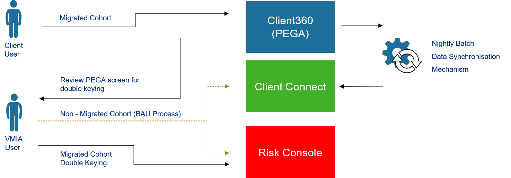
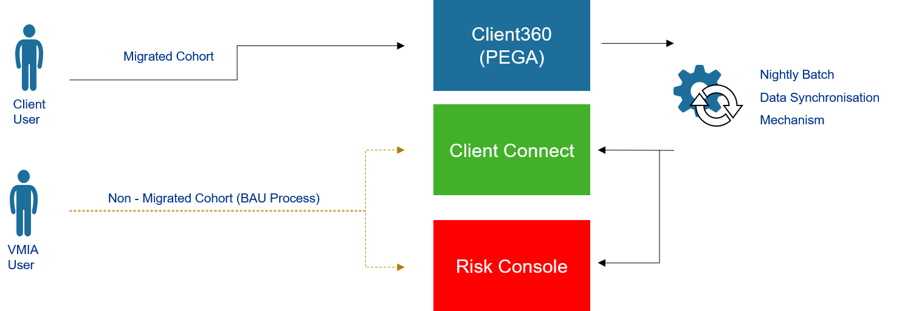
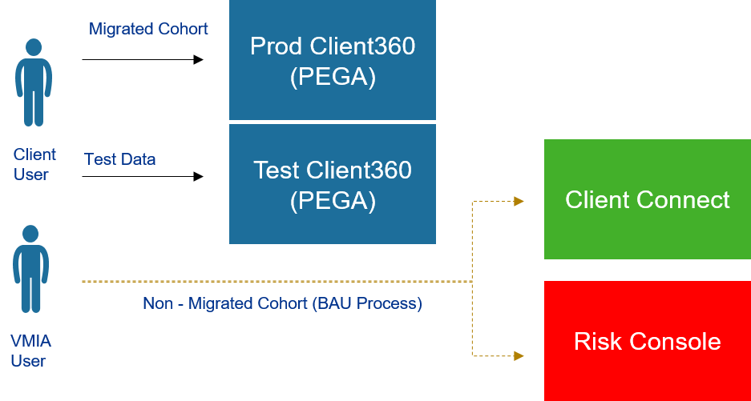
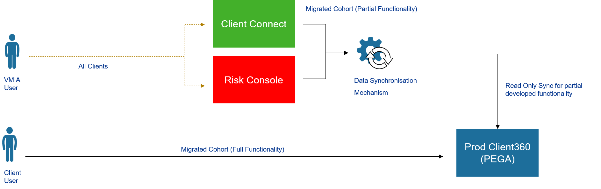
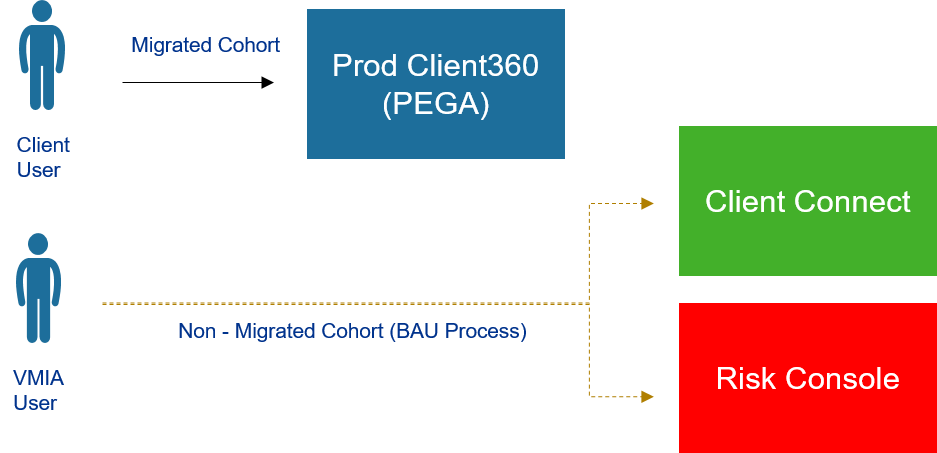

# Co-Existence Synchronisation

Add your comments directly to the page. Include links to any relevant
research, data, or feedback.

|              |                                                                                                                                                                                                                                                                                                                                                                         |
|--------------|-------------------------------------------------------------------------------------------------------------------------------------------------------------------------------------------------------------------------------------------------------------------------------------------------------------------------------------------------------------------------|
| Status       | OUTCOME DECIDED                                                                                                                                                                                                                                                                                                                                                         |
| Impact       | HIGH                                                                                                                                                                                                                                                                                                                                                                    |
| Driver       | Jigar Desai (Deactivated) t.liao@vmia.vic.gov.au Liao Ming Li (Deactivated)                                                                                                                                                                                                                                                                                             |
| Approver     | Paul Dulfer , Hendry Susilo                                                                                                                                                                                                                                                                                                                                             |
| Contributors |                                                                                                                                                                                                                                                                                                                                                                         |
| Informed     |                                                                                                                                                                                                                                                                                                                                                                         |
| Due date     |                                                                                                                                                                                                                                                                                                                                                                         |
| Outcome      | Option 2 : Aligning with PEGA functionality release principle, all functionality will be developed for a given client cohort prior to migration. Therefore Co-Existence Synchronisation will not be required for release 2 and beyond. Special cases will be analysed individually. There was no clearly identified need for read only synchronisation of data to PEGA. |

## Background

The phased roll-out approach of the PEGA application requires data to be
synchronised between PEGA and the legacy systems. This is due to the
split of functionality between releases for a cohort in which we are
migrating.

For example, functionality for policies may be ear marked for release 2,
while the functionality for claims is in release 3. This means policies
will be created in PEGA, but in order for claims to be created, the same
policy will need to be created in Risk Console as functionality for
claims is not yet ready in PEGA.

The above scenario means that data synchronisation is required between
the legacy and target systems in order for the business to complete
their operational tasks as they need to access two systems until all
functionality is catered for in the target.

For release 1, the interim solution to keep the data in sync between the
legacy systems are:

**Client Connect** - Nightly integration feed from PEGA to Client
Connect

**Risk Console** - Double keying in Risk Console (For 6 Clients)

In release 2 and beyond, the interim solution, may no longer be viable
as the client base moving into PEGA is expected to be much greater, to a
point where double keying could introduce too much overhead for
operations, not to mention human errors from double keying and the need
for an automated daily reconciliation

In order to determine the systems co-existence approach, PEGA release
functionality coverage needs to be assessed. Depending on the functional
capability release approach chosen by PEGA, different co-existence
approaches are required. The following scenarios have been identified:

**Option 1:** Core operational functionality for the cohorts are covered
in each PEGA release, and additional functionality are introduced in
future releases. Synchronisation required between target and legacy
systems. Data will need to be reconciled on an on-going basis in the
Data Platform to insure data integrity.

For **Risk Console** this option can be broken down to the following two
scenarios:

**1a** - Double Keying - Where the user enters the data in two
difference systems. The records in the two systems are manually compared
with each other to ensure that they match and are in sync.

**1b** - Nightly Batch - Similar to what is proposed and being built in
Release 1 for Client Connect, nightly batch is run to sync the data. The
possibility of this option needs to be further validated with the
vendor. Additional customisation to Risk Console may be required.

**Option 2:** Provide access to clients to a non-prod PEGA environment
with functionality planned for each release. Clients are expected to
create test data to familiarise themselves with the new system and
provide feedback. After all functionality are catered for a given
cohort, they are to be migrated into the production environment and
client will commence operating in PEGA production.

**Option 3:** For a particular cohort, PEGA is not made available unless
full functionality is tested and approved. Part of PEGA functionality to
be made read only until operational functionality for a given cohort are
all covered. Clients can familiarise themselves with the new system and
provide feedback

## Relevant data

## Options considered

<table class="confluenceTable" data-layout="wide">
<tbody>
<tr class="header">
<th class="confluenceTh"></th>
<th class="confluenceTh">
Option 1a - Double Keying
</th>
<th class="confluenceTh">
Option 1b - Nightly Batch
</th>
<th class="confluenceTh">
Option 2 - No migration until function
client functionality available
</th>
<th class="confluenceTh">
Option 3 - PEGA made available based on
functionality with some read only functionality
</th>
</tr>

<tr class="odd">
<th class="confluenceTh">
Description
</th>
<td class="confluenceTd">
In this scenario, due to the staggered
functional feature release, data will need to be kept in sync between
PEGA and source systems in order for the business to execute processes
end to end. Double Keying assumed primary for Risk Console because data
elements such as (but not limited to) clients, contact etc. will exist
in both PEGA and Risk Console. For a specific data element, either PEGA
or Risk Console will be the source of truth. Both systems (PEGA and Risk
Console) need to be in sync to control the end to end business
processes.
</td>
<td class="confluenceTd">
In this scenario, due to the staggered
functional feature release, data will need to be kept in sync between
PEGA and source systems in order for the business to execute processes
end to end. Batch update assumed for Risk Console.
</td>
<td class="confluenceTd">
In this scenario the, the assumption is that
all functionality for the selected cohort will be catered for in PEGA.
Therefore once data migration has occurred, legacy systems should ceased
to be used for data entry for the migrated cohort. PEGA will be the only
source of truth post cutover for migrated clients. Integration and
reporting for these cohorts should be sourced from PEGA. The ability to
access to a non-prod PEGA environment will enable the clients to get a
preview of the target system and provide feedback prior to
cutover.
</td>
<td class="confluenceTd">
In this scenario, PEGA is to be made read
only for some parts of functionality. All operations will be done in the
legacy system until such time all functionality of creating data matches
that of the legacy system. A sync process will be required to update
PEGA from the legacy systems for the read only parts.
</td>
</tr>
<tr class="even">
<th class="confluenceTh">
Pros and Cons
</th>
<td class="confluenceTd">

<ul>
<li>
Current release plan will not be impacted. Releases can be based
on functionality.
</li>
<li>
Aligns with strategy guiding principles of agile development of
PEGA.
</li>
</ul>

<ul>
<li>
Complex delta logic required for synchronising data between
systems.
</li>
<li>
Double keying is expected, may be error prone and increase
operational overhead.
</li>
<li>
Users may need to access multiple systems to complete operational
task.
</li>
<li>
On going reconciliation of data from for PEGA and legacy system
data required to ensure integrity.
</li>
<li>
Data sync delays. Process may not be able to be completed until
data is synced to Client Connect, which is assumed.
</li>
<li>
For co-existence reporting there will not be a clean date for
which system to report from for a client.
</li>
</ul></td>
<td class="confluenceTd">

<ul>
<li>
Releases can be based on functionality. Less effort required to
determine functional scope of a release.
</li>
<li>
Aligns with strategy guiding principles of agile development of
PEGA.
</li>
</ul>

<ul>
<li>
Complex delta logic required for synchronising data between
systems.
</li>
<li>
Additional effort from Risk Console vendor required to enable
integrated / batch updates.
</li>
<li>
Users may need to access multiple systems to complete operational
task.
</li>
<li>
On going reconciliation of data from for PEGA and legacy system
data required to ensure integrity.
</li>
<li>
Data sync delays. Process may not be able to be completed until
data is synced, which is assumed to be nightly back into Risk
Console.
</li>
<li>
For co-existence reporting there will not be a clean date for
which system to report from for a client.
</li>
</ul></td>
<td class="confluenceTd">

<ul>
<li>
Once a particular cohort has been migrated, no synchronisation
required. Target system will become source of truth.
</li>
<li>
Ability to preview functionality while the remainder is getting
built out.
</li>
</ul>

<ul>
<li>
Delay migration of cohort until all functionality are available
for the cohort.
</li>
<li>
Can only start using PEGA after cohort is migrated.
</li>
</ul></td>
<td class="confluenceTd">

<ul>
<li>
Provide clients access to information via PEGA.
</li>
<li>
Operations done in one system.
</li>
</ul>

<ul>
<li>
Read only data in PEGA is not current until sync takes
place.
</li>
<li>
Unable to initiate tasks in for read only functionality PEGA,
i.e. change assets.
</li>
</ul></td>
</tr>
<tr class="odd">
<th class="confluenceTh">
Estimated Effort
</th>
<td class="confluenceTd">
LARGE
</td>
<td class="confluenceTd">
LARGE
</td>
<td class="confluenceTd">
MEDIUM
</td>
<td class="confluenceTd">
MEDIUM/LARGE
</td>
</tr>
</tbody>
</table>

## Action items

-   

## Outcome

As per the discussions during Data Migration & Co-Existence Strategy
Walk-Through workshop on 01/07/2020, and the guiding principles of PEGA
functional release, client cohorts will not be migrated until all
functionality for the cohort has been developed. There may be few
isolated instances where the functional release may not follow this
guiding principle, and would need to be reviewed as to what approach to
be taken.

By default Option 2 without the test Client360 will be the approach.

## Attachments:

[Picture1.png](attachments/44040853/52101932.png) (image/png)  

[Picture2.png](attachments/44040853/52396326.png) (image/png)  

[Picture2.png](attachments/44040853/52036110.png) (image/png)  

[Picture3.png](attachments/44040853/52396438.png) (image/png)  

[Picture4.png](attachments/44040853/52625676.png) (image/png)  

[Picture5.png](attachments/44040853/57180226.png) (image/png)  

[Picture2.png](attachments/44040853/52101921.png) (image/png)  

[Picture4.png](attachments/44040853/52625699.png) (image/png)  

[Picture3.png](attachments/44040853/52625687.png) (image/png)  

[Picture2.png](attachments/44040853/52036130.png) (image/png)  

[Picture1.png](attachments/44040853/52396451.png) (image/png)  

[Picture1.png](attachments/44040853/54558818.png) (image/png)  

[Picture2.png](attachments/44040853/52723910.png) (image/png)  

[Picture3.png](attachments/44040853/54755461.png) (image/png)  

[Picture4.png](attachments/44040853/54820941.png) (image/png)  

[Picture2.png](attachments/44040853/54984851.png) (image/png)  

[Picture4.png](attachments/44040853/55214105.png) (image/png)  

[Picture1.png](attachments/44040853/52625519.png) (image/png)  

[Picture2.png](attachments/44040853/52068808.png) (image/png)  

[Picture3.png](attachments/44040853/52036048.png) (image/png)  

[Picture4.png](attachments/44040853/54624448.png) (image/png)  

[Picture4.png](attachments/44040853/54657211.png) (image/png)  

[Picture4.png](attachments/44040853/54591692.png) (image/png)  

[Picture4.png](attachments/44040853/52003489.png) (image/png)  

[Picture5.png](attachments/44040853/52396397.png) (image/png)  

[Picture6.png](attachments/44040853/59998254.png) (image/png)  

