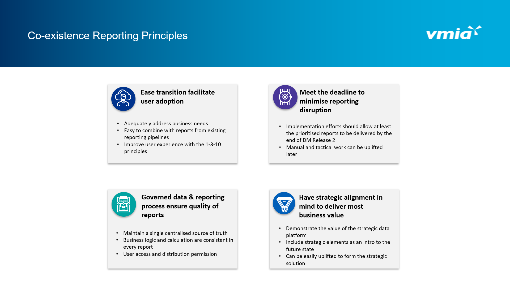
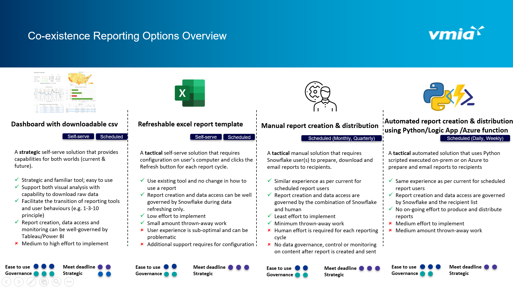
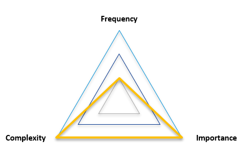

# Co-existence reportin option for each report

Add your comments directly to the page. Include links to any relevant
research, data, or feedback.

|              |                                                                                                                            |
|--------------|----------------------------------------------------------------------------------------------------------------------------|
| Status       | OUTCOME DECIDED                                                                                                            |
| Impact       | MEDIUM                                                                                                                     |
| Driver       | Sarah Fan (Deactivated) h.lindsaysmith@vmia.vic.gov.au Lindsay-Smith                                                       |
| Approver     | Maria Mota (Deactivated) Lasath Kahingala                                                                                  |
| Contributors | Dave Singh (Deactivated)                                                                                                   |
| Informed     | Hendry Susilo Bob Zhu                                                                                                      |
| Due date     |                                                                                                                            |
| Outcome      | See in individual report section. Majority of them have been decided to apply Option 2 using a refreshable Excel template. |

-   [Background](#Co-existencereportinoptionforeachreport-Background)
-   [Relevant data (on VMIA SDI
    Teams)](#Co-existencereportinoptionforeachreport-Relevantdata(onVMIASDITeams))

[Report Domain:
Premium](#Co-existencereportinoptionforeachreport-ReportDomain:Premium)

-   [Report P1: Earned / Unearned Premium
    Report](#Co-existencereportinoptionforeachreport-ReportP1:Earned/UnearnedPremiumReport)
-   [Report P2: Request for quotes
    report](#Co-existencereportinoptionforeachreport-ReportP2:Requestforquotesreport)

[Report Domain: Operation KPIs & Business
Performance](#Co-existencereportinoptionforeachreport-ReportDomain:OperationKPIs&BusinessPerformance)

-   [Report O1: 7 VMIA YTD
    Transactions](#Co-existencereportinoptionforeachreport-ReportO1:7VMIAYTDTransactions)
-   [Report O2: Premium invoice
    receipts](#Co-existencereportinoptionforeachreport-ReportO2:Premiuminvoicereceipts)
-   [Report O3: NPS Claims Settled Resolved Last
    Week](#Co-existencereportinoptionforeachreport-ReportO3:NPSClaimsSettledResolvedLastWeek)

[Report Domain:
Collections](#Co-existencereportinoptionforeachreport-ReportDomain:Collections)

-   [Report Col1: Aged Debtors Report (by team
    manager)](#Co-existencereportinoptionforeachreport-ReportCol1:AgedDebtorsReport(byteammanager))
-   [Report Col2: Aged Debtors Report
    (pdf)](#Co-existencereportinoptionforeachreport-ReportCol2:AgedDebtorsReport(pdf))

[Report Domain:
Claims](#Co-existencereportinoptionforeachreport-ReportDomain:Claims)

-   [Report C1: DET non litigated closure
    review](#Co-existencereportinoptionforeachreport-ReportC1:DETnonlitigatedclosurereview)
-   [Report C2: Monthly Peer
    Review](#Co-existencereportinoptionforeachreport-ReportC2:MonthlyPeerReview)
-   [Report C3: All Claims Monthly Records
    Audit](#Co-existencereportinoptionforeachreport-ReportC3:AllClaimsMonthlyRecordsAudit)
-   [Report C4: Overdue Claim
    Reviews](#Co-existencereportinoptionforeachreport-ReportC4:OverdueClaimReviews)
-   [Report C5: Claim Review 45 Days
    Before](#Co-existencereportinoptionforeachreport-ReportC5:ClaimReview45DaysBefore)
-   [Report C6: Claim Review All
    Claims](#Co-existencereportinoptionforeachreport-ReportC6:ClaimReviewAllClaims)

[Report Domain:
Contact](#Co-existencereportinoptionforeachreport-ReportDomain:Contact)

-   [Report Con1: All Active Clients + Contact -
    Renewal](#Co-existencereportinoptionforeachreport-ReportCon1:AllActiveClients+Contact-Renewal)
-   [Report Con2: Contacts Last
    3Months](#Co-existencereportinoptionforeachreport-ReportCon2:ContactsLast3Months)

## Background

Migrating existing data from Risk Console and Client Connect undergoes
release by release. At the end of Release 2, Cemetery Trusts and School
Councils data will be migrated and any future entries will be managed in
the new system Client 360 (i.e. PEGA). Because data of migrated client
cohorts will come out from Client 360 and snowflake particularly any
newly entered data, VMIA has explored options that can mitigate the
disruption of existing reports (i.e. mainly on split reports vs merged
reports. See <a
href="https://vmia.atlassian.net/wiki/spaces/SDI/pages/251068417/Approach"
data-linked-resource-id="251068417" data-linked-resource-version="3"
data-linked-resource-type="page">Approach</a> ). After engaging with
primary users of reports identified in scope, users are either happy to
have split reports or there is no compelling reason to not split.

In this document, following on the decision of doing split report, we
focus on deciding for each report in scope, what would be the best split
report method by taking a lense of implementation. This is largely
driven by our principles (see the diagram in the following section), the
technology savviness of users, prioritisation of reports, and the time
left before the data migration Release 2 finishes.

The following four options have been considered and one or a combination
of two will be assigned to each report listed below:

## Relevant data (on VMIA SDI Teams)

Report analysis: <a
href="https://teams.microsoft.com/l/file/B745201C-4B62-40C9-8AF3-D411AEEBE2FE?tenantId=871d3ef7-09d4-44f6-a0fa-98e89ba4b422&amp;fileType=xlsx&amp;objectUrl=https%3A%2F%2Fvmia.sharepoint.com%2Fsites%2FSDIArchitectureReferenceFiles%2FShared%20Documents%2FGeneral%2FSDI%20-%20design%20and%20architecture%20project%2FClient360%20-%20Reporting%20Analysis%2FReports_from_VMIA_Systems%2FClient360%20Reporting%20Analysis%20-%20Updated%20-%20AV-30Sep-3.xlsx&amp;baseUrl=https%3A%2F%2Fvmia.sharepoint.com%2Fsites%2FSDIArchitectureReferenceFiles&amp;serviceName=teams&amp;threadId=19:8c4186fe580248a7b2879cbfd3ce9cbe@thread.tacv2&amp;groupId=7dd30cd5-0926-45fc-8eb6-a69388306963"
rel="nofollow">General &gt; SDI - design and architecture project &gt;
Client360 - Reporting Analysis &gt; Reports_from VMIA_Systems &gt;
Client360 Reporting Analysis - Updated - AV-30Sep-3.xlsx</a>

Report field analysis: <a
href="https://teams.microsoft.com/l/file/6697EC53-431A-4241-A937-D9F770C60133?tenantId=871d3ef7-09d4-44f6-a0fa-98e89ba4b422&amp;fileType=xlsx&amp;objectUrl=https%3A%2F%2Fvmia.sharepoint.com%2Fsites%2FSDIArchitectureReferenceFiles%2FShared%20Documents%2FGeneral%2FSDI%20-%20design%20and%20architecture%20project%2FClient360%20-%20Reporting%20Analysis%2FReporting%20Analysis%20Documentation.xlsx&amp;baseUrl=https%3A%2F%2Fvmia.sharepoint.com%2Fsites%2FSDIArchitectureReferenceFiles&amp;serviceName=teams&amp;threadId=19:8c4186fe580248a7b2879cbfd3ce9cbe@thread.tacv2&amp;groupId=7dd30cd5-0926-45fc-8eb6-a69388306963"
rel="nofollow">General &gt; SDI - design and architecture project &gt;
Client360 - Reporting Analysis &gt; Reporting Analysis
Documentation.xlsx</a>

# Report Domain: Premium

## **Report P1:** <a
href="https://vmia.atlassian.net/wiki/spaces/SDI/pages/195952704/Earned+Unearned+Premium+Report"
rel="nofollow"><strong>Earned / Unearned Premium Report</strong></a>

**Existing Reporting Pipeline:** Risk Console built-in report

**Existing Report Creator:** Vivian Aw, Ventive

**Report Primary User(s)**: Vivian Aw

**Reporting Frequency:** Self Serve - run Monthly

**Purpose:** show movement in earned and unearned premium over the
financial year per month

**Report format**: excel spreadsheet (have to be) for usage 1 below.

**Report granularity**: policy number. A policy can multiple invoice
number.

**Report used for**:

1.  Run report → get the detail of each invoice → summarise it by
    product/coverage (manual, done by Vivian) → manually post the
    spreadsheet into TechOne and therefore report structure cannot be
    changed (done by Vivian)

2.  The report is to compare and match the monthly earned/unearned
    premium change in ALL ACTIVE POLICIES.

3.  Manually produce a summary with aggregation on top of the report at
    product/coverage level (done by Vivian)

4.  Mark may need to do additional aggregation/ad-hoc filtering for
    investigation

**Importance**: HIGH It is the only way to check how much a client needs
to pay and has paid. Very critical.

**Complexity**: HIGH The preliminary investigation shows some examples
such as YTD total premium for multi-year policies to be calculated
monthly. One source of complexity comes from the financial values like
this to be calculated. The other source of complexity stems from lack of
documentation of business logic. The business logic is built inside Risk
Console. The report was developed by Vivian and Ventiv via email
exchange over a year. Backward engineering is required to capture the
business logic, or redesign the report using in PEGA data and logic.

<table class="confluenceTable" data-layout="default">
<colgroup>
<col style="width: 33%" />
<col style="width: 33%" />
<col style="width: 33%" />
</colgroup>
<tbody>
<tr class="header">
<th class="confluenceTh">
<strong>Can be done in
Tableau</strong>
</th>
<th class="confluenceTh">
<strong>Can be done in SQL</strong>
</th>
<th class="confluenceTh">
<strong>Have to be done in programming
language</strong>
</th>
</tr>

<tr class="odd">
<td class="confluenceTd">

</td>
<td class="confluenceTd">

store procedure

</td>
<td class="confluenceTd">

</td>
</tr>
</tbody>
</table>

**Historical data period**: Life of a invoiced policy based on effective
date and expiration date (construction and MI have the longest life
span). Historical data is only need for claims that are currently
active. Vivian is only interested in the premiums of an active policy.

-   **PEGA** release 2 will migrate **all policies**, incl. active and
    inactive.

**Split vs. merged report preference:** Ok to have two reports and
manually merge to submit to techOne

### Note

The current user experience is that a user clicks on a button in Risk
Console to download the excel report.

**Note**: a **basic version of this report** can be created as all
critical fields are migrated to PEGA and some non-critical fields are
not available (e.g. some non-critical fields are DTF-Category, Related
Party. Critical fields are those used for calculation.). See <a
href="https://teams.microsoft.com/l/file/6697EC53-431A-4241-A937-D9F770C60133?tenantId=871d3ef7-09d4-44f6-a0fa-98e89ba4b422&amp;fileType=xlsx&amp;objectUrl=https%3A%2F%2Fvmia.sharepoint.com%2Fsites%2FSDIArchitectureReferenceFiles%2FShared%20Documents%2FGeneral%2FSDI%20-%20design%20and%20architecture%20project%2FClient360%20-%20Reporting%20Analysis%2FReporting%20Analysis%20Documentation.xlsx&amp;baseUrl=https%3A%2F%2Fvmia.sharepoint.com%2Fsites%2FSDIArchitectureReferenceFiles&amp;serviceName=teams&amp;threadId=19:8c4186fe580248a7b2879cbfd3ce9cbe@thread.tacv2&amp;groupId=7dd30cd5-0926-45fc-8eb6-a69388306963"
rel="nofollow">General &gt; SDI - design and architecture project &gt;
Client360 - Reporting Analysis &gt; Reporting Analysis
Documentation.xlsx</a> on Teams for detail.

### Action items

-   

### Outcome

## **Report P2: Request for quotes report**

**Existing Reporting Pipeline:** SAS

**Existing Report Creator:** Tony Goldsworthy

**Report Primary User(s)**: Wayne G.

**Reporting Frequency:** Schedule - run Monthly

**Purpose:** List of Organisations that have requested Insurance quotes.
This report provides a list fo new business created in the system so
they can be reviewed to ascertain that underwriting delegations have
been followed. This is an audit requirements

**Report format**: excel spreadsheet

**Report granularity**: policy no.

**Report used for**:

1.  User receives email with SAS report monthly.

2.  User reviews who has created new business and endorsements to check
    if in alignment with underwriting delegation

**Importance**: MEDIUM This is an audit requirement. If client 360 will
have underwriting delegations built as a system capability, this report
will not be required; otherwise, still required.

**Complexity**: MEDIUM

<table class="confluenceTable" data-layout="default">
<colgroup>
<col style="width: 33%" />
<col style="width: 33%" />
<col style="width: 33%" />
</colgroup>
<tbody>
<tr class="header">
<th class="confluenceTh">
<strong>Can be done in
Tableau</strong>
</th>
<th class="confluenceTh">
<strong>Can be done in SQL</strong>
</th>
<th class="confluenceTh">
<strong>Have to be done in programming
language</strong>
</th>
</tr>

<tr class="odd">
<td class="confluenceTd">

</td>
<td class="confluenceTd">

</td>
<td class="confluenceTd">

</td>
</tr>
</tbody>
</table>

**Historical data period**: All fields are critical. The report is for
recent data no need for historical data.

**Split vs. merged report preference:** happy to split

### Action items

-   

### Outcome

# Report Domain: Operation KPIs & Business Performance

## **Report O1: 7 VMIA YTD Transactions**

**Existing Reporting Pipeline:** SAS

**Existing Report Creator:** Tony Goldsworthy

**Report Primary User(s)**: Vivian Aw (Non-DHHS), Serena (DHHS)

**Reporting Frequency:** Self Serve - run Monthly

**Purpose:** VMIA Year-to-date Claims and Recovery report (DHHS and
Non-DHHS)

**Report format**: excel spreadsheet (have to be) for usage 2 below.

**Report granularity**: 1) lowest granularity: transaction ID. A claim
ID can multiple transaction ID; 2) summary granularity: policy coverage
(i.e. D&O, PPL, PI, Property, etc.)

**Report used for**:

Used to reconcile back to TechOne. It is a checking tool.

1.  Support investigation with additional manual aggregation/filtering.

**Importance**: HIGH

**Complexity**: SMALL TO MEDIUM Business logic is simple, filtering,
aggregation and joins. Medium is due to the number of sheets to produce.

-   Number of datasets: 1-2

-   Number of excel sheets:

    -   Non-DHHS: 4

    -   DHHS: 10

<table class="confluenceTable" data-layout="default">
<colgroup>
<col style="width: 33%" />
<col style="width: 33%" />
<col style="width: 33%" />
</colgroup>
<tbody>
<tr class="header">
<th class="confluenceTh">
<strong>Can be done in
Tableau</strong>
</th>
<th class="confluenceTh">
<strong>Can be done in SQL</strong>
</th>
<th class="confluenceTh">
<strong>Have to be done in programming
language</strong>
</th>
</tr>

<tr class="odd">
<td class="confluenceTd">

</td>
<td class="confluenceTd">

</td>
<td class="confluenceTd">

</td>
</tr>
</tbody>
</table>

**Historical data period**: transaction in current FY

**Split vs. merged report preference:** can tolerate with two reports in
short term (i.e. few months)

### Note

**Note**: Some **critical fields are missing** from PEGA (a check
against PEGA BIX will need to be performed). Without them, this report
cannot be done.

### Action items

-   

### Outcome

## **Report O2: Premium invoice receipts**

**Existing Reporting Pipeline:** COGNOS query + SAS (Cognos provides a
“VIEW” for query. However, can the logic used to create this “VIEW” be
accessible or documented somewhere. Tony suggest to talk to Chris Manney
who deals with Ventiv.)

**Existing Report Creator:** Tony Goldsworthy (SAS), Kim Fang (COGNOS
query)

**Report Primary User(s)**: Vivian Aw and Kim Fang

**Reporting Frequency:** Self Serve + Schedule - run Weekly (manual
query via Cognos on Monday to generate the report, and scheduled SAS
script to format the report and email to specific users)

**Purpose:** The report is for the monthly premium receipt
reconciliation for Stamp duty & GST.

**Report format**: excel spreadsheet

**Report granularity**: policy no.

**Report used for**:

1.  Kim checks the Total GST, Stamp duty and premium, She also checks
    the stamp duty for each state, total payment amount, payment date,
    and the calculation from column X to AM.

**Importance**: HIGH The report forms the basis of declaration of GST
and stamp duty monthly so Vivian Aw and Kim Fang would like it not to
fail to generate as we cannot fail to report. GST is due 21st of every
month

**Complexity**: HIGH Cognos query is only filtering. However, the logic
used to create the Cognos “VIEW” is not controlled by VMIA. Need to talk
to Chris Mainey to assess if replicating these logic is possible.

-   Number of datasets: ?

<table class="confluenceTable" data-layout="default">
<colgroup>
<col style="width: 33%" />
<col style="width: 33%" />
<col style="width: 33%" />
</colgroup>
<tbody>
<tr class="header">
<th class="confluenceTh">
<strong>Can be done in
Tableau</strong>
</th>
<th class="confluenceTh">
<strong>Can be done in SQL</strong>
</th>
<th class="confluenceTh">
<strong>Have to be done in programming
language</strong>
</th>
</tr>

<tr class="odd">
<td class="confluenceTd">

</td>
<td class="confluenceTd">

</td>
<td class="confluenceTd">

</td>
</tr>
</tbody>
</table>

**Historical data period**: This monthly report is picking up all
cash/monies received from customers within the month. So the invoices
can be as old as the aged debtors report. Kim had a look at the aged
debtors from risk console as at end of June 2020 and the oldest
outstanding debt is an invoice issued in Sept 2018 and a number of June
2019 etc.

-   PEGA has all the required invoice fields and history?

**Split vs. merged report preference:** Maria to inform

### Note

**Note**: Some **critical fields are missing** from PEGA (a check
against PEGA BIX will need to be performed). Without them, this report
cannot be done.

### Action items

-   

### Outcome

## **Report O3: NPS Claims Settled Resolved Last Week**

**Existing Reporting Pipeline:** SAS

**Existing Report Creator:** Bob Zhu

**Report Primary User(s):** Mahvash and Claims team

**Reporting Frequency:** Scheduled to run Weekly (Monday morning)

**Purpose:** report on all claims that had their Settlement Agreement
Reached Date in the last week. This report is scheduled to be run on
Monday Mornings, and an automated e-mail is sent to the recipients with
the output attached in a XLSX format

**Report format**: xlsx

**Report granularity**: claim ID

**Report used for:**

1.  It is used for NPS Claims Surveys. It must have Settlement Agreement
    Reached Date.

2.  Obtain the email addresses from the report and send a NPS survey to
    those e-mails manually.

**Importance:** VERY HIGH The report is a crucial report because it
affects the Net Promoter Score calculation for VMIA that affects the
Corporate Performance (shown to the board).

**Complexity:** VERY LOW

-   Number of datasets: 1-2

<table class="confluenceTable" data-layout="default">
<colgroup>
<col style="width: 33%" />
<col style="width: 33%" />
<col style="width: 33%" />
</colgroup>
<tbody>
<tr class="header">
<th class="confluenceTh">
<strong>Can be done in
Tableau</strong>
</th>
<th class="confluenceTh">
<strong>Can be done in SQL</strong>
</th>
<th class="confluenceTh">
<strong>Have to be done in programming
language</strong>
</th>
</tr>

<tr class="odd">
<td class="confluenceTd">

</td>
<td class="confluenceTd">

</td>
<td class="confluenceTd">

</td>
</tr>
</tbody>
</table>

**Historical data period**: clams settle in last week

**Split vs. merged report preference:** happy to split

### Action items

-   

### Outcome

# Report Domain: Collections

## **Report Col1: Aged Debtors Report (by team manager)**

**Existing Reporting Pipeline:** SAS

**Existing Report Creator:** Tony Goldsworthy, Kim (from Vikram’s team)

**Report Primary User(s):** Risk team

**Reporting Frequency:** Self Serve - run Weekly (run Monday for
receipts being updated on last Friday. Manual query to pick up data from
RC, put into a spreadsheet, SAS code scheduled to run to pick up the
spreadsheet, produce report and email to specific users for each
report.)

**Purpose:** report on clients of a specific team manager the age of
debt and outstanding amount. Have summary pages to show by team manager
and show by age of debt only. Each team manager will receive his/her own
aged debtors report relevant to his/her clients.

**Report used for:**

1.  Email to relevant users in the Risk team once report is ready so
    risk advisor can contact their clients chasing up the debts.

2.  It is the source of truth for debts.

3.  It is for internal circulation only. It won’t be sent to client.

4.  Follow the current format is essential for Kim’s work.

5.  No additional changes or analysis occurs on top of the report.

6.  CAT team would be impacted mostly due to affect client cohorts (i.e.
    cemetery trust, school councils).

**Importance:** MEDIUM TO HIGH Vikram will be worried because no money
coming in due to risk advisors unable to chase up debts with clients
without the report.

**Complexity:** MEDIUM

-   Number of datasets: 3-5 (ICT_Premium, Aged_Debtors SAS extract, a
    manually managed team manager and risk advisor mapping spreadsheet
    which the risk advisor column can map to clients via Client Connect.
    Tony manages this spreadsheet)

<table class="confluenceTable" data-layout="default">
<colgroup>
<col style="width: 33%" />
<col style="width: 33%" />
<col style="width: 33%" />
</colgroup>
<tbody>
<tr class="header">
<th class="confluenceTh">
<strong>Can be done in
Tableau</strong>
</th>
<th class="confluenceTh">
<strong>Can be done in SQL</strong>
</th>
<th class="confluenceTh">
<strong>Have to be done in programming
language</strong>
</th>
</tr>

<tr class="odd">
<td class="confluenceTd">

</td>
<td class="confluenceTd">

</td>
<td class="confluenceTd">

</td>
</tr>
</tbody>
</table>

**Historical data period**: All history of premium and debts data in
risk console

**Split vs. merged report preference:** no compelling reason not to

### Action items

-   

### Outcome

## **Report Col2: Aged Debtors Report (pdf)**

**Existing Reporting Pipeline:** Risk Console build-in report

**Existing Report Creator:** Chris Manning (know the business logic)

**Report Primary User(s):** Kim, Vikram, Vivian Aw

**Reporting Frequency:** Self Serve - run Monthly (end of a Month)

**Purpose:** report on outstanding premium payment per client and total.

**Report used for:**

1.  Monthly reconciliation with TechOne

2.  Kim only look at the total amounts in the past page of the report

3.  Vivian Aw uses this report but only twice a year for DTF reporting.
    This was because there is no breakdown in TechOne by customer for
    risk console premium This will change when the premium is uploaded
    to TechOne on a daily basis and we are creating each customer in
    TechOne. She will be using the aged debtors report in TechOne then.

**Importance:** MEDIUM TO HIGH Going forward with DM (confirm with
Katasha and Vikram), this report may not be used as RC data will be
brought into TechOne and therefore reconciliation is no longer need (how
about PEGA data?)

**Complexity:** MEDIUM

-   Number of datasets: N/A

<table class="confluenceTable" data-layout="default">
<colgroup>
<col style="width: 33%" />
<col style="width: 33%" />
<col style="width: 33%" />
</colgroup>
<tbody>
<tr class="header">
<th class="confluenceTh">
<strong>Can be done in
Tableau</strong>
</th>
<th class="confluenceTh">
<strong>Can be done in SQL</strong>
</th>
<th class="confluenceTh">
<strong>Have to be done in programming
language</strong>
</th>
</tr>

<tr class="odd">
<td class="confluenceTd">

</td>
<td class="confluenceTd">

</td>
<td class="confluenceTd">

</td>
</tr>
</tbody>
</table>

**Historical data period**: All history of premium and debts data in
risk console

**Split vs. merged report preference:** no compelling reason not to
split

### Action items

-   

### Outcome

# Report Domain: Claims

## **Report C1: DET non litigated closure review**

**Existing Reporting Pipeline:** SAS

**Existing Report Creator:** Tony Goldsworthy

**Report Primary User(s):** Peter Thompson, Sarah McPherson

**Reporting Frequency:** Schedule - run Monthly

**Purpose:** The report provides a list of claims closed per month.

**Report used for:**

1.  Use to have internal discussion, underwriting fee (under deductible
    management)

2.  Aggregation/filtering on top of report

**Importance:** HIGH Kelly mentioned that it is used for DET invoicing.

**Complexity:** MEDIUM

-   Number of datasets: ?

<table class="confluenceTable" data-layout="default">
<colgroup>
<col style="width: 33%" />
<col style="width: 33%" />
<col style="width: 33%" />
</colgroup>
<tbody>
<tr class="header">
<th class="confluenceTh">
<strong>Can be done in
Tableau</strong>
</th>
<th class="confluenceTh">
<strong>Can be done in SQL</strong>
</th>
<th class="confluenceTh">
<strong>Have to be done in programming
language</strong>
</th>
</tr>

<tr class="odd">
<td class="confluenceTd">

</td>
<td class="confluenceTd">

</td>
<td class="confluenceTd">

</td>
</tr>
</tbody>
</table>

**Historical data period**: All claims

**Split vs. merged report preference:** Happy to split

### Action items

-   

### Outcome

## **Report C2: Monthly Peer Review**

**Existing Reporting Pipeline:** SAS

**Existing Report Creator:** Tony Goldsworthy

**Report Primary User(s):** Peter Thompson, Sarah McPherson, Joanne
Drummound

**Reporting Frequency:** Self server - run Monthly

**Purpose:** This report shows which claim needs to fall into monthly
peer review program. It highlights which claim hasn't been reviewed yet.

**Report used for:**

1.  Look at row by row. The summary sheets aggregate to claim handler
    level.

**Importance:** HIGH Sarah M. mentioned that it is an audit report. Need
to be fixed immediately if fail to generate. Peter mentioned that
Cemetery Trusts and School councils have huge impact on this report.

**Complexity:** MEDIUM

-   Number of datasets: ?

<table class="confluenceTable" data-layout="default">
<colgroup>
<col style="width: 33%" />
<col style="width: 33%" />
<col style="width: 33%" />
</colgroup>
<tbody>
<tr class="header">
<th class="confluenceTh">
<strong>Can be done in
Tableau</strong>
</th>
<th class="confluenceTh">
<strong>Can be done in SQL</strong>
</th>
<th class="confluenceTh">
<strong>Have to be done in programming
language</strong>
</th>
</tr>

<tr class="odd">
<td class="confluenceTd">

</td>
<td class="confluenceTd">

</td>
<td class="confluenceTd">

</td>
</tr>
</tbody>
</table>

**Historical data period**: All claims

**Split vs. merged report preference:** Happy to split

### Action items

-   

### Outcome

## **Report C3: All Claims Monthly Records Audit**

**Existing Reporting Pipeline:** SAS

**Existing Report Creator:** Tony Goldsworthy

**Report Primary User(s):** Suba (Actuary team)

**Reporting Frequency:** Schedule - run Monthly (Tony to confirm)

**Purpose:** This program does a compare of current months allclaims
records to the previous month. Used by actuaries as a check when sending
data to exrernal actuaries.

**Report used for:**

1.  The report contains multiple sheets, each one showing exception
    cases or "success" statement.

2.  Suba uses this report as a check to identify any changes in the data
    from one month to another.

**Importance:** HIGH

**Complexity:** HIGH Claim cross over PEGA will be hard to do due to
reconciliation.

-   Number of datasets: ?

<table class="confluenceTable" data-layout="default">
<colgroup>
<col style="width: 33%" />
<col style="width: 33%" />
<col style="width: 33%" />
</colgroup>
<tbody>
<tr class="header">
<th class="confluenceTh">
<strong>Can be done in
Tableau</strong>
</th>
<th class="confluenceTh">
<strong>Can be done in SQL</strong>
</th>
<th class="confluenceTh">
<strong>Have to be done in programming
language</strong>
</th>
</tr>

<tr class="odd">
<td class="confluenceTd">

</td>
<td class="confluenceTd">

</td>
<td class="confluenceTd">

</td>
</tr>
</tbody>
</table>

**Historical data period**: last month claims data

**Split vs. merged report preference:** no compelling reason not to
split

### Action items

-   

### Outcome

## **Report C4: Overdue Claim Reviews**

**Existing Reporting Pipeline:** SAS

**Existing Report Creator:** Tony Goldsworthy

**Report Primary User(s):** Sarah McPherson, Joanne Drummound

**Reporting Frequency:** Schedule - run monthly

**Purpose:** Audit requirement on if a claim is reviewed by a claim
handler. Affects all clients. Risk Console has built-in logic to create
a review date for a claim based on the claim category. A claim handler
will need to review the claim by the review date and tick a box in Risk
Console. If a review isn’t done on time, that claim will be in this
report. (Does PEGA support this review process? Maria to confirm with
Jane Boag)

**Report used for:**

1.  To inform claim handler what reviews need to be reviewed.

2.  Generally first look at the summary tab to see who has how many
    claims to review. And then go to detail table to show what claims
    for that handler.

**Importance:** HIGH This is an audit requirement. If fail to generate
the report, the pipeline needs to be fixed immediately.

**Complexity:** MEDIUM

-   Number of datasets: ?

<table class="confluenceTable" data-layout="default">
<colgroup>
<col style="width: 33%" />
<col style="width: 33%" />
<col style="width: 33%" />
</colgroup>
<tbody>
<tr class="header">
<th class="confluenceTh">
<strong>Can be done in
Tableau</strong>
</th>
<th class="confluenceTh">
<strong>Can be done in SQL</strong>
</th>
<th class="confluenceTh">
<strong>Have to be done in programming
language</strong>
</th>
</tr>

<tr class="odd">
<td class="confluenceTd">

</td>
<td class="confluenceTd">

</td>
<td class="confluenceTd">

</td>
</tr>
</tbody>
</table>

**Historical data period**: all claims that haven't been reviewed by
their given date

**Split vs. merged report preference:** happy to split

### Action items

-   

### Outcome

## **Report C5: Claim Review 45 Days Before**

**Existing Reporting Pipeline:** SAS

**Existing Report Creator:** Tony Goldsworthy

**Report Primary User(s):** Sarah McPherson, Joanne Drummound

**Reporting Frequency:** Schedule - run monthly

**Purpose:** Uses Litigation downloaded from ARC. Trial dates between
current date and next 90 days for specific litigation_status are
reported. This report is scheduled to be run on 1st of the month with a
preview report scheduled on 24th of each month. e-mail is sent to the
recipients with the output attached in a XLSX format

**Report used for:**

1.  Filtering and aggregation on top of report

**Importance:** LOW Sarah M. mentioned that it is highly unlikely to
have Cemetery Trusts and School Councils in the report. It is a critical
report for maintream litigation claims. Can tolerate few months not
having the split report.

**Complexity:** MEDIUM

-   Number of datasets: ?

<table class="confluenceTable" data-layout="default">
<colgroup>
<col style="width: 33%" />
<col style="width: 33%" />
<col style="width: 33%" />
</colgroup>
<tbody>
<tr class="header">
<th class="confluenceTh">
<strong>Can be done in
Tableau</strong>
</th>
<th class="confluenceTh">
<strong>Can be done in SQL</strong>
</th>
<th class="confluenceTh">
<strong>Have to be done in programming
language</strong>
</th>
</tr>

<tr class="odd">
<td class="confluenceTd">

</td>
<td class="confluenceTd">

</td>
<td class="confluenceTd">

</td>
</tr>
</tbody>
</table>

**Historical data period**: all claims that haven't been reviewed by
their given date

**Split vs. merged report preference:** happy to split

### Action items

-   

### Outcome

## **Report C6: Claim Review All Claims**

**Existing Reporting Pipeline:** SAS

**Existing Report Creator:** Tony Goldsworthy

**Report Primary User(s):** Sarah McPherson, Joanne Drummound

**Reporting Frequency:** Schedule - run monthly

**Purpose:**

**Report used for:**

1.  Filtering and aggregation on top of report

**Importance:** LOW Sarah M. mentioned that minimum impact from School
Councils and Cemetery Trusts. Can tolerate for few months not to have
the split report done

**Complexity:** MEDIUM

-   Number of datasets: ?

<table class="confluenceTable" data-layout="default">
<colgroup>
<col style="width: 33%" />
<col style="width: 33%" />
<col style="width: 33%" />
</colgroup>
<tbody>
<tr class="header">
<th class="confluenceTh">
<strong>Can be done in
Tableau</strong>
</th>
<th class="confluenceTh">
<strong>Can be done in SQL</strong>
</th>
<th class="confluenceTh">
<strong>Have to be done in programming
language</strong>
</th>
</tr>

<tr class="odd">
<td class="confluenceTd">

</td>
<td class="confluenceTd">

</td>
<td class="confluenceTd">

</td>
</tr>
</tbody>
</table>

**Historical data period**: all claims that haven't been reviewed by
their given date

**Split vs. merged report preference:** happy to split

### Action items

-   

### Outcome

# Report Domain: Contact

## **Report Con1: All Active Clients + Contact - Renewal**

**Existing Reporting Pipeline:** Client Connect

**Existing Report Creator:** Client Connect direct reports

**Report Primary User(s):** Kaylene (enterprise system)

**Reporting Frequency:** Self serve - ad-hoc

**Purpose:** They’re generic template used by Enterprise System
(Kaylene) to generate custom reports requested by VMIA stakeholders

**Report used for:** provide a list of contacts of active clients or
clients for renewal for VMIA stakeholders

**Importance:** LOW

**Complexity:** MEDIUM

-   Number of datasets: N/A

<table class="confluenceTable" data-layout="default">
<colgroup>
<col style="width: 33%" />
<col style="width: 33%" />
<col style="width: 33%" />
</colgroup>
<tbody>
<tr class="header">
<th class="confluenceTh">
<strong>Can be done in
Tableau</strong>
</th>
<th class="confluenceTh">
<strong>Can be n/adone in
SQL</strong>
</th>
<th class="confluenceTh">
<strong>Have to be done in programming
language</strong>
</th>
</tr>

<tr class="odd">
<td class="confluenceTd">

</td>
<td class="confluenceTd">

</td>
<td class="confluenceTd">

</td>
</tr>
</tbody>
</table>

**Historical data period**: latest client contact

**Split vs. merged report preference:** split report. Can be manual
ad-hoc process as Maria suggested.

### Action items

-   

### Outcome

## **Report Con2: Contacts Last 3Months**

**Existing Reporting Pipeline:** SAS

**Existing Report Creator:** Tony Goldsworthy

**Report Primary User(s):** Mahvash R, Grace

**Reporting Frequency:** Self Serve - run Quarterly

**Purpose:** The report is a list of all Contacts VMIA has contacted in
the last 3 or 6 months. There is an option to select 6 months contact
data if required.

**Report used for:**

1.  It is used to generate a list of emalis to send out NPS emails.

**Importance:** VERY HIGH

**Complexity:** LOW

-   Number of datasets: 6+

<table class="confluenceTable" data-layout="default">
<colgroup>
<col style="width: 33%" />
<col style="width: 33%" />
<col style="width: 33%" />
</colgroup>
<tbody>
<tr class="header">
<th class="confluenceTh">
<strong>Can be done in
Tableau</strong>
</th>
<th class="confluenceTh">
<strong>Can be done in SQL</strong>
</th>
<th class="confluenceTh">
<strong>Have to be done in programming
language</strong>
</th>
</tr>

<tr class="odd">
<td class="confluenceTd">

</td>
<td class="confluenceTd">

</td>
<td class="confluenceTd">

</td>
</tr>
</tbody>
</table>

**Historical data period**: All claim history in RC and history in CC
(sometimes department/org changes their names)

**Split vs. merged report preference:** Happy to split

### Note

This is a scheduled run report. Only a subset of fields are currently in
use:

First Name, Last Name, Email, Organisation, Client VGRMF, Last
Historical Contact, Last Valid Historical Contact VMIA, Weekly for
Claims Settlement Agreement Reached

### Action items

-   

### Outcome

## Attachments:

    <li>

[][image-20200918-031831.png](image/png)  
    </li>
    <li>

[image-20200918-053918.png](attachments/251330730/251134212.png)
(image/png)  
    </li>

[image-20200918-071427.png](attachments/251330730/251265286.png)
(image/png)  

[image-20200918-112036.png](attachments/251330730/251495115.png)
(image/png)  

[image-20200918-114938.png](attachments/251330730/251495131.png)
(image/png)  

[image-20200924-051440.png](attachments/251330730/266207287.png)
(image/png)  

[image-20200924-055527.png](attachments/251330730/266502181.png)
(image/png)  

[image-20200924-055655.png](attachments/251330730/267124760.png)
(image/png)  

[image-20200924-063736.png](attachments/251330730/266240111.png)
(image/png)  

[image-20200924-065745.png](attachments/251330730/267321373.png)
(image/png)  

[image-20200928-035118.png](attachments/251330730/277250084.png)
(image/png)  

[image-20200928-043241.png](attachments/251330730/277086282.png)
(image/png)  

[image-20200928-072259.png](attachments/251330730/277151885.png)
(image/png)  

[image-20200929-071322.png](attachments/251330730/279871602.png)
(image/png)  

[image-20201002-041830.png](attachments/251330730/288817159.png)
(image/png)  

[image-20201002-065441.png](attachments/251330730/288129201.png)
(image/png)  

[image-20201002-065609.png](attachments/251330730/288227533.png)
(image/png)  

[image-20201002-075920.png](attachments/251330730/288817204.png)
(image/png)  

[image-20201019-042801.png](attachments/251330730/333250636.png)
(image/png)  

[image-20201019-042951.png](attachments/251330730/333250642.png)
(image/png)  

