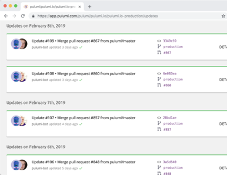

# Infrastructure as Code Platform for Azure

<div>

<div>

Add your comments directly to the page. Include links to any relevant
research, data, or feedback.

</div>

</div>

<div class="plugin-tabmeta-details">

<div class="table-wrap">

|              |                                                                                                                                                                                                              |
|--------------|--------------------------------------------------------------------------------------------------------------------------------------------------------------------------------------------------------------|
| Status       | OUTCOME DECIDED                                                                                                                                                                                              |
| Impact       | MEDIUM                                                                                                                                                                                                       |
| Driver       | Jason Dang (Deactivated)                                                                                                                                                                                     |
| Approver     | Hendry Susilo                                                                                                                                                                                                |
| Contributors | h.lindsaysmith@vmia.vic.gov.au Lindsay-Smith p.lim@vmia.vic.gov.au Lim                                                                                                                                       |
| Informed     | Mentes KelesLasath Kahingala Michael Thien                                                                                                                                                                   |
| Due date     | 26/06/2020                                                                                                                                                                                                   |
| Outcome      | VMIA has agreed for Pulumi to be the Infrastructure as Code platform for the strategic data platform pending the outcome of commercial negotiations between Pulumi and VMIA. 3 Licenses will be provisioned. |

</div>

</div>

## Background

Infrastructure as Code is a process of managing and provisioning cloud
resources. For Azure cloud development the native choice for
infrastructure as code is Azure Resource Manager (ARM) Templates. There
are however alternative platforms such as pulumi that can be utilised
that can accelerate the development of and improve the efficiency of
managing Infrastructure as Code.

## Relevant data

Infrastructure as Code is a modern approach for automating the
provisioning and deployment of cloud resources instead of the
traditional interactive configuration approach known as click-ops. By
defining what resources are required to be deployed through
configuration scripts, you achieve:

-   Consistency

-   Reliablilty

-   Reusability

-   Scalability

-   Rapid Deployment

To achieve this in the Azure platform, two potential options are being
considered; Azure Resource Manager (ARM) Templates and Pulumi.

**Azure Resource Manager (ARM)**

An ARM template is a JSON file that defines the configuration and
deployment of Azure Cloud Resources. Once created, the ARM template can
then be uploaded to Azure Resource Manager to deploy all the declared
resources. The use of ARM does not incur any additional costs. ARM
template reference documentation can be found here for all applicable
services: <a href="https://docs.microsoft.com/en-us/azure/templates/"
rel="nofollow">https://docs.microsoft.com/en-us/azure/templates/</a>

Below is an example code snippet of an ARM template to deploy a virtual
machine.

<div class="code panel pdl" style="border-width: 1px;">

<div class="codeContent panelContent pdl">

``` java
{
    "$schema": "https://schema.management.azure.com/schemas/2015-01-01/deploymentTemplate.json#",
    "contentVersion": "1.0.0.0",
    "parameters": {
        "adminUsername": {
            "type": "string",
            "defaultValue": "ashuser",
            "metadata": {
                "description": "User name for the Virtual Machine."
            }
        },
        "adminPassword": {
            "type": "securestring",
            "defaultValue": "Ashpassword123",
            "metadata": {
                "description": "Password for the Virtual Machine."
            }
        },
        "osDiskSize": {
            "type": "int",
            "defaultValue": 1024
        }
    },
    "variables": {
        "location": "[resourceGroup().location]",
        "addressPrefix": "10.0.0.0/16",
        "subnetName": "Subnet",
        "subnetPrefix": "10.0.0.0/24",
        "storageAccountType": "Standard_LRS",
        "publicIPAddressType": "Dynamic",
        "publicIPAddressName": "[concat('my-',variables('uniqString'),'-pip')]",
        "nsgName": "[concat('my-',variables('uniqString'),'-nsg')]",
        "nicName": "[concat('my-',variables('uniqString'),'-nic')]",
        "vmName": "[concat('my-',variables('uniqString'),'-vm')]",
        "vmSize": "Standard_DS1_v2",
        "virtualNetworkName": "[concat('my-',variables('uniqString'),'-vnet')]",
        "uniqString": "[toLower(substring(uniqueString(resourceGroup().id), 0,5))]",
        "vnetID": "[resourceId('Microsoft.Network/virtualNetworks',variables('virtualNetworkName'))]",
        "subnetRef": "[concat(variables('vnetID'),'/subnets/',variables('subnetName'))]",
        "windowsImage": {
            "publisher": "MicrosoftWindowsServer",
            "offer": "WindowsServer",
            "sku": "2012-R2-Datacenter",
            "version": "latest"
        }
    },
    "resources": [
        {
            "apiVersion": "2017-04-01",
            "type": "Microsoft.Network/virtualNetworks",
            "name": "[variables('virtualNetworkName')]",
            "location": "[variables('location')]",
            "properties": {
                "addressSpace": {
                    "addressPrefixes": [
                        "[variables('addressPrefix')]"
                    ]
                },
                "subnets": [
                    {
                        "name": "[variables('subnetName')]",
                        "properties": {
                            "addressPrefix": "[variables('subnetPrefix')]"
                        }
                    }
                ]
            }
        }
    ]
}
```

</div>

</div>

**Pulumi**

Pulumi is an open-source infrastructure as code platform which allows
developers to define the configuration and deployment of Azure Resources
using their own preference of programming language. It includes a CLI,
runtime, libraries and a hosted service which allows for a robust way of
managing and provisioning cloud infrastructure. The supported
programming languages for Pulumi are Typescript, Javascript, Python, Go
and C#.

The following diagram illustrates on a high level how Pulumi works to
deploy infrastructure to the cloud:


Pulumi also comes with a portal that provides end to end visibility of
infrastructure changes and deployments.



Below is a Python example of a Pulumi project:

<div class="code panel pdl" style="border-width: 1px;">

<div class="codeContent panelContent pdl">

``` py
import pulumi
from pulumi_azure import core, storage

# Create an Azure Resource Group
resource_group = core.ResourceGroup("resource_group")

# Create an Azure resource (Storage Account)
account = storage.Account("storage",
    resource_group_name=resource_group.name,
    account_tier='Standard',
    account_replication_type='LRS')

# Export the connection string for the storage account
pulumi.export('connection_string', account.primary_connection_string)
```

</div>

</div>

In terms of cost, there are 3 different price and licensing models for
Pulumi:

<div class="table-wrap">

<table class="confluenceTable" data-layout="default">
<tbody>
<tr class="header">
<th class="confluenceTh" data-highlight-colour="#b3bac5"><p><strong>Name
of Subscription</strong></p></th>
<th class="confluenceTh"><p><strong>Team Starter</strong></p></th>
<th class="confluenceTh"><p><strong>Team Pro</strong></p></th>
<th class="confluenceTh"><p><strong>Enterprise</strong></p></th>
</tr>

<tr class="odd">
<td class="confluenceTd"
data-highlight-colour="#b3bac5"><p><strong>Price (USD)</strong></p></td>
<td class="confluenceTd"><p>$50-$60/month</p></td>
<td class="confluenceTd"><p>$75-$90/user</p></td>
<td class="confluenceTd"><p>Custom</p></td>
</tr>
<tr class="even">
<td class="confluenceTd"
data-highlight-colour="#b3bac5"><p><strong>Description</strong></p></td>
<td class="confluenceTd"><ul>
<li><p><strong>3</strong> team members</p></li>
<li><p>Any cloud and language</p></li>
<li><p>State management</p></li>
<li><p>Unlimited deployments</p></li>
<li><p>Secrets management</p></li>
<li><p>CI/CD integrations</p></li>
<li><p>1 organization</p></li>
<li><p>Up to 20 project stacks</p></li>
<li><p>Unlimited deployment history</p></li>
<li><p>Team activity dashboard</p></li>
</ul></td>
<td class="confluenceTd"><ul>
<li><p>Up to <strong>25</strong> team members</p></li>
<li><p>Everything in Team Starter</p></li>
<li><p>Teams and roles</p></li>
<li><p>Unlimited project stacks</p></li>
<li><p>APIs and webhooks</p></li>
<li><p>12×5 support available</p></li>
</ul></td>
<td class="confluenceTd"><ul>
<li><p><strong>Unlimited</strong> team members</p></li>
<li><p>Everything in Team Pro</p></li>
<li><p>SAML/SSO</p></li>
<li><p>Organization policies</p></li>
<li><p>Self-host available</p></li>
<li><p>24×7 support available</p></li>
</ul></td>
</tr>
</tbody>
</table>

</div>

More information about pricing can be found
here(<a href="https://www.pulumi.com/pricing/"
rel="nofollow">https://www.pulumi.com/pricing/</a>)

## Options considered

<div class="table-wrap">

<table class="confluenceTable" data-layout="default">
<tbody>
<tr class="header">
<th class="confluenceTh"></th>
<th class="confluenceTh"><p>Option 1: ARM Templates</p></th>
<th class="confluenceTh"><p>Option 2: Pulumi</p></th>
</tr>

<tr class="odd">
<th class="confluenceTh"><p>Description</p></th>
<td class="confluenceTd"><p>An ARM template is a JSON file that defines
the configuration and deployment of Azure Cloud Resources. Once created,
the ARM template can then be uploaded to Azure Resource Manager to
deploy all the declared resources.</p></td>
<td class="confluenceTd"><p>Pulumi is an open-source infrastructure as
code platform which allows developers to define the configuration and
deployment of Azure Resources using their own preference of programming
language. It includes a CLI, runtime, libraries and a hosted service
which allows for a robust way of managing and provisioning cloud
infrastructure. The supported programming languages for Pulumi are
Typescript, Javascript, Python, Go and C#.</p></td>
</tr>
<tr class="even">
<th class="confluenceTh"><p>Pros and cons</p></th>
<td class="confluenceTd"><p></p>
<ul>
<li><p>No additional cost incurred</p></li>
<li><p>Azure Portal Support is available as it is a native Azure IaC
tool</p></li>
<li><p>More community support available for ARM (i.e. Stack Overflow
popularity)</p></li>
</ul>
<p></p>
<ul>
<li><p>JSON Configuration language is not as readable and easy to learn
as familiar programming languages such as Python</p></li>
<li><p>Highly complex to maintain and develop ARM templates when more
Azure resources are deployed.</p>
<ul>
<li><p>Size of template files can increase exponentially.</p></li>
</ul></li>
<li><p>Only the syntax of ARM templates can be validated. To validate
the resources, the template has to be deployed.</p></li>
<li><p>Tear down of nested resources can be manual</p></li>
<li><p>A resource group needs to be created first prior to ARM
deployment</p></li>
</ul></td>
<td class="confluenceTd"><p></p>
<ul>
<li><p>Leverages familiar programming languages so application
developers can easily deploy their own infrastructure resources so less
need for mundane 'infrastructure tasks’</p></li>
<li><p>Pulumi offers Policy as code (CrossGuard) to enforce compliance
on cloud resources before deployment</p></li>
<li><p>Can integrate with a wide range of CI/CD applications such as
Bitbucket and Azure DevOps</p></li>
<li><p>Open source and community driven with an active slack channel for
discussions</p></li>
<li><p>Pulumi can deploy ARM templates if necessary</p></li>
<li><p>Environments can easily be torn down</p></li>
<li><p>Ability to leverage testing frameworks of programming
languages</p></li>
<li><p>Central portal provides a single management plan across multiple
subscriptions</p></li>
</ul>
<p></p>
<ul>
<li><p>Product roadmap for Pulumi might be highly dependent on
Terraform</p></li>
<li><p>Most Pulumi customers are US/EU based currently.</p></li>
<li><p>May lag the ability to support newly release Azure
features</p></li>
</ul></td>
</tr>
<tr class="odd">
<th class="confluenceTh"><p>Estimated cost</p></th>
<td class="confluenceTd"><p>LOW</p></td>
<td class="confluenceTd"><p>MEDIUM</p></td>
</tr>
</tbody>
</table>

</div>

## Recommendation

The recommended approach would be to use Pulumi as the Infrastructure as
Code Platform for the strategic data project as it will accelerate the
development and deployment of Azure resources for VMIA and reduce the
operational overhead of the azure platform. While there are license
costs incurred for Pulumi, the benefits that it offers including support
for familiar coding languages and end to end visibility monitoring and
auditing of Azure infrastructure can be argued justify the cost.

## Action items

-   Pulumi demonstration to VMIA
-   Present decision findings and information to VMIA
-   VMIA to make final decision on Infrastructure as Code Platform
-   VMIA to commence commercial conversations with Pulumi

## Outcome

VMIA has agreed for Pulumi to be the Infrastructure as Code platform for
the strategic data platform pending the outcome of commercial
negotiations between Pulumi and VMIA. 3 Licenses will be provisioned.

<div class="pageSectionHeader">

## Attachments:

</div>

<div class="greybox" align="left">


[image-20200611-020835.png](attachments/8978442/11599875.png)
(image/png)  

[image-20200611-021034.png](attachments/8978442/11468805.png)
(image/png)  

</div>
