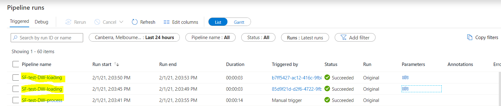
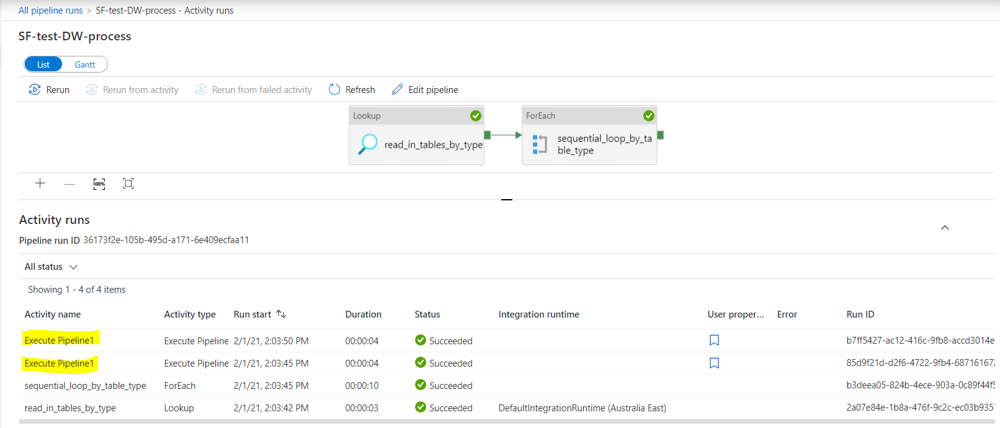
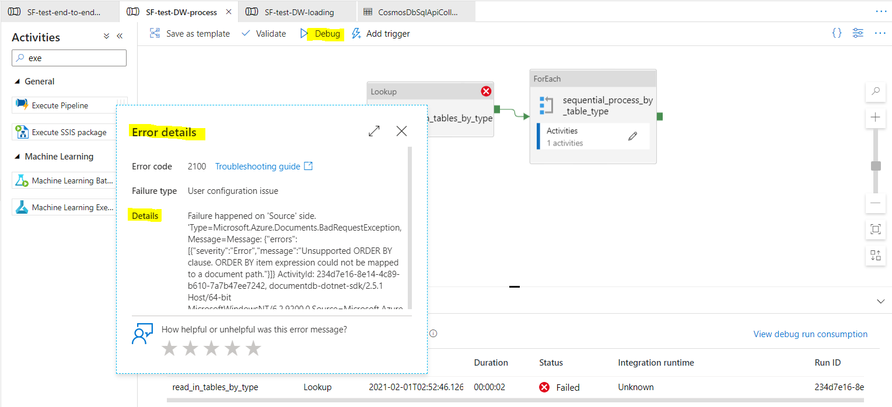
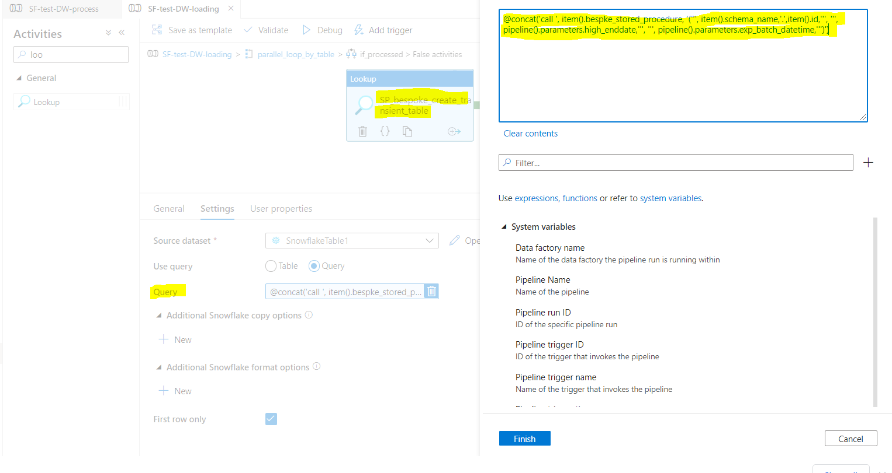
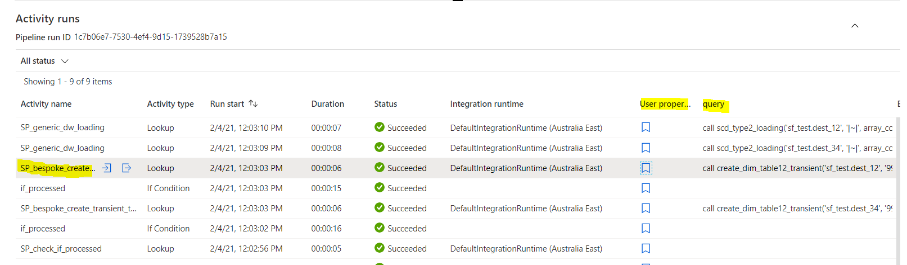

# Data Warehouse Loading Process POC

# Introduction

The following code provides a toy example of performing <a
href="https://vmia.atlassian.net/wiki/spaces/SDI/pages/567148575/Data+Warehouse+Loading+Pattern+Design?focusedCommentId=606732305#comment-606732305"
data-card-appearance="inline"
rel="nofollow">https://vmia.atlassian.net/wiki/spaces/SDI/pages/567148575/Data+Warehouse+Loading+Pattern+Design?focusedCommentId=606732305#comment-606732305</a>
in the <a href="Data_Warehouse_Pipeline_-_3._Process.md"
data-linked-resource-id="469860353" data-linked-resource-version="42"
data-linked-resource-type="page">Data Warehouse Pipeline - 3.
Process</a>.

The **purpose **of the POC is (as stated in
the <a href="https://vmia.atlassian.net/browse/SDID-1479"
rel="nofollow">Jira ticket</a>):

-   SP POC: Can retrieve and prepare **config **that stored procedures
    can directly consume. **output**: config structure that can be
    populated is confirmed

-   SP POC: Can run the stored procedures following the
    proposed **loading pattern**. Combine bespoke transformation with a
    generic SP that handles audit columns and things like update logic.
    Create a real version of how this will work. **output**: stored
    procedure(s) code structure well defined

-   Sequential Dependency POC: When running the pipeline in parallel and
    in sequence for multiple data warehouse tables using config,
    demonstrate the debugging process using ADF Monitor. POC should have
    two loops so we can prove out operating both and debugging where the
    error is the **output**: prove that debugging which SP'S failed and
    how much of the whole pipeline executed is a workable process

<div class="toc-macro rbtoc1639539527114">

-   1 [Introduction](#DataWarehouseLoadingProcessPOC-Introduction)
-   2 [Development
    Process](#DataWarehouseLoadingProcessPOC-DevelopmentProcess)
    -   2.1 [Step 1: Setup Mock
        Tables](#DataWarehouseLoadingProcessPOC-Step1:SetupMockTables)
    -   2.2 [Step 2: Prepare SQL Version of
        Code](#DataWarehouseLoadingProcessPOC-Step2:PrepareSQLVersionofCode)
    -   2.3 [Step 3: Translate SQL Code into Stored
        Procedures](#DataWarehouseLoadingProcessPOC-Step3:TranslateSQLCodeintoStoredProcedures)
    -   2.4 [Step 4: Build the Pipeline in
        ADF](#DataWarehouseLoadingProcessPOC-Step4:BuildthePipelineinADF)
-   3 [Variation to the Original
    Design](#DataWarehouseLoadingProcessPOC-VariationtotheOriginalDesign)
    -   3.1 [Change nested ForEach Loop into ForEach Loop + sub-pipeline
        for the Star Schema
        Pipeline](#DataWarehouseLoadingProcessPOC-ChangenestedForEachLoopintoForEachLoop+sub-pipelinefortheStarSchemaPipeline)
    -   3.2 [Split the Execute Loading Stored Procedure into Three
        Modularised Stored
        Procedure](#DataWarehouseLoadingProcessPOC-SplittheExecuteLoadingStoredProcedureintoThreeModularisedStoredProcedure)
-   4 [Config](#DataWarehouseLoadingProcessPOC-Config)
    -   4.1 [Table Type
        Config](#DataWarehouseLoadingProcessPOC-TableTypeConfig)
    -   4.2 [Table Config](#DataWarehouseLoadingProcessPOC-TableConfig)
-   5 [Development and Debug in
    ADP](#DataWarehouseLoadingProcessPOC-DevelopmentandDebuginADP)
    -   5.1 [Lookup
        Activity](#DataWarehouseLoadingProcessPOC-LookupActivity)
    -   5.2 [ForEach Loop](#DataWarehouseLoadingProcessPOC-ForEachLoop)

</div>

# Development Process

## Step 1: Setup Mock Tables

<div class="code panel pdl" style="border-width: 1px;">

<div class="codeContent panelContent pdl">

``` java
use database <database_name>;
create or replace table <schema_name>.source_1 (
 col1 int,
 col2 string,
 col3 float,
 system_valid_from timestamp,
 system_valid_to timestamp,
 current_flag boolean,
 insert_run_id string,
 update_run_id string,
 record_insert_datetime timestamp,
 record_update_datetime timestamp,
 is_delete_flag boolean,
 exp_batch_datetime timestamp
);

create or replace table <schema_name>.source_2 (
 col1 int,
 col2 string,
 col3 float,
 col4 int,
 system_valid_from timestamp,
 system_valid_to timestamp,
 current_flag boolean,
 insert_run_id string,
 update_run_id string,
 record_insert_datetime timestamp,
 record_update_datetime timestamp,
 is_delete_flag boolean,
 exp_batch_datetime timestamp
);

create or replace table <schema_name>.dest_12 (
 col1 int,
 col12 string,
 col13 float,
 col4 int,
 system_valid_from timestamp,
 system_valid_to timestamp,
 current_flag boolean,
 insert_run_id string,
 update_run_id string,
 record_insert_datetime timestamp,
 record_update_datetime timestamp,
 is_delete_flag boolean,
 exp_batch_datetime timestamp
);

insert into <schema_name>.source_1
  values
  (1, 'abc', 12.23, '2021-01-26 00:00:00.000 -0800'::timestamp, '9999-12-31 00:00:00.000 -0800'::timestamp,1, '1', NULL, '2021-01-27 15:56:26.342 -0800'::timestamp, NULL, 0, '2021-01-26 09:00:00.000 -0800'::timestamp),
  (2, 'cde', 23.451, '2021-01-26 00:00:00.000 -0800'::timestamp, '9999-12-31 00:00:00.000 -0800'::timestamp,1, '1', NULL, '2021-01-27 15:56:26.342 -0800'::timestamp, NULL, 0, '2021-01-26 09:00:00.000 -0800'::timestamp),
  (3, 'dfg', 45.67, '2021-01-26 00:00:00.000 -0800'::timestamp, '9999-12-31 00:00:00.000 -0800'::timestamp,1, '1', NULL, '2021-01-27 15:56:26.342 -0800'::timestamp, NULL, 0, '2021-01-26 09:00:00.000 -0800'::timestamp);

insert into <schema_name>.source_2
  values
  (2, 'cde', 23.45,22, '2021-01-24 10:00:00.000 -0800'::timestamp, '9999-12-31 00:00:00.000 -0800'::timestamp,1,  '1', NULL, '2021-01-27 15:56:26.342 -0800'::timestamp, NULL, 0, '2021-01-25 00:00:00.000 -0800'::timestamp),
  (3, 'dfg', 45.67,33, '2021-01-24 10:00:00.000 -0800'::timestamp, '9999-12-31 00:00:00.000 -0800'::timestamp,1,'1', NULL, '2021-01-27 15:56:26.342 -0800'::timestamp, NULL, 0, '2021-01-25 00:00:00.000 -0800'::timestamp),
  (4, 'hji', 67.89,44, '2021-01-24 10:00:00.000 -0800'::timestamp, '9999-12-31 00:00:00.000 -0800'::timestamp,1,'1', NULL, '2021-01-27 15:56:26.342 -0800'::timestamp, NULL, 0, '2021-01-25 00:00:00.000 -0800'::timestamp);

insert into <schema_name>.dest_12
  values
  (2, 'bbb', 23.45,22, '2021-01-20 10:00:00.000 -0800'::timestamp, '9999-12-31 00:00:00.000 -0800'::timestamp,1,  '0', NULL, '2021-01-21 15:56:26.342 -0800'::timestamp, NULL, 0, '2021-01-21 00:00:00.000 -0800'::timestamp);

create or replace table <schema_name>.dest_34 like <schema_name>.dest_12;
create or replace table <schema_name>.dest_56 like <schema_name>.dest_12;
```

</div>

</div>

## Step 2: Prepare SQL Version of Code

-   Validate SQL code is doing the expected things

<div class="code panel pdl" style="border-width: 1px;">

<div class="codeContent panelContent pdl">

``` java
use database <database_name>;

# create transient table
create transient table temp_1 as  
select a.col1 as col1, a.col2 as col12, a.col3 as col13, b.col4 as col4, a.system_valid_from, b.system_valid_to
, case when b.system_valid_to = '9999-12-31 00:00:00.000 -0800'::timestamp then 1 else 0 end as current_flag
, a.is_delete_flag
from
(select col1, col2, col3, system_valid_from, system_valid_to, is_delete_flag from <schema_name>.source_1 where exp_batch_datetime = '2021-01-26 09:00:00.000 -0800'::timestamp) as a
left join
(select col1, col2, col3, col4, system_valid_from, system_valid_to from <schema_name>.source_2) as b
on a.col1 = b.col1 and (a.system_valid_from < b.system_valid_to and a.system_valid_to >= b.system_Valid_to)
where b.col1 is not NULL


# update outdated records
update <schema_name>.dest_12
set current_flag = 0, system_valid_to = c.system_valid_from, update_run_id = 123, record_update_datetime = current_timestamp()
from (select b.* from 
(select * from <schema_name>.dest_12 where md5(concat_ws('|@|', col1)) in (select md5(concat_ws('|@|', col1)) from temp_1)
and md5(concat_ws('|@|', col12, col13, col4)) not in (select md5(concat_ws('|@|', col12, col13, col4)) from temp_1)
and current_flag = 1) as a
inner join
(select * from temp_1) as b
on a.col1 = b.col1) as c
where <schema_name>.dest_12.current_flag = 1 and <schema_name>.dest_12.col1 = c.col1


# insert existing records with updates and new records
insert into <schema_name>.dest_12
select col1, col12, col13, col4, system_valid_from, system_valid_to, 1 as current_flag
, 11, NULL
, current_timestamp(), NULL
, is_delete_flag
, '2021-01-26 09:00:00.000 -0800'::timestamp
from (
select *
from temp_1 
where md5(concat_ws('|@|', col1)) not in (select md5(concat_ws('|@|', col1)) from <schema_name>.dest_12)
union
select * from temp_1
where md5(concat_ws('|@|', col1)) in (select md5(concat_ws('|@|', col1)) from <schema_name>.dest_12) and
md5(concat_ws('|@|', col12, col13, col4)) not in (select md5(concat_ws('|@|', col12, col13, col4)) from <schema_name>.dest_12)) as a
```

</div>

</div>

## Step 3: Translate SQL Code into Stored Procedures

From SQL to Stored Procedure:

1.  make sure the sql_str is a direct the translation of the SQL code in
    Step 2. Can just return the sql_str from the stored procedure to
    ensure the sql_str is produced properly (execute the returned
    sql_str manually).

2.  parameterise the component associated with runtime (i.e. information
    that only would available during the runtime).

3.  add in all the standard code: execute the sql_str, grab the
    technical metadata, return the object.

4.  clear out the destination table and run the stored procedure, and
    check the output to ensure the stored procedure is doing what’s
    expected.

<div class="code panel pdl" style="border-width: 1px;">

<div class="codeContent panelContent pdl">

``` java
use database <database_name>;
CREATE OR REPLACE PROCEDURE check_if_processed(TABLE_NAME VARCHAR, EXP_BATCH_DATETIME VARCHAR)
  RETURNS string not null
  LANGUAGE JAVASCRIPT
  AS
  $$
  
    var return_obj = {};
  
//  check if the batch has been processed successfully by checking the EXP_BATCH_DATETIME in the destination table by TABLE_NAME
  var sql_str = "select count(*) from " + TABLE_NAME + " where EXP_BATCH_DATETIME = '" + EXP_BATCH_DATETIME + "'::timestamp"
  var response = snowflake.execute({
      sqlText: sql_str,    
  });
  var sf_query_id = response.getQueryId();
  return_obj['sf_query_id'] = sf_query_id;
  return_obj['sql_str'] = sql_str;
  
  var sf_query_output_key = response.getColumnName(1);
  response.next();
  var sf_query_output_value = response.getColumnValue(1);
  return_obj[sf_query_output_key] = sf_query_output_value

  if (sf_query_output_value > 0) {
    return_obj['status'] = "processed"
    return_obj['detail']  = 'Table ' + TABLE_NAME + ' has already succesfully processed batch ' + EXP_BATCH_DATETIME + ' and therefore skip the process.'
    return JSON.stringify(return_obj)
  } else {
    return_obj['status'] = "not yet"
    return_obj['detail']  = 'No record is found in Table ' + TABLE_NAME + ' for batch ' + EXP_BATCH_DATETIME + ' and therefore will process.'
    return JSON.stringify(return_obj)
  }
  $$;

call check_if_processed('<schema_name>.dest_34', '2021-01-26 09:00:00.000 -0800')


CREATE OR REPLACE PROCEDURE create_dim_table12_transient(TABLE_NAME VARCHAR, HIGH_DATETIME VARCHAR, EXP_BATCH_DATETIME VARCHAR)
  RETURNS string not null
  LANGUAGE JAVASCRIPT
  AS
  $$
  
  var return_obj = {};
  
//  create the transient table by applying custom joins and filters
  
  var dest_table_name = TABLE_NAME + "_transient"
  var sql_str = "create or replace transient table " + dest_table_name + " as "
    + "select a.col1 as col1, a.col2 as col12, a.col3 as col13, b.col4 as col4, a.system_valid_from, b.system_valid_to, "
    + "case when b.system_valid_to = '" + HIGH_DATETIME + "'::timestamp then 1 else 0 end as current_flag, a.is_delete_flag "
    + "from (select col1, col2, col3, system_valid_from, system_valid_to, is_delete_flag from <schema_name>.source_1 where exp_batch_datetime = '"
    + EXP_BATCH_DATETIME + "'::timestamp) as a left join "
    + "(select col1, col2, col3, col4, system_valid_from, system_valid_to from <schema_name>.source_2) as b "
    + "on a.col1 = b.col1 and (a.system_valid_from < b.system_valid_to and a.system_valid_to >= b.system_Valid_to) where b.col1 is not NULL"

  var response = snowflake.execute({
      sqlText: sql_str,    
  });
    
//  extract technical metadata from the Snowflake resultSet
  
  var sf_query_id = response.getQueryId();
  return_obj['sf_query_id'] = sf_query_id;
  return_obj['sql_str'] = sql_str;
  
  var sf_query_output_key = response.getColumnName(1);
  response.next();
  var sf_query_output_value = response.getColumnValue(1);
  return_obj['status'] = 'succeeded'
  return_obj['detail'] = sf_query_output_value
    
  return JSON.stringify(return_obj)
  $$;

call create_dim_table12_transient('<schema_name>.dest_12', '9999-12-31 00:00:00.000 -0800', '2021-01-26 09:00:00.000 -0800')


CREATE OR REPLACE PROCEDURE scd_type2_loading(TABLE_NAME VARCHAR, HASH_DELIMITER VARCHAR, PRIMARY_KEY_LIST ARRAY, ATTR_COL_LIST ARRAY, RUN_ID STRING, EXP_BATCH_DATETIME VARCHAR)   //procedure call the above procedure
  RETURNS string not null
  LANGUAGE JAVASCRIPT
  AS
  $$
  
  var return_obj = {};
  
//  String preparation
   
   var temp_table_name = TABLE_NAME + "_transient"
   var PRIMARY_KEY_STR = PRIMARY_KEY_LIST.join(',')
   var ATTR_COL_STR = ATTR_COL_LIST.join(',')
   
   var ON_string_pattern = 'a.<key> = b.<key>'
   var ON_string_list = PRIMARY_KEY_LIST.map(function(e) { 
      var r = ON_string_pattern.replace(/<key>/g, e); // /../g: global replacement
      return r;
    });
   var On_string = ON_string_list.join(' and ')
   
   var WHERE_string_pattern = '<dest_table>.<key> = c.<key>'
   var WHERE_string_list = PRIMARY_KEY_LIST.map(function(e) { 
      var r = WHERE_string_pattern.replace('<dest_table>', TABLE_NAME).replace(/<key>/g, e);
      return r;
    });
   var WHERE_string = WHERE_string_list.join(' and ');


//  update outdated records
  
  var sql_str = "update " + TABLE_NAME + " set current_flag = 0, system_valid_to = c.system_valid_from, update_run_id = '" + RUN_ID + "', record_update_datetime = current_timestamp() "
    + "from (select b.* from "
    + "(select * from " + TABLE_NAME + " where md5(concat_ws('" + HASH_DELIMITER + "', " + PRIMARY_KEY_STR + ")) in (select md5(concat_ws('" + HASH_DELIMITER + "', " + PRIMARY_KEY_STR + ")) from " + temp_table_name + ") "
    + "and md5(concat_ws('" + HASH_DELIMITER + "', " + ATTR_COL_STR + ")) not in (select md5(concat_ws('" + HASH_DELIMITER + "', " + ATTR_COL_STR + ")) from " + temp_table_name + ") and current_flag = 1) as a "
    + "inner join (select * from " + temp_table_name + ") as b "
    + "on " + On_string + ") as c "
    + "where " + TABLE_NAME + ".current_flag = 1 and " + WHERE_string;

  var response = snowflake.execute({
      sqlText: sql_str,    
  });
    
//  extract technical metadata from the Snowflake resultSet
  
  var sf_query_id = response.getQueryId();
  return_obj['update_records'] = {}
  return_obj['update_records']['sf_query_id'] = sf_query_id;
  return_obj['update_records']['sql_str'] = sql_str;
  
  var sf_query_output_key = response.getColumnName(1);
  response.next();
  var sf_query_output_value = response.getColumnValue(1);
  return_obj['update_records'][sf_query_output_key] = sf_query_output_value;
  
  
//  insert existing records with updates and new records
  var sql_str = "insert into " + TABLE_NAME
    + " SELECT " + PRIMARY_KEY_STR + ', ' + ATTR_COL_STR + ", system_valid_from, system_valid_to, 1 as current_flag"
    + ", '" + RUN_ID + "', NULL"
    + ", current_timestamp(), NULL"
    + ", is_delete_flag"
    + ", '" + EXP_BATCH_DATETIME + "'::timestamp "
    + "from (select * from " + temp_table_name
    + " where md5(concat_ws('" + HASH_DELIMITER + "', " + PRIMARY_KEY_STR + ")) not in (select md5(concat_ws('" + HASH_DELIMITER + "', " + PRIMARY_KEY_STR +")) from " + TABLE_NAME + ") "
    + "union "
    + "select * from " + temp_table_name
    + " where md5(concat_ws('" + HASH_DELIMITER + "', " + PRIMARY_KEY_STR + ")) in (select md5(concat_ws('" + HASH_DELIMITER + "', " + PRIMARY_KEY_STR + ")) from " + TABLE_NAME + ") and "
    + "md5(concat_ws('" + HASH_DELIMITER + "', " + ATTR_COL_STR + ")) not in (select md5(concat_ws('" + HASH_DELIMITER + "', " + ATTR_COL_STR + ")) from " + TABLE_NAME + ")) as a";

  var response = snowflake.execute({
      sqlText: sql_str,    
  });
    
//  extract technical metadata from the Snowflake resultSet
  
  var sf_query_id = response.getQueryId();
  return_obj['insert_records'] = {}
  return_obj['insert_records']['sf_query_id'] = sf_query_id;
  return_obj['insert_records']['sql_str'] = sql_str;
  
  var sf_query_output_key = response.getColumnName(1);
  response.next();
  var sf_query_output_value = response.getColumnValue(1);
  return_obj['insert_records'][sf_query_output_key] = sf_query_output_value;
  
  return_obj['status'] = 'succeeded'
  return_obj['detail'] = 'Table ' + TABLE_NAME + ' has successfully performed upsert for batch ' + EXP_BATCH_DATETIME + '. '
  return JSON.stringify(return_obj)
  $$;
    
    
call scd_type2_loading('<schema_name>.dest_34', '|@|',array_construct('col1'), array_construct('col12', 'col13', 'col4'),'a6d012ba-2156-4993-97ba-2cfbbff120af', '2021-01-26 09:00:00.000 -0000')
```

</div>

</div>

The relationship between tables in the POC is as follow:

<div
id="ap-com.mxgraph.confluence.plugins.diagramly__drawio8777835324649292872"
class="ap-container">

<div
id="embedded-com.mxgraph.confluence.plugins.diagramly__drawio8777835324649292872"
class="ap-content">

</div>

</div>

## Step 4: Build the Pipeline in ADF

-   For the purpose of POC, we only build the most complicated section
    the **Star Schema Pipeline** in which there are two ForEach loops
    running in sequence and/or parallel.

    -   

        In **ADF** (refer to <a
        href="https://vmia.atlassian.net/wiki/spaces/SDI/pages/606765065/Data+Warehouse+Loading+Process+POC#Variation-to-the-Original-Design"
        data-card-appearance="inline"
        rel="nofollow">https://vmia.atlassian.net/wiki/spaces/SDI/pages/606765065/Data+Warehouse+Loading+Process+POC#Variation-to-the-Original-Design</a>
        for variations in implementation based on the initial design)

<div
id="ap-com.mxgraph.confluence.plugins.diagramly__drawio7376793550508436894"
class="ap-container">

<div
id="embedded-com.mxgraph.confluence.plugins.diagramly__drawio7376793550508436894"
class="ap-content">

</div>

</div>

-   This step takes **most of the time** to design the suitable config
    structure, use parameters to propagate dynamic values, check the
    output, and construct dynamic CosmosDB SQL queries and Snowflake
    stored procedure calling queries.

-   There are **two pain points** for this step:

    -   **Check the value** of a parameter, output of an activity,
        dynamic values. To address this, we leverage **User
        Properties**. You can use it display query and input in the log.
        Recommend to use User Properties for all primary activities.

        -   

        -   As **constructing a dynamic query** requires concatenating
            short strings and parameters together, the **escaping
            quotes** can be handled differently for different queries.

            -   for **CosmosDB query**, because there is no
                differentiation between double and single quote, and in
                ADF expression string needs to wrap around in single
                quote, we can use **double quotes to avoid escaping
                quotes**:

            -   <div class="code panel pdl" style="border-width: 1px;">

                <div class="codeContent panelContent pdl">

                ``` java
                # a cosmosDB query
                select * from c where c.table_type = 'dim' order by c.sequence_by_table

                # the dynamic query string in ADF (note that the single quotes in the above query need to be changed to double quotes as shown below)
                @concat('select * from c where c.table_type = "',item().id, '"', ' order by c.sequence_by_table')
                ```

                </div>

                </div>

            -   For **Snowflake query**, because the double-quoted
                string is case sensitive and double quotes and single
                quotes are used differently, and in ADF expression
                string needs to wrap around in single quote, we need to
                use **two single quotes to escape quotes**.

                -   <div class="code panel pdl"
                    style="border-width: 1px;">

                    <div class="codeContent panelContent pdl">

                    ``` java
                    # a snowflake query
                    call create_dim_dest_12_transient('schema1.dim_dest_12_transient'
                    , '9999-12-31 00:00:00.000 -0800'
                    , '2021-01-21 15:56:26.342 -0800')

                    # the dynamic query string in ADF
                    @concat('call '
                    , item().bespke_stored_procedure
                    , '(''', item().schema_name,'.',item().id,'''
                    , ''', pipeline().parameters.high_enddate,'''
                    , ''', pipeline().parameters.exp_batch_datetime,''')')
                    ```

                    </div>

                    </div>

                -   Determine the right number of single quotes can get
                    quite complicated in terms of how many single quotes
                    to have. One way to improve the developer experience
                    is to (as shown in the example) to **bring each
                    value to its separate row** to have a clear
                    boundary. Also, **leverage the expression editor
                    built in the ADF** to validate the syntax and inform
                    if any missing or extra single quotes.

# Variation to the Original Design

## Change nested ForEach Loop into ForEach Loop + sub-pipeline for the Star Schema Pipeline

ADF doesn’t support nested ForEach Loop as in the design for the Star
Schema Pipeline. A workaround is to put the 2nd ForEach Loop into a
sub-pipeline. The first ForEach Loop will use the Execute Pipeline
Activity to invoke the sub-pipeline. **Note**: to establish the Azure
Monitor Log traceability, include the sub-pipeline name into the name of
the Execute Pipeline Activity. See the screenshot below where the
Execute Pipeline Activity name doesn’t contain the traceable name.



## Split the Execute Loading Stored Procedure into Three Modularised Stored Procedure

As illustrated in the design diagram and the implementation pipeline
graph (in section <a
href="https://vmia.atlassian.net/wiki/spaces/SDI/pages/606765065/Data+Warehouse+Loading+Process+POC#Step-4%3A-Build-the-Pipeline-in-ADF"
rel="nofollow"><strong>Step 4: Build the Pipeline in ADF</strong></a>),
the implementation split the proposed initially one stored procedure
into three:

-   **check_if_process**: check whether there is any record in the
    destination table with the same EXP_BATCH_DATETIME.

-   **bespoke_create_transient**: apply bespoke joins and filters and
    create a transient table which contains the delta snapshot of the
    current batch. This activity **calls different stored
    procedures** based on the name of the destination table.

-   **generic_dw_loading**: perform a type2 loading of data from the
    transient data into the destination table.

The **advantage** of this split is that the main logic is surfaced to
the ADF pipeline. Each stored procedure only performs a straightforward
procedure, making the code more manageable and swappable (for different
destination tables, swap in different bespoke_create_transient code).

# Config

## Table Type Config

This is to record the mapping between table type and their sequence.
Each item is per type.

<div class="code panel pdl" style="border-width: 1px;">

<div class="codeContent panelContent pdl">

``` java
{
  "id": "fact",
  "sequence_by_type": 2,
  "stored_procedure": {
      "processed_check_sp": "check_if_processed",
      "table_loading_sp": "scd_type2_loading"
  }
}
```

</div>

</div>

## Table Config

This is to record the parameters for stored procedures of each data
warehouse table and their execution sequence. Each item is per table.

<div class="code panel pdl" style="border-width: 1px;">

<div class="codeContent panelContent pdl">

``` java
{
  "id": "dest_56",
  "table_type": "fact",
  "schema_name": "<schema_name>",
  "sequence_by_table": 1,
  "bespke_stored_procedure": "create_fact_table_56_transient",
  "primary_key_list": [
      "col1"
  ],
  "attr_col_list": [
      "col12",
      "col13",
      "col4"
  ]
}
```

</div>

</div>

**Note**:

-   If possible, incorporate this config into an existing config to
    reduce the number of configs.

-   Have considered incorporating the Table Type Config into the Table
    Config and using a GROUP BY and ORDER BY to achieve the same result.
    However, Azure CosmosDB doesn’t support using GROUP BY and ORDER BY
    together.

# Development and Debug in ADP

## Lookup Activity

One of the uses of Lookup Activity is to retrieve config information
from the CosmosDB using SQL query. One way to develop the query is to
leverage the editing UI in CosmosDB. You can use the Debug function in
ADF (as shown in the screenshot below). The Error details would return
the message you would see in the system you’re directly interacting
with.



## ForEach Loop

The use of the ForEach Loop is to run multiple activities or
sub-pipelines in parallel. To reveal what values got passed on in each
iteration in a loop, can use User Properties and cast the value to
String.


Run the pipeline using Add Trigger, and check the Azure Monitor log. The
defined the User Property field will show the value. Add the User
Property field to the table if you a long list of activities
(unfortunately you have to do it every time).


User Properties is also a useful tool to display any dynamic queries.



In the Azure Monitor Log,



<div class="pageSectionHeader">

## Attachments:

</div>

<div class="greybox" align="left">


[image-20210201-025554.png](attachments/606765065/615219258.png)
(image/png)  

[image-20210201-030218.png](attachments/606765065/606404887.png)
(image/png)  

[image-20210201-030409.png](attachments/606765065/615317558.png)
(image/png)  

[image-20210201-030519.png](attachments/606765065/606241138.png)
(image/png)  

[image-20210201-031439.png](attachments/606765065/615284805.png)
(image/png)  

[image-20210201-031518.png](attachments/606765065/615448644.png)
(image/png)  

[image-20210203-041616.png](attachments/606765065/621478199.png)
(image/png)  

[image-20210203-041736.png](attachments/606765065/621609217.png)
(image/png)  

[image-20210203-043816.png](attachments/606765065/621478234.png)
(image/png)  

[\~drawio\~5dc205aeb6e6b50c58aeca8b\~ADF_DW_POC.svg.tmp](attachments/606765065/621478268.tmp)
(application/vnd.jgraph.mxfile)  

[\~drawio\~5dc205aeb6e6b50c58aeca8b\~ADF_DW_POC.svg.tmp](attachments/606765065/621019551.tmp)
(application/vnd.jgraph.mxfile)  

[\~drawio\~5dc205aeb6e6b50c58aeca8b\~ADF_DW_POC.svg.tmp](attachments/606765065/621543804.tmp)
(application/vnd.jgraph.mxfile)  

[\~drawio\~5dc205aeb6e6b50c58aeca8b\~ADF_DW_POC.svg.tmp](attachments/606765065/621379921.tmp)
(application/vnd.jgraph.mxfile)  

[\~drawio\~5dc205aeb6e6b50c58aeca8b\~ADF_DW_POC.svg.tmp](attachments/606765065/621379930.tmp)
(application/vnd.jgraph.mxfile)  

[\~drawio\~5dc205aeb6e6b50c58aeca8b\~ADF_DW_POC.svg.tmp](attachments/606765065/621445520.tmp)
(application/vnd.jgraph.mxfile)  

[\~drawio\~5dc205aeb6e6b50c58aeca8b\~ADF_DW_POC.svg.tmp](attachments/606765065/621642082.tmp)
(application/vnd.jgraph.mxfile)  

[\~drawio\~5dc205aeb6e6b50c58aeca8b\~ADF_DW_POC.svg.tmp](attachments/606765065/621118012.tmp)
(application/vnd.jgraph.mxfile)  

[\~drawio\~5dc205aeb6e6b50c58aeca8b\~ADF_DW_POC.svg.tmp](attachments/606765065/621118021.tmp)
(application/vnd.jgraph.mxfile)  

[\~drawio\~5dc205aeb6e6b50c58aeca8b\~ADF_DW_POC.svg.tmp](attachments/606765065/621576620.tmp)
(application/vnd.jgraph.mxfile)  

[ADF_DW_POC.svg](attachments/606765065/621576655.svg)
(application/vnd.jgraph.mxfile)  

[ADF_DW_POC.svg.png](attachments/606765065/621412682.png) (image/png)  

[\~drawio\~5dc205aeb6e6b50c58aeca8b\~DW_POC_tables.svg.tmp](attachments/606765065/624493246.tmp)
(application/vnd.jgraph.mxfile)  

[\~drawio\~5dc205aeb6e6b50c58aeca8b\~DW_POC_tables.svg.tmp](attachments/606765065/624624275.tmp)
(application/vnd.jgraph.mxfile)  

[\~drawio\~5dc205aeb6e6b50c58aeca8b\~DW_POC_tables.svg.tmp](attachments/606765065/624493259.tmp)
(application/vnd.jgraph.mxfile)  

[\~drawio\~5dc205aeb6e6b50c58aeca8b\~DW_POC_tables.svg.tmp](attachments/606765065/624460404.tmp)
(application/vnd.jgraph.mxfile)  

[\~drawio\~5dc205aeb6e6b50c58aeca8b\~DW_POC_tables.svg.tmp](attachments/606765065/624624284.tmp)
(application/vnd.jgraph.mxfile)  

[\~drawio\~5dc205aeb6e6b50c58aeca8b\~DW_POC_tables.svg.tmp](attachments/606765065/624591550.tmp)
(application/vnd.jgraph.mxfile)  

[\~drawio\~5dc205aeb6e6b50c58aeca8b\~DW_POC_tables.svg.tmp](attachments/606765065/624460413.tmp)
(application/vnd.jgraph.mxfile)  

[\~drawio\~5dc205aeb6e6b50c58aeca8b\~DW_POC_tables.svg.tmp](attachments/606765065/624755178.tmp)
(application/vnd.jgraph.mxfile)  

[\~drawio\~5dc205aeb6e6b50c58aeca8b\~DW_POC_tables.svg.tmp](attachments/606765065/624525984.tmp)
(application/vnd.jgraph.mxfile)  

[\~drawio\~5dc205aeb6e6b50c58aeca8b\~DW_POC_tables.svg.tmp](attachments/606765065/624362265.tmp)
(application/vnd.jgraph.mxfile)  

[DW_POC_tables.svg](attachments/606765065/624591568.svg)
(application/vnd.jgraph.mxfile)  

[DW_POC_tables.svg.png](attachments/606765065/624722336.png)
(image/png)  

[\~drawio\~5dc205aeb6e6b50c58aeca8b\~DW_POC_tables.svg.tmp](attachments/606765065/624361502.tmp)
(application/vnd.jgraph.mxfile)  

[\~DW_POC_tables.svg.tmp](attachments/606765065/624494006.tmp)
(application/vnd.jgraph.mxfile)  

[DW_POC_tables.svg](attachments/606765065/624592179.svg)
(application/vnd.jgraph.mxfile)  

[DW_POC_tables.svg.png](attachments/606765065/624362832.png)
(image/png)  

[image-20210204-014833.png](attachments/606765065/624755366.png)
(image/png)  

[image-20210204-014914.png](attachments/606765065/624755374.png)
(image/png)  

[image-20210204-015029.png](attachments/606765065/624722550.png)
(image/png)  

[\~DW_POC_tables.svg.tmp](attachments/606765065/624591563.tmp)
(application/vnd.jgraph.mxfile)  

[DW_POC_tables.svg](attachments/606765065/624394947.svg)
(application/vnd.jgraph.mxfile)  

[DW_POC_tables.svg.png](attachments/606765065/624329345.png)
(image/png)  

</div>
