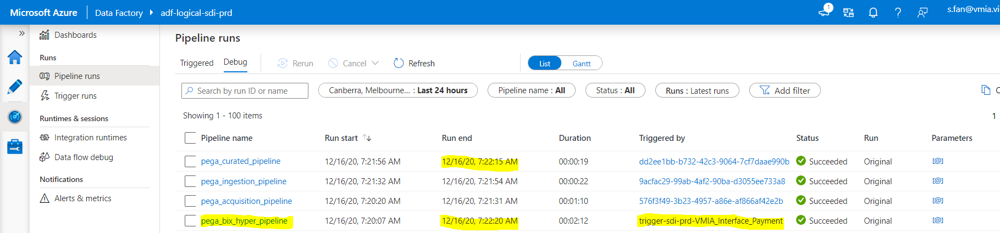
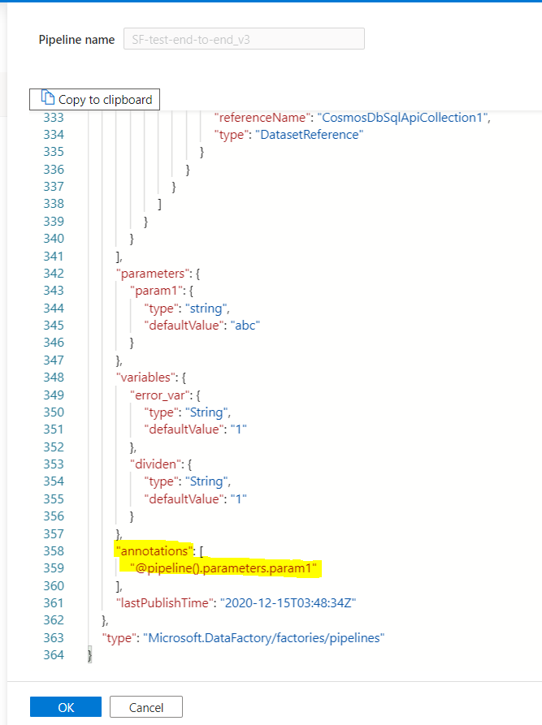
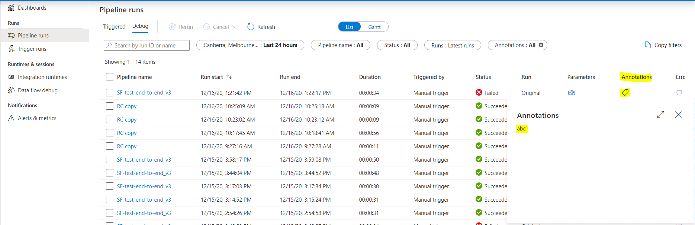
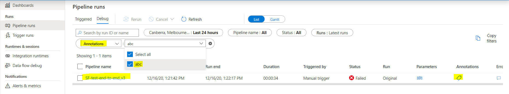
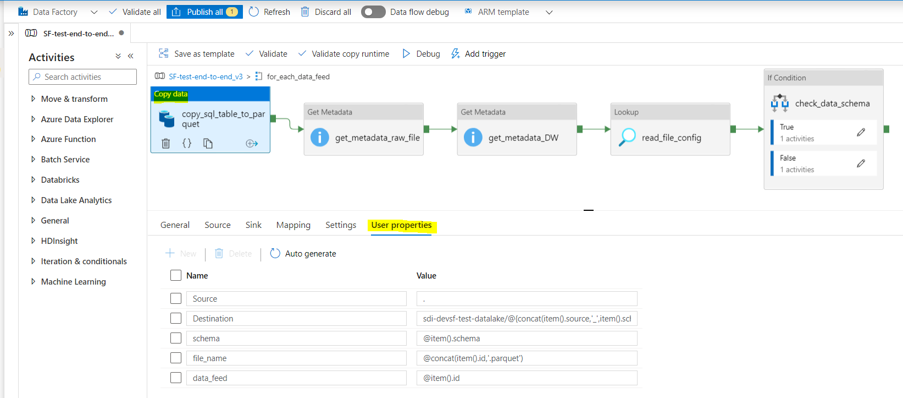
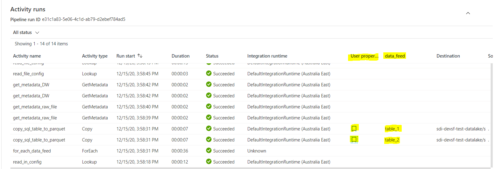

# Data Warehouse Pipeline - 3. Process

# Introduction

This documentation records possible process designs for the data
warehouse pipeline. Processes generally follow the same pattern as the
Data Lake Hyper Pipeline, conceptually organise activities in a
meaningful way, and are designed to be simple and generic. Therefore,
ForEach loops, parameters and activity outputs are used in the solution
to make the pipelines config-driven with runtime dynamic values.
Annotation and User Properties are leveraged to provide additional
metadata of the pipeline runs and bring transparency when monitoring.

<div class="toc-macro rbtoc1639539305343">

-   1 [Introduction](#DataWarehousePipeline-3.Process-Introduction)
-   2 [Process Diagram](#DataWarehousePipeline-3.Process-ProcessDiagram)
    -   2.1 [High-level
        Overview](#DataWarehousePipeline-3.Process-High-levelOverview)
        -   2.1.1 [Description of the
            processes:](#DataWarehousePipeline-3.Process-Descriptionoftheprocesses:)
    -   2.2 [Data Warehouse Process
        Structure](#DataWarehousePipeline-3.Process-DataWarehouseProcessStructure)
    -   2.3 [Low-level Process
        Diagram](#DataWarehousePipeline-3.Process-Low-levelProcessDiagram)
        -   2.3.1 [Description of the
            process:](#DataWarehousePipeline-3.Process-Descriptionoftheprocess:)
    -   2.4 [Handling Various
        Scenario](#DataWarehousePipeline-3.Process-HandlingVariousScenario)
        -   2.4.1 [ADF Monitor and Pipeline
            Debug](#DataWarehousePipeline-3.Process-ADFMonitorandPipelineDebug)
-   3 [Meeting to review Design for pipeline dependencies in pipelines
    or configValidation with
    VMIA](#DataWarehousePipeline-3.Process-MeetingtoreviewDesignforpipelinedependenciesinpipelinesorconfigValidationwithVMIA)
    -   3.1 [Using config to describe table dependencies vs. embedding
        the dependencies in pipeline
        sequence](#DataWarehousePipeline-3.Process-Usingconfigtodescribetabledependenciesvs.embeddingthedependenciesinpipelinesequence)

</div>

# Process Diagram

## High-level Overview

<div
id="ap-com.mxgraph.confluence.plugins.diagramly__drawio7395275711541834257"
class="ap-container">

<div
id="embedded-com.mxgraph.confluence.plugins.diagramly__drawio7395275711541834257"
class="ap-content">

</div>

</div>

### Description of the processes:

The **Data Lake Hyper Pipeline** consists of components from **DL1 to
DL5** (for detailed views, please refer to
<a href="https://vmia.atlassian.net/wiki/spaces/SDI/pages/257884214"
data-linked-resource-id="257884214" data-linked-resource-version="40"
data-linked-resource-type="page">ADF Hyper Pipeline - XML (PEGA)</a>,
<a href="https://vmia.atlassian.net/wiki/spaces/SDI/pages/424116229"
data-linked-resource-id="424116229" data-linked-resource-version="23"
data-linked-resource-type="page">ADF Hyper Pipeline - File Server (Risk
Console)</a>, and
<a href="https://vmia.atlassian.net/wiki/spaces/SDI/pages/437190686"
data-linked-resource-id="437190686" data-linked-resource-version="10"
data-linked-resource-type="page">ADF Hyper Pipeline - DB Pull (Client
Connect/IDR2)</a>). For the Data Warehouse Hyper Pipeline, two options
are proposed. **Option A** is a more complicated version with a Data
Vault included in the scope, while **Option B** only contains a star
schema consumption layer. The Data Warehouse Hyper Pipeline will be
triggered by a scheduled trigger, rather than by the successful finish
of the Data Lake Hyper Pipeline. If the Data Warehouse Hyper Pipeline
will wake up every time a curated table is updated (i.e. a data feed is
ingested into the data lake), it would create many log items in the ADF
monitor but only a small subset of them would have actual execution when
dependency conditions are met. For more detail about the Data Warehouse
Hyper Pipeline, please refer to <a
href="https://vmia.atlassian.net/wiki/spaces/SDI/pages/469860353/Data+Warehouse+Pipeline+-+3.+Process#Low-level-Process-Diagram"
rel="nofollow">Low-level Process Diagram</a>. An additional feature in
the future that could be implemented would be an external orchestrator
function which monitored all data lake pipelines and triggered the data
warehouse pipeline as soon as the upstream data lake loads are finished

## Data Warehouse Process Structure

<div class="table-wrap">

<table class="confluenceTable" data-layout="default">
<tbody>
<tr class="header">
<th class="confluenceTh"></th>
<th class="confluenceTh"><p><strong>Use one generic pipeline to run all
data warehouse loads in ADF</strong> RECOMMENDED</p></th>
<th class="confluenceTh"><p><strong>Use individual pipelines to run
different data warehouse loads in ADF</strong></p></th>
</tr>

<tr class="odd">
<td class="confluenceTd"><p>Description</p></td>
<td class="confluenceTd"><p>Each data lake pipeline associates with a
source system. All the data lake pipelines are upstream of a generic
data warehouse pipeline for loading into data warehouse tables. <a
href="https://vmia.atlassian.net/wiki/spaces/SDI/pages/469860353/Data+Warehouse+Pipeline+-+3.+Process#ADF-Monitor-and-Pipeline-Debug"
rel="nofollow">Using Annotation and User Properties</a> can provide
additional metadata to assist monitoring what is running in the data
warehouse pipeline</p>
<div
id="ap-com.mxgraph.confluence.plugins.diagramly__drawio1537456600513734423"
class="ap-container">
<div
id="embedded-com.mxgraph.confluence.plugins.diagramly__drawio1537456600513734423"
class="ap-content">

</div>
</div></td>
<td class="confluenceTd"><p>Each data lake pipeline associates with a
source system. Because a data warehouse load usually would require more
than one table, a data warehouse hyper pipeline can be organised based
on loads to a particular domain, e.g. account, policy, claim, etc.</p>
<div
id="ap-com.mxgraph.confluence.plugins.diagramly__drawio8209484584412575162"
class="ap-container">
<div
id="embedded-com.mxgraph.confluence.plugins.diagramly__drawio8209484584412575162"
class="ap-content">

</div>
</div></td>
</tr>
<tr class="even">
<td class="confluenceTd"><p>Advantages</p></td>
<td class="confluenceTd"><ul>
<li><p>Minimum ADF configuration work is required as only one generic
Data Warehouse Hyper Pipeline to define.</p></li>
<li><p>The Data Warehouse Hyper Pipeline will be config-driven.</p></li>
</ul></td>
<td class="confluenceTd"><ul>
<li><p>Allow for variations within each Data Warehouse Hyper
Pipeline.</p></li>
<li><p>The Data Warehouse Hyper Pipeline can support both config-driven
and using static values.</p></li>
</ul></td>
</tr>
<tr class="odd">
<td class="confluenceTd"><p>Disadvantages</p></td>
<td class="confluenceTd"><ul>
<li><p>Assume a generic pattern for the Data Warehouse Hyper
Pipeline.</p></li>
</ul></td>
<td class="confluenceTd"><ul>
<li><p>More ADF configuration work as more Data Warehouse Hyper
Pipelines to define.</p></li>
<li><p>The Data Warehouse Hyper Pipeline will have some hard-coded
values.</p></li>
</ul></td>
</tr>
</tbody>
</table>

</div>

## Low-level Process Diagram

<div
id="ap-com.mxgraph.confluence.plugins.diagramly__drawio4822298707651272471"
class="ap-container">

<div
id="embedded-com.mxgraph.confluence.plugins.diagramly__drawio4822298707651272471"
class="ap-content">

</div>

</div>

### Description of the process:

1.  A **schedule trigger** starts the **Data Warehouse Hyper
    Pipeline** and the **Data Vault Pipeline**. Using the schedule
    trigger avoids the Checkpoint function needing to wake up the hyper
    pipeline many times after each curated load finishes, and only a few
    lead to execution (as no executions can happen until all
    dependencies are met.. This can make the monitoring more manageable.
    an extension of this would be to remove the scheduled trigger and
    track the state of curated loads in an external orchestration
    component.

2.  Start the **Checkpoint function (azure function activity)** to check
    dependencies.

    1.  Retrieve rules on the dependency check.

    2.  Retrieve the status of the last run of the Data Warehouse Hyper
        Pipeline and the status of the Data Lake Hyper Pipelines in the
        current period from the Log Analytics.

    3.  Set up number of **Retry** and Retry Interval to provide leeway
        when the Data Lake Hyper Pipeline takes a bit longer to finish.

3.  **Apply the dependency rules** to the pipeline status. There are two
    types of rules to apply: 1) pipeline dependency on the status of the
    last run of the Data Warehouse Hyper Pipeline, and 2) table
    dependency on what curated tables have been updated to load to one
    or more data vault tables. The table dependency check will inform
    what data vault tables can be updated.

    1.  Raise an error in the Data Vault Pipeline and hence Data
        Warehouse Hyper Pipeline when any of the dependency rules isn’t
        met.

    2.  Trigger the next function and pass on a list of finished data
        feed name. In the first version of this there will be an all or
        nothing approach. No progression of the DW pipeline unless all
        tables are finished, if this proves too likely to stop the DW
        pipeline, then more granular dependencies can be set. **Note**:
        For easy tracking what data feeds are supposed to run, augment
        existing data feed config by adding a switch field to indicate
        if a data feed is switched ON or OFF. When a data feed is
        switched back on after a period of down time, the data feed can
        be switched on and processed back-fill manually. This will
        result in re-processing other data feeds that are ON the whole
        time. Due to the usage of the **expected batch time field**
        already loaded tables will be skipped during backfill

4.  Start the **Read loading job config Lookup activity**. With the data
    vault table names returned by the Checkpoint function (use the
    **table_list** in the where clause of the cosmosDB query), retrieve
    the parameters needed for loading each data vault table using the
    data vault stored procedure(s) and put them into a list for all data
    vault tables. **Note**: The checkpoint function output object is a
    generic output. Table_type is used to further organise the tables if
    needed as in step 11 to support sequential loading. Since data vault
    loading isn’t sequential, we only need one item in the output object
    to spit out the data vault table names.

    1.  <div class="code panel pdl" style="border-width: 1px;">

        <div class="codeContent panelContent pdl">

        ``` java
        # Input list from the checkpoint function:
        [
            {"table_type": "data vault", "table_list": ["table_1", "table_2"]}
        ]
        ```

        </div>

        </div>

5.  Pass the list of parameters for loading into each data vault table
    into the **forEach loop activity**. Each item/iteration is to load
    one or multiple curated tables into one data vault table. Because
    there is no dependency between data vault tables, loading can be
    done **in parallel**. ForEach parallellism will be used to balance
    between throughput and compute requirements

    1.  <div class="code panel pdl" style="border-width: 1px;">

        <div class="codeContent panelContent pdl">

        ``` java
        # Input list to the loop:
        [
            {"table_table": "table_1", "parameters": {"sp_name": "sp_1".....}},
            {"table_table": "table_2", "parameters": {"sp_name": "sp_2".....}}
        ]
        ```

        </div>

        </div>

6.  Within the loop for each iteration, pass parameters to the **data
    vault loading stored procedure** to load into one data vault table.

7.  The stored procedure is triggered via the **Lookup activity** in
    ADF. It can be one generic stored procedure with different sections
    to load hub, satellite, and link table, or a main stored procedure
    that call individual stored procedures to load different tables
    based on the loading pattern and table type. In the **Parameters**
    field from the config, there is a **sp_name** field, which is used
    to call a stored procedure, which can be a generic or bespoke stored
    procedure.

    1.  Grab and manipulate data from one or more tables from the
        curated layer. See more details in
        <a href="Data_Warehouse_Loading_Pattern_Design"
        data-linked-resource-id="567148575" data-linked-resource-version="21"
        data-linked-resource-type="page">Data Warehouse Loading Pattern
        Design</a>

    2.  Ingest data into one data vault table. See more details in
        <a href="Data_Warehouse_Loading_Pattern_Design"
        data-linked-resource-id="567148575" data-linked-resource-version="21"
        data-linked-resource-type="page">Data Warehouse Loading Pattern
        Design</a>

8.  If the Data Vault Pipeline successfully executes for all tables,
    trigger the **Star Schema Pipeline**.

9.  Start the **Checkpoint function (azure function activity)** to check
    dependencies.

    1.  Retrieve rules on the dependency check.

    2.  Retrieve the status of the last run of the Data Warehouse Hyper
        Pipeline from Log Analytics. This 2nd check is more to ensure
        when we need to rerun the Star Schema Pipeline manually, all the
        expected data vault tables are updated for a given period.
        **Note**: The dependency rules between tables need to entail two
        type of dependencies:

        1.  dependency between data vault/curated tables and star schema
            tables

        2.  dependency between dimension, linked and fact tables

10. **Apply the dependency rules** to the pipeline status. There are two
    types of rules to apply: 1) pipeline dependency on the status of the
    last run of the Data Warehouse Hyper Pipeline, and 2) table
    dependency on what data vault tables have been updated to load to
    one or more star schema tables. The table dependency check will
    inform what star schema tables can be updated and their table type.

    1.  Raise an error in the Star Schema Pipeline and hence Data
        Warehouse Hyper Pipeline when any of the dependency rules isn’t
        met.

    2.  Trigger the next function and pass on a list of finished data
        vault table names.

11. The **first forEach loop activity** will unpack the top level of the
    list at **table type level** and run in **sequential**: loading into
    all dimension tables, then bridge tables and lastly the fact tables.
    Each item contains parameters for loading jobs for one type of table
    (e.g. dimension). Each item used for iteration will be the star
    schema table list per table type. Items need to be organised in the
    following **order in the list**: dimension → bridge → fact.

    1.  <div class="code panel pdl" style="border-width: 1px;">

        <div class="codeContent panelContent pdl">

        ``` java
        # Input list to the 1st loop:
        [
            {"table_type": "dimension", "table_list": ["table_1", "table_2"]},
            {"table_type": "fact", "table_list": ["table_3", "table_4"]}
        ]
        ```

        </div>

        </div>

12. Within the first loop, start the **Read loading job config Lookup
    activity** to retrieve parameters used by a stored procedure for all
    the star schema tables in the table list of a table type.

    1.  <div class="code panel pdl" style="border-width: 1px;">

        <div class="codeContent panelContent pdl">

        ``` java
        # an illustrative example fo demonstrate how to use concat and join to incorporate a list in the WHERE clause of the cosmosDB query
        @concat('select * from c where c.table_name in ("', join(activity('read_in_config').output.value[0].table_list,'","'),'")')
        ```

        </div>

        </div>

13. A list of parameters passes over to the second loop. The **second
    forEach loop** **activity** will unpack the list at **the individual
    loading job level**. All the jobs can be run **in parallel or in
    sequence**. Each item contains parameters for one loading job for
    one table. The **sequence** field is optional if there is any
    **dependency** between tables within one table type.

    1.  <div class="code panel pdl" style="border-width: 1px;">

        <div class="codeContent panelContent pdl">

        ``` java
        # Input list to the 2nd loop for dimension table type:
        [
            {"table_table": "table_1", "sequence": 1, parameters": {"sp_name": "sp_1".....}},
            {"table_table": "table_2", "sequence": 2, "parameters": {"sp_name": "sp_2".....}}
        ]
        ```

        </div>

        </div>

14. Within the loop for each iteration, pass parameters to the **star
    schema loading stored procedure** to load into one star schema
    table.

15. The stored procedure is triggered via the **Lookup activity** in ADF
    and can call stored procedure dynamically. The stored procedure(s)
    can be generic to load for one type of tables (e.g. a stored
    procedure to load all dimension tables), and several specific stored
    procedure to load different tables (e.g. a stored procedure to load
    one fact table). This will depend on if there are common loading
    patterns and procedures for a loading job.

    1.  Grab and manipulate data from one or more tables from the data
        vault.

    2.  Ingest data into one star schema table.

**Note**:

-   When the Data Warehouse Hyper Pipeline **only contains the Star
    Schema Pipeline (Option B)**, the process of the hyper pipeline can
    start from **step 9** where a **scheduled trigger** wakes up the
    hyper pipeline. The checkpoint function will check the following
    conditions:

    -   If last run of data warehouse hyper pipeline failed

    -   Not all the expected curated tables successfully finished the
        current round

-   All the dependency rules, as they’re all associated with individual
    data warehouse tables, they should all live in the same config with
    other data warehouse table information used by the pipeline process
    (e.g. bespoke stored procedure names, parameter inputs).

## Handling Various Scenario

<div class="table-wrap">

<table class="confluenceTable" data-layout="default">
<tbody>
<tr class="header">
<th class="confluenceTh"><p><strong>#</strong></p></th>
<th class="confluenceTh"><p><strong>Scenario
Description</strong></p></th>
<th class="confluenceTh"><p><strong>Treatment</strong></p></th>
<th class="confluenceTh"><p><strong>Current solution can
handle?</strong></p></th>
</tr>

<tr class="odd">
<td class="confluenceTd"><p>1</p></td>
<td class="confluenceTd"><p><strong>Flexibility in handling table
dependency rules</strong>: all the curated tables or the data vault
tables are ready vs. an expected subset of curated or data vault tables
is prepared. The latter one is for the scenario when we know there are
one or few data feeds required a significant amount of work to fix and
won’t be ingested for a while.</p></td>
<td class="confluenceTd"><ul>
<li><p><strong>Dependency rules</strong> are stored in
the <strong>runtime config</strong> and therefore, can be easily changed
for specific business needs.</p></li>
<li><p>If <strong>only a subset of curated tables</strong> will be
loaded into the data warehouse, the loading procedure will need to first
load data with a placeholder on keys and then replace the placeholder
with the actual key when data is available. This will <strong>increase
the complexity of the stored procedure</strong>.</p></li>
<li><p>The <strong>hyper pipeline status check</strong> <strong>by the
checkpoint function</strong> needs to <strong>pertain to a list of data
feeds</strong>. This can be achieved via parameter values populated by a
trigger. In the build-time config, specify what data feeds are expected
to be ingested into data lakee and data warehouse.</p></li>
<li><p>When back filling for tables that were turned off, manual runs
are required and each time will run all the tables for the warehouse.
The primary design is that duplicate data will be prevent by the
effective usage of time stamps to manage the loads (by making them
idempotent <a
href="https://discourse.getdbt.com/t/understanding-idempotent-data-transformations/518"
rel="nofollow">Understanding idempotent data transformations - Modeling
- dbt Discourse (getdbt.com)</a>. if this proves problematic then a
traditional ETL control framework which tracks which tables have loaded
for which execution can be added as an enhancement.</p></li>
</ul></td>
<td class="confluenceTd"><p>Yes</p></td>
</tr>
<tr class="even">
<td class="confluenceTd"><p>2</p></td>
<td class="confluenceTd"><p><strong>Track </strong>if <strong>any data
feed never gets ingested</strong> in the data warehouse.</p></td>
<td class="confluenceTd"><p>What data feeds go into the data warehouse
is controlled by the <strong>runtime config</strong>, it is user’s
responsibility to make sure all the intended data feeds are included in
the config, e.g. add in a new data feed. If within the list of data
feeds, some data doesn’t reach to the end, the Data Vault or Star Schema
Pipeline will fail, and subsequently, the <strong>Data Warehouse Hyper
Pipeline will fail</strong>. By using the ADF Annotation and User
Properties, we can easily track what data feed and destination tables
fail to load. the Check point function should check if all curated
tables have an attached dependency rule</p></td>
<td class="confluenceTd"><p>Yes</p></td>
</tr>
<tr class="odd">
<td class="confluenceTd"><p>3</p></td>
<td class="confluenceTd"><p><strong>Various ingestion cadence</strong>
into the data lake</p></td>
<td class="confluenceTd"><p>The scheduled triggers are built during the
deployment phase using <strong>build-time config</strong>. The
build-time config informs for a data warehouse table (e.g. data vault or
star schema) what cadence to run. The cadence will be decided by users
on a case by case basis.</p></td>
<td class="confluenceTd"><p>Yes</p></td>
</tr>
<tr class="even">
<td class="confluenceTd"><p>4</p></td>
<td class="confluenceTd"><p><strong>Rerun</strong> the Data Warehouse
Hyper Pipeline from the <strong>failed activity.</strong></p></td>
<td class="confluenceTd"><p>Since the hyper pipeline has forEach loops,
some data will inevitably be <strong>re-ingested during a
rerun</strong>. The data warehouse loading scripts will be implemented
in a way that <strong>only new records or existing records with changes
will be inserted (handled by SQL statements)</strong>. The load must be
<strong>idempotent.</strong> No duplications will be inserted. This can
handle the rerun any successfully finished data warehouse table
loading.</p></td>
<td class="confluenceTd"><p>Yes</p></td>
</tr>
</tbody>
</table>

</div>

### ADF Monitor and Pipeline Debug

When building the data lake pipelines, we rely on the trigger name to
inform what file is processed in a particular Data Lake Hyper Pipeline.
The screenshot below shows a data lake pipeline run for Pega bix extract
called VMIA Interface Payment. The hyper pipeline consists of the
acquisition, ingestion and curated pipeline. **Note** that within the
hyper pipeline, the **Triggered by** values of between sub-pipelines
triggers are the pipeline RunIds.



For the generic data warehouse hyper pipeline, we should use
**Annotation (for pipeline displaying source system)** and **User
Properties (for activity displaying data feed)** to provide additional
metadata. See the <a
href="https://www.cathrinewilhelmsen.net/2019/12/14/annotations-user-properties-azure-data-factory/"
rel="nofollow">Elaboration</a> on how to create and use Annotation for
detail.

For **pipelines** in ADF, we should use parameters to define the values
in **Annotation**. Annotation is <a
href="https://stackoverflow.com/questions/62929329/add-dynamic-content-to-annotations-in-azure-data-factory"
rel="nofollow">no longer available in ADF UI but can still be added in
via the JSON code</a>.

**Step 1:** Create a Parameter at the pipeline level.


**Step 2:** Go to the code editor at the pipeline level. The default
value of Annotation is \[\]. Add in dynamic content in the list.



**Step 3:** After publishing, deploying and rerunning the pipeline, in
ADF Monitor, the **Annotation field** will appear the icon with the
parameter value inside. Can use the **Add Filter** to filter log item
that only contain a specific Annotation value.



For **activities** in ADF, we can use dynamic content to define the
values of up to **5** fields in **User Properties**.



In the ADF Monitor, for the activities that have User Properties, we can
click on the icon to see detail, as well as add a particular field into
the log table.



# Meeting to review Design for pipeline dependencies in pipelines or configValidation with VMIA

To maximise the value delivered and minimise the solution complexity, we
hosted a session to validate with VMIA and also seek their opinion and
preference.

**Attendees**: Bo Kwon (Deactivated) , Rahul Pandey (Deactivated),
Lasath Kahingala, h.lindsaysmith@vmia.vic.gov.au Lindsay-Smith, Sarah
Fan (Deactivated)

## Using config to describe table dependencies vs. embedding the dependencies in pipeline sequence

This question assesses VMIA’s preference in managing table dependencies
between using config or a more visual, static, hardcoded approach. In
this case we are talking about the sequencing of what snowflake stored
procedures run and which ones run in parallel or have dependencies. Both
Rahul and Bo preferred to use config as it provides flexibility to
change ordering without having to alter the pipeline, extensibility and
is less labour intensive to implement. When asked then question of how
we should figure out the table dependencies from the config easily (as
this can be argued is one of the benefits of dependencies defined
statically in a visual tool), Rahul mentioned that the data governance
stream is expected to procure a tool which can build a data lineage
diagram and in his opinion this is what should be used to understand the
flow of data through the warehouse, not the config or ADF dataflows. The
config is more to be used for dependency checks and process
orchestration. When a dependency changes the config should be what is
changed and the lineage derived from this (or the actual execution of
sql on snowflake which is also possibel wi9th some tools)

It was agreed that the design to sequence stored procedures via config
should be POCed

<div class="pageSectionHeader">

## Attachments:

</div>

<div class="greybox" align="left">


[\~drawio\~5dc205aeb6e6b50c58aeca8b\~data_warehouse_process.svg.tmp](attachments/469860353/469893250.tmp)
(application/vnd.jgraph.mxfile)  

[\~drawio\~5dc205aeb6e6b50c58aeca8b\~data_warehouse_process.svg.tmp](attachments/469860353/470122625.tmp)
(application/vnd.jgraph.mxfile)  

[\~drawio\~5dc205aeb6e6b50c58aeca8b\~data_warehouse_process.svg.tmp](attachments/469860353/462651967.tmp)
(application/vnd.jgraph.mxfile)  

[\~drawio\~5dc205aeb6e6b50c58aeca8b\~data_warehouse_process.svg.tmp](attachments/469860353/469860449.tmp)
(application/vnd.jgraph.mxfile)  

[\~drawio\~5dc205aeb6e6b50c58aeca8b\~data_warehouse_process.svg.tmp](attachments/469860353/462815839.tmp)
(application/vnd.jgraph.mxfile)  

[\~drawio\~5dc205aeb6e6b50c58aeca8b\~data_warehouse_process.svg.tmp](attachments/469860353/470057097.tmp)
(application/vnd.jgraph.mxfile)  

[\~drawio\~5dc205aeb6e6b50c58aeca8b\~data_warehouse_process.svg.tmp](attachments/469860353/470057106.tmp)
(application/vnd.jgraph.mxfile)  

[\~drawio\~5dc205aeb6e6b50c58aeca8b\~data_warehouse_process.svg.tmp](attachments/469860353/470089844.tmp)
(application/vnd.jgraph.mxfile)  

[\~drawio\~5dc205aeb6e6b50c58aeca8b\~data_warehouse_process.svg.tmp](attachments/469860353/469827717.tmp)
(application/vnd.jgraph.mxfile)  

[\~drawio\~5dc205aeb6e6b50c58aeca8b\~data_warehouse_process.svg.tmp](attachments/469860353/462881551.tmp)
(application/vnd.jgraph.mxfile)  

[data_warehouse_process.svg](attachments/469860353/462914179.svg)
(application/vnd.jgraph.mxfile)  

[data_warehouse_process.svg.png](attachments/469860353/462652013.png)
(image/png)  

[data_warehouse_process.svg](attachments/469860353/462652125.svg)
(application/vnd.jgraph.mxfile)  

[data_warehouse_process.svg.png](attachments/469860353/469827827.png)
(image/png)  

[data_warehouse_process.svg](attachments/469860353/469860563.svg)
(application/vnd.jgraph.mxfile)  

[data_warehouse_process.svg.png](attachments/469860353/469860573.png)
(image/png)  

[data_warehouse_process.svg](attachments/469860353/469860625.svg)
(application/vnd.jgraph.mxfile)  

[data_warehouse_process.svg.png](attachments/469860353/469991666.png)
(image/png)  

[\~data_warehouse_orchestration.svg.tmp](attachments/469860353/469991622.tmp)
(application/vnd.jgraph.mxfile)  

[\~data_warehouse_orchestration.svg.tmp](attachments/469860353/469991631.tmp)
(application/vnd.jgraph.mxfile)  

[\~data_warehouse_orchestration.svg.tmp](attachments/469860353/470057263.tmp)
(application/vnd.jgraph.mxfile)  

[\~data_warehouse_orchestration.svg.tmp](attachments/469860353/469926078.tmp)
(application/vnd.jgraph.mxfile)  

[\~data_warehouse_orchestration.svg.tmp](attachments/469860353/462914259.tmp)
(application/vnd.jgraph.mxfile)  

[\~data_warehouse_orchestration.svg.tmp](attachments/469860353/462815967.tmp)
(application/vnd.jgraph.mxfile)  

[\~data_warehouse_orchestration.svg.tmp](attachments/469860353/469827864.tmp)
(application/vnd.jgraph.mxfile)  

[\~data_warehouse_orchestration.svg.tmp](attachments/469860353/470057272.tmp)
(application/vnd.jgraph.mxfile)  

[\~data_warehouse_orchestration.svg.tmp](attachments/469860353/462652172.tmp)
(application/vnd.jgraph.mxfile)  

[\~data_warehouse_orchestration.svg.tmp](attachments/469860353/470122791.tmp)
(application/vnd.jgraph.mxfile)  

[data_warehouse_orchestration2.svg](attachments/469860353/561840810.svg)
(application/vnd.jgraph.mxfile)  

[data_warehouse_orchestration2.svg.png](attachments/469860353/561742490.png)
(image/png)  

[data_warehouse_process.svg](attachments/469860353/495682248.svg)
(application/vnd.jgraph.mxfile)  

[data_warehouse_process.svg.png](attachments/469860353/495845987.png)
(image/png)  

[Data_warehouse_hyper_pipeline.svg](attachments/469860353/472745172.svg)
(application/vnd.jgraph.mxfile)  

[Data_warehouse_hyper_pipeline.svg.png](attachments/469860353/472974368.png)
(image/png)  

[Data_warehouse_hyper_pipeline.svg](attachments/469860353/493060704.svg)
(application/vnd.jgraph.mxfile)  

[Data_warehouse_hyper_pipeline.svg.png](attachments/469860353/492864147.png)
(image/png)  

[image-20201216-011835.png](attachments/469860353/487784652.png)
(image/png)  

[image-20201216-012341.png](attachments/469860353/492896296.png)
(image/png)  

[image-20201216-013841.png](attachments/469860353/493027358.png)
(image/png)  

[image-20201216-014037.png](attachments/469860353/492765212.png)
(image/png)  

[image-20201216-014455.png](attachments/469860353/492896306.png)
(image/png)  

[image-20201216-023216.png](attachments/469860353/492994573.png)
(image/png)  

[image-20201216-023341.png](attachments/469860353/487784693.png)
(image/png)  

[image-20201216-023538.png](attachments/469860353/488308931.png)
(image/png)  

[image-20201216-030449.png](attachments/469860353/492765231.png)
(image/png)  

[Data_warehouse_hyper_pipeline.svg](attachments/469860353/492765689.svg)
(application/vnd.jgraph.mxfile)  

[Data_warehouse_hyper_pipeline.svg.png](attachments/469860353/492864169.png)
(image/png)  

[Data_warehouse_hyper_pipeline.svg](attachments/469860353/495845597.svg)
(application/vnd.jgraph.mxfile)  

[Data_warehouse_hyper_pipeline.svg.png](attachments/469860353/495386896.png)
(image/png)  

[Data_warehouse_hyper_pipeline.svg](attachments/469860353/495747806.svg)
(application/vnd.jgraph.mxfile)  

[Data_warehouse_hyper_pipeline.svg.png](attachments/469860353/495747816.png)
(image/png)  

[data_warehouse_process.svg](attachments/469860353/495780585.svg)
(application/vnd.jgraph.mxfile)  

[data_warehouse_process.svg.png](attachments/469860353/495846009.png)
(image/png)  

[data_warehouse_process.svg](attachments/469860353/495747900.svg)
(application/vnd.jgraph.mxfile)  

[data_warehouse_process.svg.png](attachments/469860353/495616721.png)
(image/png)  

[Data_warehouse_hyper_pipeline.svg](attachments/469860353/495780734.svg)
(application/vnd.jgraph.mxfile)  

[Data_warehouse_hyper_pipeline.svg.png](attachments/469860353/495649741.png)
(image/png)  

[\~data_warehouse_process.svg.tmp](attachments/469860353/495649687.tmp)
(application/vnd.jgraph.mxfile)  

[\~data_warehouse_process.svg.tmp](attachments/469860353/495649701.tmp)
(application/vnd.jgraph.mxfile)  

[\~data_warehouse_process.svg.tmp](attachments/469860353/495616707.tmp)
(application/vnd.jgraph.mxfile)  

[\~data_warehouse_process.svg.tmp](attachments/469860353/495682352.tmp)
(application/vnd.jgraph.mxfile)  

[data_warehouse_process.svg](attachments/469860353/495584100.svg)
(application/vnd.jgraph.mxfile)  

[data_warehouse_process.svg.png](attachments/469860353/495584110.png)
(image/png)  

[\~data_warehouse_process.svg.tmp](attachments/469860353/495682366.tmp)
(application/vnd.jgraph.mxfile)  

[\~data_warehouse_process.svg.tmp](attachments/469860353/495780675.tmp)
(application/vnd.jgraph.mxfile)  

[\~data_warehouse_process.svg.tmp](attachments/469860353/495846119.tmp)
(application/vnd.jgraph.mxfile)  

[\~data_warehouse_process.svg.tmp](attachments/469860353/495780689.tmp)
(application/vnd.jgraph.mxfile)  

[\~data_warehouse_process.svg.tmp](attachments/469860353/495616773.tmp)
(application/vnd.jgraph.mxfile)  

[data_warehouse_process.svg](attachments/469860353/495616783.svg)
(application/vnd.jgraph.mxfile)  

[data_warehouse_process.svg.png](attachments/469860353/495584170.png)
(image/png)  

[Data_warehouse_hyper_pipeline.svg](attachments/469860353/556597249.svg)
(application/vnd.jgraph.mxfile)  

[Data_warehouse_hyper_pipeline.svg.png](attachments/469860353/556597259.png)
(image/png)  

[\~data_warehouse_process.svg.tmp](attachments/469860353/469893261.tmp)
(application/vnd.jgraph.mxfile)  

[data_warehouse_process.svg](attachments/469860353/469860458.svg)
(application/vnd.jgraph.mxfile)  

[data_warehouse_process.svg.png](attachments/469860353/462815848.png)
(image/png)  

[Data_warehouse_hyper_pipeline.svg](attachments/469860353/556171323.svg)
(application/vnd.jgraph.mxfile)  

[Data_warehouse_hyper_pipeline.svg.png](attachments/469860353/556433429.png)
(image/png)  

[Data_warehouse_hyper_pipeline.svg](attachments/469860353/556138581.svg)
(application/vnd.jgraph.mxfile)  

[Data_warehouse_hyper_pipeline.svg.png](attachments/469860353/556433485.png)
(image/png)  

[Data_warehouse_hyper_pipeline.svg](attachments/469860353/556433508.svg)
(application/vnd.jgraph.mxfile)  

[Data_warehouse_hyper_pipeline.svg.png](attachments/469860353/556105863.png)
(image/png)  

[Data_warehouse_hyper_pipeline.svg](attachments/469860353/558989321.svg)
(application/vnd.jgraph.mxfile)  

[Data_warehouse_hyper_pipeline.svg.png](attachments/469860353/558989331.png)
(image/png)  

[\~Data_warehouse_hyper_pipeline.svg.tmp](attachments/469860353/556171444.tmp)
(application/vnd.jgraph.mxfile)  

[\~Data_warehouse_hyper_pipeline.svg.tmp](attachments/469860353/556499034.tmp)
(application/vnd.jgraph.mxfile)  

[\~Data_warehouse_hyper_pipeline.svg.tmp](attachments/469860353/556073076.tmp)
(application/vnd.jgraph.mxfile)  

[\~Data_warehouse_hyper_pipeline.svg.tmp](attachments/469860353/559153345.tmp)
(application/vnd.jgraph.mxfile)  

[Data_warehouse_hyper_pipeline.svg](attachments/469860353/564494347.svg)
(application/vnd.jgraph.mxfile)  

[Data_warehouse_hyper_pipeline.svg.png](attachments/469860353/564527127.png)
(image/png)  

[\~Data_warehouse_hyper_pipeline.svg.tmp](attachments/469860353/559218857.tmp)
(application/vnd.jgraph.mxfile)  

[\~Data_warehouse_hyper_pipeline.svg.tmp](attachments/469860353/561741875.tmp)
(application/vnd.jgraph.mxfile)  

[\~Data_warehouse_hyper_pipeline.svg.tmp](attachments/469860353/564461583.tmp)
(application/vnd.jgraph.mxfile)  

[\~data_warehouse_orchestration2.svg.tmp](attachments/469860353/561840785.tmp)
(application/vnd.jgraph.mxfile)  

[\~data_warehouse_orchestration2.svg.tmp](attachments/469860353/559153935.tmp)
(application/vnd.jgraph.mxfile)  

[\~data_warehouse_orchestration2.svg.tmp](attachments/469860353/561545950.tmp)
(application/vnd.jgraph.mxfile)  

[\~data_warehouse_orchestration2.svg.tmp](attachments/469860353/561775121.tmp)
(application/vnd.jgraph.mxfile)  

[\~data_warehouse_orchestration2.svg.tmp](attachments/469860353/561611424.tmp)
(application/vnd.jgraph.mxfile)  

[\~data_warehouse_orchestration2.svg.tmp](attachments/469860353/559219489.tmp)
(application/vnd.jgraph.mxfile)  

[\~data_warehouse_orchestration2.svg.tmp](attachments/469860353/561775130.tmp)
(application/vnd.jgraph.mxfile)  

[\~data_warehouse_orchestration2.svg.tmp](attachments/469860353/561808110.tmp)
(application/vnd.jgraph.mxfile)  

[\~data_warehouse_orchestration2.svg.tmp](attachments/469860353/561742481.tmp)
(application/vnd.jgraph.mxfile)  

[\~data_warehouse_orchestration2.svg.tmp](attachments/469860353/559219481.tmp)
(application/vnd.jgraph.mxfile)  

[data_warehouse_orchestration2.svg](attachments/469860353/469893412.svg)
(application/vnd.jgraph.mxfile)  

[data_warehouse_orchestration2.svg.png](attachments/469860353/462652181.png)
(image/png)  

[\~Data_warehouse_hyper_pipeline.svg.tmp](attachments/469860353/564527117.tmp)
(application/vnd.jgraph.mxfile)  

[\~Data_warehouse_hyper_pipeline.svg.tmp](attachments/469860353/580386887.tmp)
(application/vnd.jgraph.mxfile)  

[Data_warehouse_hyper_pipeline.svg](attachments/469860353/472613684.svg)
(application/vnd.jgraph.mxfile)  

[Data_warehouse_hyper_pipeline.svg.png](attachments/469860353/472581189.png)
(image/png)  

[\~Data_warehouse_hyper_pipeline.svg.tmp](attachments/469860353/472612865.tmp)
(application/vnd.jgraph.mxfile)  

[\~drawio\~5dc205aeb6e6b50c58aeca8b\~DW_process_2.svg.tmp](attachments/469860353/580124855.tmp)
(application/vnd.jgraph.mxfile)  

[\~drawio\~5dc205aeb6e6b50c58aeca8b\~DW_process_2.svg.tmp](attachments/469860353/580354170.tmp)
(application/vnd.jgraph.mxfile)  

[\~drawio\~5dc205aeb6e6b50c58aeca8b\~DW_process_2.svg.tmp](attachments/469860353/580026502.tmp)
(application/vnd.jgraph.mxfile)  

[\~drawio\~5dc205aeb6e6b50c58aeca8b\~DW_process_2.svg.tmp](attachments/469860353/580354179.tmp)
(application/vnd.jgraph.mxfile)  

[\~drawio\~5dc205aeb6e6b50c58aeca8b\~DW_process_2.svg.tmp](attachments/469860353/580124864.tmp)
(application/vnd.jgraph.mxfile)  

[\~drawio\~5dc205aeb6e6b50c58aeca8b\~DW_process_2.svg.tmp](attachments/469860353/580419714.tmp)
(application/vnd.jgraph.mxfile)  

[\~drawio\~5dc205aeb6e6b50c58aeca8b\~DW_process_2.svg.tmp](attachments/469860353/580026511.tmp)
(application/vnd.jgraph.mxfile)  

[\~drawio\~5dc205aeb6e6b50c58aeca8b\~DW_process_2.svg.tmp](attachments/469860353/580026520.tmp)
(application/vnd.jgraph.mxfile)  

[\~drawio\~5dc205aeb6e6b50c58aeca8b\~DW_process_2.svg.tmp](attachments/469860353/580190370.tmp)
(application/vnd.jgraph.mxfile)  

[\~drawio\~5dc205aeb6e6b50c58aeca8b\~DW_process_2.svg.tmp](attachments/469860353/580092010.tmp)
(application/vnd.jgraph.mxfile)  

[DW_process_2.svg](attachments/469860353/580190382.svg)
(application/vnd.jgraph.mxfile)  

[DW_process_2.svg.png](attachments/469860353/580223127.png)
(image/png)  

[DW_process_2.svg](attachments/469860353/580092111.svg)
(application/vnd.jgraph.mxfile)  

[DW_process_2.svg.png](attachments/469860353/580321392.png)
(image/png)  

[\~drawio\~5dc205aeb6e6b50c58aeca8b\~DW_process_3.svg.tmp](attachments/469860353/580124883.tmp)
(application/vnd.jgraph.mxfile)  

[\~drawio\~5dc205aeb6e6b50c58aeca8b\~DW_process_3.svg.tmp](attachments/469860353/580059310.tmp)
(application/vnd.jgraph.mxfile)  

[\~drawio\~5dc205aeb6e6b50c58aeca8b\~DW_process_3.svg.tmp](attachments/469860353/580157634.tmp)
(application/vnd.jgraph.mxfile)  

[\~drawio\~5dc205aeb6e6b50c58aeca8b\~DW_process_3.svg.tmp](attachments/469860353/580124892.tmp)
(application/vnd.jgraph.mxfile)  

[\~drawio\~5dc205aeb6e6b50c58aeca8b\~DW_process_3.svg.tmp](attachments/469860353/580354225.tmp)
(application/vnd.jgraph.mxfile)  

[\~drawio\~5dc205aeb6e6b50c58aeca8b\~DW_process_3.svg.tmp](attachments/469860353/580223147.tmp)
(application/vnd.jgraph.mxfile)  

[\~drawio\~5dc205aeb6e6b50c58aeca8b\~DW_process_3.svg.tmp](attachments/469860353/580223156.tmp)
(application/vnd.jgraph.mxfile)  

[\~drawio\~5dc205aeb6e6b50c58aeca8b\~DW_process_3.svg.tmp](attachments/469860353/579993870.tmp)
(application/vnd.jgraph.mxfile)  

[\~drawio\~5dc205aeb6e6b50c58aeca8b\~DW_process_3.svg.tmp](attachments/469860353/580386956.tmp)
(application/vnd.jgraph.mxfile)  

[\~drawio\~5dc205aeb6e6b50c58aeca8b\~DW_process_3.svg.tmp](attachments/469860353/580419743.tmp)
(application/vnd.jgraph.mxfile)  

[DW_process_3.svg](attachments/469860353/580026573.svg)
(application/vnd.jgraph.mxfile)  

[DW_process_3.svg.png](attachments/469860353/579993895.png)
(image/png)  

[DW_process_2.svg](attachments/469860353/580092257.svg)
(application/vnd.jgraph.mxfile)  

[DW_process_2.svg.png](attachments/469860353/580059465.png)
(image/png)  

[DW_process_3.svg](attachments/469860353/580026645.svg)
(application/vnd.jgraph.mxfile)  

[DW_process_3.svg.png](attachments/469860353/580223230.png)
(image/png)  

[\~DW_process_3.svg.tmp](attachments/469860353/580026635.tmp)
(application/vnd.jgraph.mxfile)  

[\~DW_process_3.svg.tmp](attachments/469860353/580124979.tmp)
(application/vnd.jgraph.mxfile)  

[\~DW_process_3.svg.tmp](attachments/469860353/580321506.tmp)
(application/vnd.jgraph.mxfile)  

[\~DW_process_3.svg.tmp](attachments/469860353/580092173.tmp)
(application/vnd.jgraph.mxfile)  

[\~DW_process_3.svg.tmp](attachments/469860353/580190476.tmp)
(application/vnd.jgraph.mxfile)  

[\~DW_process_3.svg.tmp](attachments/469860353/580223220.tmp)
(application/vnd.jgraph.mxfile)  

[\~DW_process_3.svg.tmp](attachments/469860353/580387062.tmp)
(application/vnd.jgraph.mxfile)  

[\~DW_process_3.svg.tmp](attachments/469860353/580354344.tmp)
(application/vnd.jgraph.mxfile)  

[\~DW_process_3.svg.tmp](attachments/469860353/580419851.tmp)
(application/vnd.jgraph.mxfile)  

[\~DW_process_3.svg.tmp](attachments/469860353/580419768.tmp)
(application/vnd.jgraph.mxfile)  

[DW_process_3.svg](attachments/469860353/580419748.svg)
(application/vnd.jgraph.mxfile)  

[DW_process_3.svg.png](attachments/469860353/580223165.png)
(image/png)  

[\~DW_process_2.svg.tmp](attachments/469860353/580026683.tmp)
(application/vnd.jgraph.mxfile)  

[\~DW_process_2.svg.tmp](attachments/469860353/580092239.tmp)
(application/vnd.jgraph.mxfile)  

[\~DW_process_2.svg.tmp](attachments/469860353/580321552.tmp)
(application/vnd.jgraph.mxfile)  

[\~DW_process_2.svg.tmp](attachments/469860353/580125019.tmp)
(application/vnd.jgraph.mxfile)  

[\~DW_process_2.svg.tmp](attachments/469860353/580354412.tmp)
(application/vnd.jgraph.mxfile)  

[\~DW_process_2.svg.tmp](attachments/469860353/580354426.tmp)
(application/vnd.jgraph.mxfile)  

[\~DW_process_2.svg.tmp](attachments/469860353/579993992.tmp)
(application/vnd.jgraph.mxfile)  

[\~DW_process_2.svg.tmp](attachments/469860353/580190554.tmp)
(application/vnd.jgraph.mxfile)  

[\~DW_process_2.svg.tmp](attachments/469860353/580223303.tmp)
(application/vnd.jgraph.mxfile)  

[\~DW_process_2.svg.tmp](attachments/469860353/580419728.tmp)
(application/vnd.jgraph.mxfile)  

[DW_process_2.svg](attachments/469860353/580354188.svg)
(application/vnd.jgraph.mxfile)  

[DW_process_2.svg.png](attachments/469860353/580157614.png)
(image/png)  

</div>
