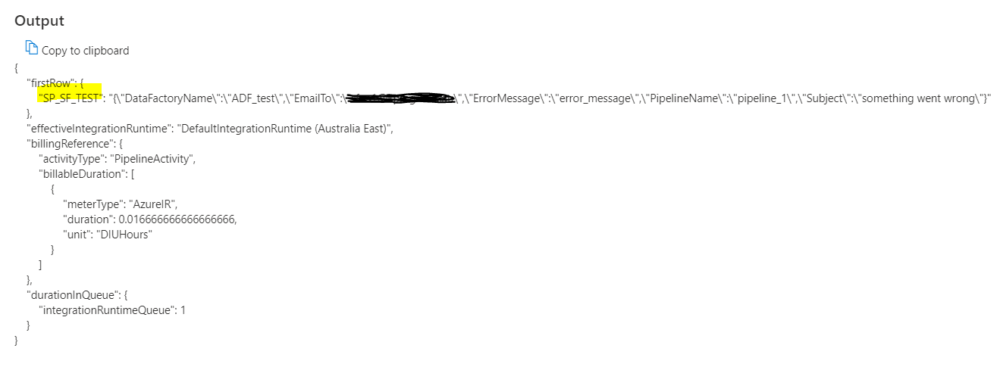
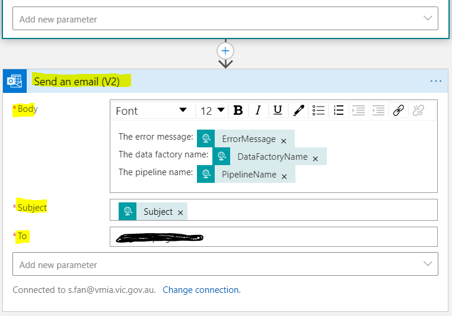
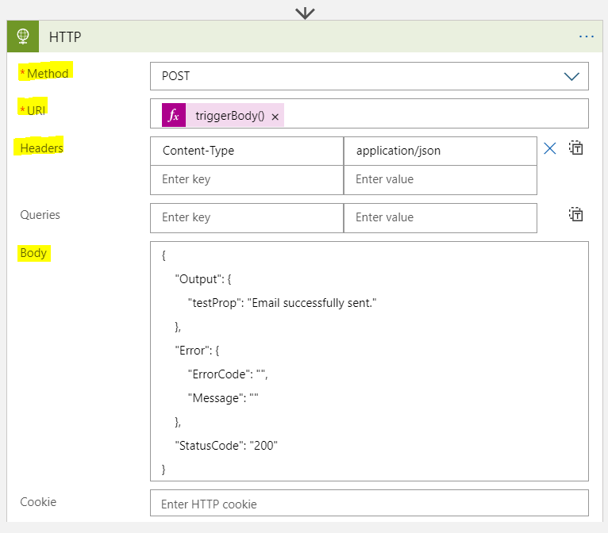
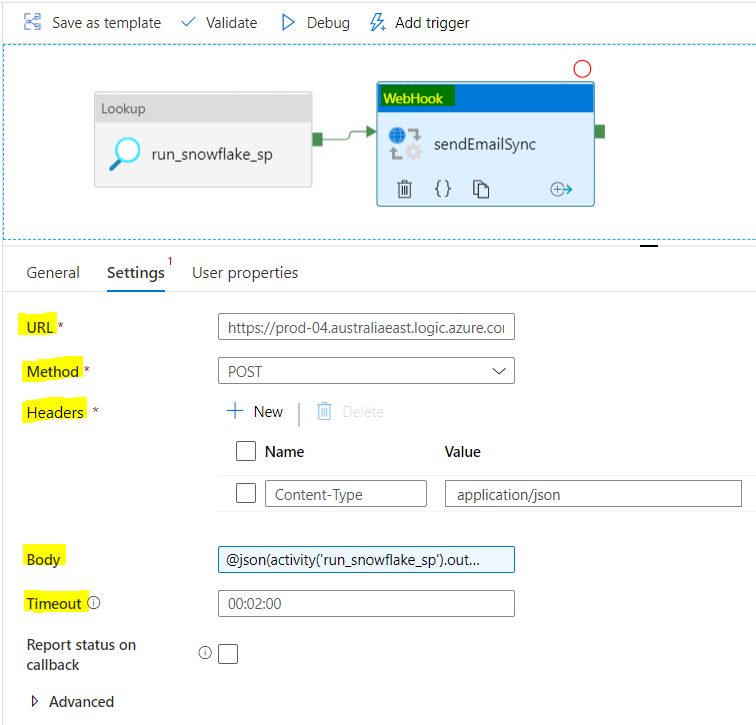
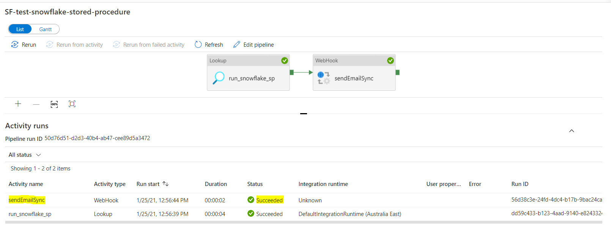

# Data Warehouse Reconciliation Framework

# Introduction

As mentioned in <a href="Data_Warehouse_Loading_Pattern_Design.md"
data-linked-resource-id="567148575" data-linked-resource-version="21"
data-linked-resource-type="page">Data Warehouse Loading Pattern
Design</a>, there will be a number of bespoke stored procedures used to
produce the intermediary tables to simplify the data warehouse load
procedure. To ensure that data are inserted and updated correctly in the
destination tables (i.e. data warehouse tables), we need to have a
framework to automatically reconcile some basic stats between what we
expect to produce based on the content in the time-varying tables in the
curated layer and what actually produced in the final data warehouse
tables. The reconciliation will run repeatedly for each period and
notify users if discover any inconsistency.

<div class="toc-macro rbtoc1639539804959">

-   1 [Introduction](#DataWarehouseReconciliationFramework-Introduction)
-   2 [Metrics to
    Reconcile](#DataWarehouseReconciliationFramework-MetricstoReconcile)
-   3 [Reconciliation Framework Design
    Options](#DataWarehouseReconciliationFramework-ReconciliationFrameworkDesignOptions)
-   4 [Decision](#DataWarehouseReconciliationFramework-Decision)
-   5 [Send Email from ADF Using Logic
    Apps](#DataWarehouseReconciliationFramework-SendEmailfromADFUsingLogicApps)
-   6 [Stored Procedure
    Structure](#DataWarehouseReconciliationFramework-StoredProcedureStructure)

</div>

# Metrics to Reconcile

The **reconciliation** happens between the **time-varying tables** at
the curated layer and the **star schema tables** in the data warehouse,
the very first beginning and the last step of the data warehouse
pipeline. The following table list metrics that will be used for
comparison:

<div class="table-wrap">

|                        |                                      |                                                                   |
|------------------------|--------------------------------------|-------------------------------------------------------------------|
| **Target**             | **Metrics**                          | **Purpose**                                                       |
| All star schema tables | Number of row inserted               | Ensure the expected number of insertion is performed successfully |
| All star schema tables | Number of row updated                | Ensure the expected number of updates is performed successfully   |
| All star schema tables | Total number of rows                 | filter by active records.                                         |
| Fact tables            | Sum of values of applicable field(s) | Ensure the calculation is performed correctly                     |

</div>

# Reconciliation Framework Design Options

The options are base on the outcome from
<a href="Data_Warehouse_Pipeline_-_3._Process.md"
data-linked-resource-id="469860353" data-linked-resource-version="42"
data-linked-resource-type="page">Data Warehouse Pipeline - 3.
Process</a>.

<div class="table-wrap">

<table class="confluenceTable" data-layout="default">
<tbody>
<tr class="header">
<th class="confluenceTh"></th>
<th class="confluenceTh"><p><strong>Option 1: Reconciliation as a
pipeline executed after the star schema pipeline</strong></p></th>
<th class="confluenceTh"><p><strong>Option 2: Embed reconciliation in
data warehouse load and only perform loading if reconcile</strong>
DECIDED</p></th>
<th class="confluenceTh"><p><strong>Option 3: ADF triggers a dashboard
refresh and visualise on a pre-created metrics view</strong></p></th>
</tr>

<tr class="odd">
<td class="confluenceTd"><p>Description</p></td>
<td class="confluenceTd"><p>Extend the existing <a
href="Data_Warehouse_Pipeline_-_3._Process.md"
data-linked-resource-id="469860353" data-linked-resource-version="42"
data-linked-resource-type="page">data warehouse hyper pipeline
design</a> to have one more sub-pipeline for reconciliation. Once all
the star schema tables have been successfully loaded, run the
reconciliation pipeline. The pipeline will contain <strong>bespoke
stored procedure(s)</strong> to calculate different metrics. The
calculation Metrics value of both expected and actual can be persisted
into a table in Snowflake to track historical trend and future analysis.
Utilise the existing method (<a
href="https://www.mssqltips.com/sqlservertip/5718/azure-data-factory-pipeline-email-notification--part-1/"
rel="nofollow">ADF, logic apps, and Web Activity</a>) to <strong>send
out notification emails</strong>. <strong>Note</strong>: when
calculating the expected metric values, only need to use a driving
table. The implementation of the logic usually can be simpler and need
to be different from the implementation of the loading.</p>
<div
id="ap-com.mxgraph.confluence.plugins.diagramly__drawio2285520807949371143"
class="ap-container">
<div
id="embedded-com.mxgraph.confluence.plugins.diagramly__drawio2285520807949371143"
class="ap-content">

</div>
</div></td>
<td class="confluenceTd"><p>Extend on the stored procedures within a
<strong>ForEach loop</strong> in the existing <a
href="Data_Warehouse_Pipeline_-_3._Process.md"
data-linked-resource-id="469860353" data-linked-resource-version="42"
data-linked-resource-type="page">data warehouse hyper pipeline
design</a>, and add <strong>new bespoke stored procedure</strong>
(calculate <strong>expected values from time-varying tables</strong>,
based on a driving table) and <strong>enhance the existing bespoke
stored procedure</strong> (calculate <strong>expected values from
loading logic</strong>). If <strong>a table fails to reconcile</strong>,
the master will <strong>skip its loading process</strong> rather than
stop loading for all tables. The results can be written to a metric
table to track trends and support future analysis. Only when two
expected values are consistent, execute the loading logic and ingest
data into the data warehouse table. The reconciliation happens to both
the data vault and star schema pipeline. Once the loop finishes, Utilise
the existing method (<a
href="https://www.mssqltips.com/sqlservertip/5718/azure-data-factory-pipeline-email-notification--part-1/"
rel="nofollow">ADF, logic apps, and Web Activity</a>) to <strong>send
out notification emails</strong>.</p>
<div
id="ap-com.mxgraph.confluence.plugins.diagramly__drawio7694715179941597971"
class="ap-container">
<div
id="embedded-com.mxgraph.confluence.plugins.diagramly__drawio7694715179941597971"
class="ap-content">

</div>
</div></td>
<td class="confluenceTd"><p>Maintain the existing data warehouse hyper
pipeline design. To support the reconciliation, produce a <strong>view
in Snowflake</strong> with all the metrics with expected values from
time-varying tables and actual values from star schema tables. Create a
<strong>dashboard</strong> to consume and visualise the metrics. Add a
<strong>Web Activity or Copy Activity in ADF</strong> as the
<strong>last step</strong> in the Data Warehouse Hyper Pipeline to
<strong>refresh data extract in Tableau or PowerBI API</strong> for
visualisation (A plan B is to use <strong>scheduled refresh</strong> on
the side of <a
href="https://help.tableau.com/current/server/en-us/schedule_add.htm"
rel="nofollow">Tableau</a> and <a
href="https://docs.microsoft.com/en-us/power-bi/report-server/configure-scheduled-refresh"
rel="nofollow">PowerBI</a>). Add a <strong>data-driven alert</strong> on
the dashboard to send out an email when a threshold is reached.</p>
<div
id="ap-com.mxgraph.confluence.plugins.diagramly__drawio2249810376468340967"
class="ap-container">
<div
id="embedded-com.mxgraph.confluence.plugins.diagramly__drawio2249810376468340967"
class="ap-content">

</div>
</div></td>
</tr>
<tr class="even">
<td class="confluenceTd"><p>Advantages</p></td>
<td class="confluenceTd"><ul>
<li><p>Only a new pipeline gets added after loading data to the star
schema. The data vault and star schema pipeline are untouched.</p></li>
<li><p>The solution is relatively simple and predictable.</p></li>
<li><p>Can control how to send the notification: each problem triggers
an email or one email that contains all the problems using a stored
procedure.</p></li>
<li><p>Historical metric values are persistent in a metric
table.</p></li>
<li><p>As the reconciliation is part of the data warehouse hyper
pipeline, reconciliation failure will cause the hyper pipeline failure
and therefore, no future loading will happen until the reconciliation
succeeds.</p></li>
</ul></td>
<td class="confluenceTd"><ul>
<li><p>If inconsistency is discovered, no rollback is needed as data
warehouse tables haven’t been updated yet.</p></li>
<li><p>Historical metric values are persistent in a metric
table.</p></li>
<li><p>As reconciliation failure will fail the data warehouse pipelines,
no future loading will happen until the reconciliation
succeeds.</p></li>
</ul></td>
<td class="confluenceTd"><ul>
<li><p>Leverage functionality in ADF (to trigger a dashboard refresh: <a
href="https://www.clearpeaks.com/beyond-standard-etl-with-azure-data-factory-creating-automated-and-pay-per-use-etl-pipelines-with-rest-api-triggering/"
rel="nofollow">Tableau</a>, <a
href="https://www.moderndata.ai/2019/05/powerbi-dataset-refresh-using-adf/"
rel="nofollow">PowerBI</a>) and dashboard (data-driven alert: <a
href="https://help.tableau.com/current/pro/desktop/en-us/data_alerts.htm"
rel="nofollow">Tableau</a>, <a
href="https://docs.microsoft.com/en-us/power-bi/consumer/end-user-alerts"
rel="nofollow">PowerBI</a>) for reconciliation with
visualisation.</p></li>
<li><p>The solution is relatively light weight (no stored procedures)
and provides visualisation on reconciliation.</p></li>
<li><p>Can control how to send the notification: each problem triggers
an email or one email that contains all the problems.</p></li>
<li><p>Historical metric values are persistent in a metric
view.</p></li>
</ul></td>
</tr>
<tr class="odd">
<td class="confluenceTd"><p>Disadvantages</p></td>
<td class="confluenceTd"><ul>
<li><p>If inconsistency is discovered, rollback is required as incorrect
data due to error in data has been populated into the data warehouse
tables.</p></li>
<li><p>To reduce the amount of rollback and reload which is quite labour
intensive, testing of stored procedure needs to be done
thoroughly.</p></li>
<li><p>Data manipulation logic exists in two places, i.e. snowflake
stored procedures that perform data load and reconciliation.</p></li>
</ul></td>
<td class="confluenceTd"><ul>
<li><p>Increase the complexity of the data vault and star schema
pipeline, particular the stored procedures.</p></li>
<li><p>Data manipulation logic exists in two places, i.e. snowflake
stored procedures that perform data load and reconciliation.</p></li>
</ul></td>
<td class="confluenceTd"><ul>
<li><p>If inconsistency is discovered, rollback is required as incorrect
data due to error in stored procedures have been introduced into the
data warehouse tables.</p></li>
<li><p>To reduce the amount of rollback and reload which is quite
effortful, testing of stored procedure needs to be done
thoroughly.</p></li>
<li><p>Only a subset of visualisation supports data-driven email alert
(<a
href="https://help.tableau.com/current/pro/desktop/en-us/data_alerts.htm"
rel="nofollow">Tableau</a>, <a
href="https://docs.microsoft.com/en-us/power-bi/consumer/end-user-alerts"
rel="nofollow">PowerBI</a>).</p></li>
<li><p>The view that the dashboard consumes will need manual update if a
new data feed is added or any logic is changed.</p></li>
<li><p>Data manipulation logic exists in two places, i.e. snowflake
stored procedure, view creation.</p></li>
<li><p>Will need a POC to confirm the integration with ADF and Tableau
or PowerBI.</p></li>
<li><p>As the reconciliation is independent to the data warehouse
pipelines, reconciliation failure has no impact on the data warehouse
load and therefore, won’t stop any future load.</p></li>
</ul></td>
</tr>
</tbody>
</table>

</div>

# Decision

The decision is made based on four principles:

<div class="table-wrap">

<table class="confluenceTable" data-layout="default">
<tbody>
<tr class="header">
<th class="confluenceTh"><p><strong>Principles</strong></p></th>
<th class="confluenceTh"><p><strong>Reconciliation as a pipeline
executed after the star schema pipeline</strong></p></th>
<th class="confluenceTh"><p><strong>Embed reconciliation in data
warehouse load and only perform loading if reconcile</strong>
DECIDED</p></th>
<th class="confluenceTh"><p><strong>ADF triggers a dashboard refresh and
visualise on a pre-created metrics view</strong></p></th>
</tr>

<tr class="odd">
<td class="confluenceTd"><p>Simple solution is better solution.</p></td>
<td class="confluenceTd"><p></p>
<p>Build a new pipeline for reconciliation using known functionalities
in ADF and Snowflake.</p></td>
<td class="confluenceTd"><p></p>
<p>Create new stored procedure to calculated expectation from
time-varying tables, and enhance existing stored procedure to calculate
expectation from loading logic for both data vault and star schema
pipeline. The complexity comes from the reconciliation in both data
vault and star schema to avoid rollback for incorrection
values.</p></td>
<td class="confluenceTd"><p></p>
<p>Build a new view for all the reconciliation metrics and a dashboard
to visualise metrics. The complexity comes from the extra work on the
visualisation and the integration between ADF and the
dashboard.</p></td>
</tr>
<tr class="even">
<td class="confluenceTd"><p>Minimise the introduction of new services
unless necessary.</p></td>
<td class="confluenceTd"><p></p>
<p>No new service needed.</p></td>
<td class="confluenceTd"><p></p>
<p>No new service needed.</p></td>
<td class="confluenceTd"><p></p>
<p>Introduce dashboard (Tableau or PowerBI) and associated integration
with ADF.</p></td>
</tr>
<tr class="odd">
<td class="confluenceTd"><p>It has to be easy to use for on-going
maintenance and operation.</p></td>
<td class="confluenceTd"><p></p>
<p>If a transformation logic changes, more than one places in the
reconciliation solution need to be updated.</p></td>
<td class="confluenceTd"><p></p>
<p>If a transformation logic changes, more than one places in the
reconciliation solution need to be updated.</p></td>
<td class="confluenceTd"><p></p>
<p>If a transformation logic changes, more than one places in the
reconciliation solution need to be updated.</p></td>
</tr>
<tr class="even">
<td class="confluenceTd"><p>Whether require rollback and reload if
reconciliation fails</p></td>
<td class="confluenceTd"><p></p>
<p>Will require rollback and reload if reconciliation fails.</p>
<p>Reconciliation failure can stop future data warehouse loading and
therefore reduce the amount of rollback.</p></td>
<td class="confluenceTd"><p></p>
<p>No rollback and reload needed as data won’t be loaded due to
reconciliation failure.</p>
<p>Reconciliation failure can stop future data warehouse loading and
therefore avoid the amount of rollback.</p></td>
<td class="confluenceTd"><p></p>
<p>Will require rollback and reload if reconciliation fails.</p>
<p>Reconciliation failure doesn’t stop future data warehouse loading and
therefore more rollback if the reconciliation didn’t resolve early
enough.</p></td>
</tr>
</tbody>
</table>

</div>

In the 2nd Feb. 2021 meeting with Bo Kwon (Deactivated),
h.lindsaysmith@vmia.vic.gov.au Lindsay-Smith and Sarah Fan
(Deactivated), the option 2 is chosen. The primary reason is because
this option doesn’t require rollback and reload if reconciliation fails.
We foresee reconciliation failure could happen quite often during the
early stage of the pipeline implementation due to the large number of
bespoke stored procedure to implement for data warehouse loading, and
the on-going changes from PEGA. Rollback and reload are manual and
effortful. By investing more initial effort to implement the option 2
could bring in more time saving when reconciliation fails.

In the 8th Feb. 2021 meeting with Rahul Pandey (Deactivated), he has
agreed on the choice of the option 2 as long as only the problematic
table gets stopped and rest of tables that are successfully reconciled
will perform the loading.

# Send Email from ADF Using Logic Apps

Sending an email from ADF requires a **Logic App** to be created and a
**Webhook Activity** to make a POST call to the URL of the Logic App,
The Logic App consists of a HTTP trigger and an Outlook 365 send email
action.

**Step 0**: A stored procedure (named **SP_SF_TEST**) to **output** the
error message and technical metadata (**Note**: make sure the keys that
are used in the dynamic email is at the top level of the JSON object as
in the example. Otherwise, they will return Null in the email.). The
Lookup Activity can return an example in the following screenshot:



**Step 1**: create a Logic App

-   HTTP Trigger

    -   After save the app, need to grab the **URL** which will be used
        in the **Webhook Activity**.

    -   The **JSON Schema** needs to reflect the exact structure of the
        JSON in the **Webhook Activity**.

        -   <div class="code panel pdl" style="border-width: 1px;">

            <div class="codeContent panelContent pdl">

            ``` java
            # The JSON Schema used in the example
            {
                    "DataFactoryName": {
                        "type": "string"
                    },
                    "EmailTo": {
                        "type": "string"
                    },
                    "ErrorMessage": {
                        "type": "string"
                    },
                    "PipelineName": {
                        "type": "string"
                    },
                    "Subject": {
                        "type": "string"
                    }
            }
            ```

            </div>

            </div>


-   Send email action using Office Outlook 365

    -   When specify **Body, Subject and To fields**, the GUI will
        automatically bring up **dynamic content fields** that can be
        used. You will find that the keys in the JSON object passed over
        from the Webhook Activity appear in the list. Select them to
        draft the email.



-   <a
    href="https://docs.microsoft.com/en-us/azure/data-factory/control-flow-webhook-activity#:~:text=A%20webhook%20activity%20can%20control,proceeds%20to%20the%20next%20activity"
    rel="nofollow">Make a callback to the Webhook activity</a>

    -   This is to return the execution status to ADF

    -   Use **HTTP action** with **POST** method and the
        **callBackUri** in the output of the HTTP trigger. The
        **callBackUri** is dynamic for each HTTP trigger.

    -   The **Header** has to be as shown in the example.

    -   The **Body** has to follow the structure shown in the example.

        -   <div class="code panel pdl" style="border-width: 1px;">

            <div class="codeContent panelContent pdl">

            ``` java
            # Define URI using expression
            triggerBody()['callBackUri']
            ```

            </div>

            </div>



**Step 2**: define the Webhook Activity

-   **Webhook vs. Web** Activity

    -   The difference between a Webhook Activity and a Web Activity is
        that the **Webhook Activity** is a **synchronous** service that
        ADF will receive the execution status of the logic app, while
        the **Web Activity** is an **asynchronous** service that ADF
        only cares about whether it successfully triggers the logic app
        and doesn’t care about the execution outcome.

-   The **URI** is the logic app url.

-   The **Header** is required by the logic app and has to be the value
    shown.

-   The **Body** can be either a string (as in the example), or a JSON
    object.

    -   <div class="code panel pdl" style="border-width: 1px;">

        <div class="codeContent panelContent pdl">

        ``` java
        # a string. Executing the string return a JSON object
        @json(activity('run_snowflake_sp').output.firstRow.SP_SF_TEST)

        # a JSON object
        {
                "DataFactoryName": "ADF_test",
                "EmailTo": "sfan1@kpmg.com.au",
                "ErrorMessage": "error_message",
                "PipelineName": "pipeline_1",
                "Subject": "something went wrong"
        }
        ```

        </div>

        </div>

-   An appropriate **Timeout** is required so ADF doesn’t have to wait
    for too long for the execution status from the logic app, or too
    short before the callback request being sent and executed.



Then the email is successfully sent out, in **ADF log** (Azure Monitor):



In the **Logic App log**,


# Stored Procedure Structure

Snowflake supports a stored procedure calling another store procedure
and consume the latter’s output. This would serve the option 1 and 2 for
a master stored procedure (i.e. trigger the metric calculation and
evaluate the expected and actual values) to call one or more slave
stored procedure (i.e. calculate the expected and the actual values of
metrics). A generic code structure is as below:

<div class="code panel pdl" style="border-width: 1px;">

<div class="codeContent panelContent pdl">

``` java
use database sf_test;
CREATE OR REPLACE PROCEDURE get_columns(TABLE_NAME VARCHAR)
  RETURNS ARRAY
  LANGUAGE JAVASCRIPT
  AS
  $$
  var stmt = snowflake.createStatement({
      sqlText: "SELECT * FROM " + TABLE_NAME + " LIMIT 1;",    
  });
  stmt.execute();

  var cols=[];
  for (i = 1; i <= stmt.getColumnCount(); i++) {
    cols.push(stmt.getColumnName(i));
  }
  return cols
  $$;


CREATE OR REPLACE PROCEDURE get_data()   //procedure call the above procedure
  RETURNS ARRAY
  LANGUAGE JAVASCRIPT
  AS
  $$
  var r = snowflake.execute({sqlText: "call get_columns('sf_test.test2')"});
  r.next(); // use next() to iterate over the resultset to retrieve technical metadata
  return r.getColumnValue(1);
  $$;
    
call get_data();
```

</div>

</div>

<div class="pageSectionHeader">

## Attachments:

</div>

<div class="greybox" align="left">


[\~drawio\~5dc205aeb6e6b50c58aeca8b\~Recon_design_1.svg.tmp](attachments/575045842/577372179.tmp)
(application/vnd.jgraph.mxfile)  

[\~drawio\~5dc205aeb6e6b50c58aeca8b\~Recon_design_1.svg.tmp](attachments/575045842/577536003.tmp)
(application/vnd.jgraph.mxfile)  

[Recon_design_1.svg](attachments/575045842/574947680.svg)
(application/vnd.jgraph.mxfile)  

[Recon_design_1.svg.png](attachments/575045842/577470475.png)
(image/png)  

[\~drawio\~5dc205aeb6e6b50c58aeca8b\~Recon_design1.svg.tmp](attachments/575045842/577536055.tmp)
(application/vnd.jgraph.mxfile)  

[\~drawio\~5dc205aeb6e6b50c58aeca8b\~Recon_design1.svg.tmp](attachments/575045842/564495494.tmp)
(application/vnd.jgraph.mxfile)  

[\~drawio\~5dc205aeb6e6b50c58aeca8b\~Recon_design1.svg.tmp](attachments/575045842/574849449.tmp)
(application/vnd.jgraph.mxfile)  

[\~drawio\~5dc205aeb6e6b50c58aeca8b\~Recon_design1.svg.tmp](attachments/575045842/577470513.tmp)
(application/vnd.jgraph.mxfile)  

[\~drawio\~5dc205aeb6e6b50c58aeca8b\~Recon_design1.svg.tmp](attachments/575045842/564495503.tmp)
(application/vnd.jgraph.mxfile)  

[\~drawio\~5dc205aeb6e6b50c58aeca8b\~Recon_design1.svg.tmp](attachments/575045842/577601579.tmp)
(application/vnd.jgraph.mxfile)  

[\~drawio\~5dc205aeb6e6b50c58aeca8b\~Recon_design1.svg.tmp](attachments/575045842/574849458.tmp)
(application/vnd.jgraph.mxfile)  

[\~drawio\~5dc205aeb6e6b50c58aeca8b\~Recon_design1.svg.tmp](attachments/575045842/577503298.tmp)
(application/vnd.jgraph.mxfile)  

[\~drawio\~5dc205aeb6e6b50c58aeca8b\~Recon_design1.svg.tmp](attachments/575045842/577503307.tmp)
(application/vnd.jgraph.mxfile)  

[\~drawio\~5dc205aeb6e6b50c58aeca8b\~Recon_design1.svg.tmp](attachments/575045842/577372208.tmp)
(application/vnd.jgraph.mxfile)  

[Recon_design1.svg](attachments/575045842/567149302.svg)
(application/vnd.jgraph.mxfile)  

[Recon_design1.svg.png](attachments/575045842/577536144.png)
(image/png)  

[\~drawio\~5dc205aeb6e6b50c58aeca8b\~Recon_design2.svg.tmp](attachments/575045842/577404984.tmp)
(application/vnd.jgraph.mxfile)  

[\~drawio\~5dc205aeb6e6b50c58aeca8b\~Recon_design2.svg.tmp](attachments/575045842/567149202.tmp)
(application/vnd.jgraph.mxfile)  

[\~drawio\~5dc205aeb6e6b50c58aeca8b\~Recon_design2.svg.tmp](attachments/575045842/577470555.tmp)
(application/vnd.jgraph.mxfile)  

[\~drawio\~5dc205aeb6e6b50c58aeca8b\~Recon_design2.svg.tmp](attachments/575045842/577404993.tmp)
(application/vnd.jgraph.mxfile)  

[\~drawio\~5dc205aeb6e6b50c58aeca8b\~Recon_design2.svg.tmp](attachments/575045842/577503325.tmp)
(application/vnd.jgraph.mxfile)  

[\~drawio\~5dc205aeb6e6b50c58aeca8b\~Recon_design2.svg.tmp](attachments/575045842/577470564.tmp)
(application/vnd.jgraph.mxfile)  

[\~drawio\~5dc205aeb6e6b50c58aeca8b\~Recon_design2.svg.tmp](attachments/575045842/577405002.tmp)
(application/vnd.jgraph.mxfile)  

[\~drawio\~5dc205aeb6e6b50c58aeca8b\~Recon_design2.svg.tmp](attachments/575045842/577503334.tmp)
(application/vnd.jgraph.mxfile)  

[\~drawio\~5dc205aeb6e6b50c58aeca8b\~Recon_design2.svg.tmp](attachments/575045842/577470573.tmp)
(application/vnd.jgraph.mxfile)  

[\~drawio\~5dc205aeb6e6b50c58aeca8b\~Recon_design2.svg.tmp](attachments/575045842/577175613.tmp)
(application/vnd.jgraph.mxfile)  

[Recon_design2.svg](attachments/575045842/577372313.svg)
(application/vnd.jgraph.mxfile)  

[Recon_design2.svg.png](attachments/575045842/577175636.png)
(image/png)  

[Recon_design2.svg](attachments/575045842/567149254.svg)
(application/vnd.jgraph.mxfile)  

[Recon_design2.svg.png](attachments/575045842/567149264.png)
(image/png)  

[Recon_design2.svg](attachments/575045842/577503453.svg)
(application/vnd.jgraph.mxfile)  

[Recon_design2.svg.png](attachments/575045842/567149390.png)
(image/png)  

[Recon_design1.svg](attachments/575045842/577470830.svg)
(application/vnd.jgraph.mxfile)  

[Recon_design1.svg.png](attachments/575045842/577470840.png)
(image/png)  

[\~drawio\~5dc205aeb6e6b50c58aeca8b\~Recon_design3.svg.tmp](attachments/575045842/577634508.tmp)
(application/vnd.jgraph.mxfile)  

[\~drawio\~5dc205aeb6e6b50c58aeca8b\~Recon_design3.svg.tmp](attachments/575045842/577470667.tmp)
(application/vnd.jgraph.mxfile)  

[\~drawio\~5dc205aeb6e6b50c58aeca8b\~Recon_design3.svg.tmp](attachments/575045842/567149323.tmp)
(application/vnd.jgraph.mxfile)  

[\~drawio\~5dc205aeb6e6b50c58aeca8b\~Recon_design3.svg.tmp](attachments/575045842/577405102.tmp)
(application/vnd.jgraph.mxfile)  

[\~drawio\~5dc205aeb6e6b50c58aeca8b\~Recon_design3.svg.tmp](attachments/575045842/574849574.tmp)
(application/vnd.jgraph.mxfile)  

[\~drawio\~5dc205aeb6e6b50c58aeca8b\~Recon_design3.svg.tmp](attachments/575045842/577372428.tmp)
(application/vnd.jgraph.mxfile)  

[\~drawio\~5dc205aeb6e6b50c58aeca8b\~Recon_design3.svg.tmp](attachments/575045842/577601740.tmp)
(application/vnd.jgraph.mxfile)  

[\~drawio\~5dc205aeb6e6b50c58aeca8b\~Recon_design3.svg.tmp](attachments/575045842/577405111.tmp)
(application/vnd.jgraph.mxfile)  

[\~drawio\~5dc205aeb6e6b50c58aeca8b\~Recon_design3.svg.tmp](attachments/575045842/577372437.tmp)
(application/vnd.jgraph.mxfile)  

[\~drawio\~5dc205aeb6e6b50c58aeca8b\~Recon_design3.svg.tmp](attachments/575045842/577634503.tmp)
(application/vnd.jgraph.mxfile)  

[Recon_design3.svg](attachments/575045842/577634542.svg)
(application/vnd.jgraph.mxfile)  

[Recon_design3.svg.png](attachments/575045842/574849600.png)
(image/png)  

[\~Recon_design3.svg.tmp](attachments/575045842/564495685.tmp)
(application/vnd.jgraph.mxfile)  

[\~Recon_design3.svg.tmp](attachments/575045842/577175756.tmp)
(application/vnd.jgraph.mxfile)  

[\~Recon_design3.svg.tmp](attachments/575045842/577601753.tmp)
(application/vnd.jgraph.mxfile)  

[\~Recon_design3.svg.tmp](attachments/575045842/577601762.tmp)
(application/vnd.jgraph.mxfile)  

[\~Recon_design3.svg.tmp](attachments/575045842/574849591.tmp)
(application/vnd.jgraph.mxfile)  

[\~Recon_design3.svg.tmp](attachments/575045842/567149372.tmp)
(application/vnd.jgraph.mxfile)  

[Recon_design3.svg](attachments/575045842/577634562.svg)
(application/vnd.jgraph.mxfile)  

[Recon_design3.svg.png](attachments/575045842/577503440.png)
(image/png)  

[\~Recon_design3.svg.tmp](attachments/575045842/577503422.tmp)
(application/vnd.jgraph.mxfile)  

[\~Recon_design3.svg.tmp](attachments/575045842/577536173.tmp)
(application/vnd.jgraph.mxfile)  

[\~Recon_design3.svg.tmp](attachments/575045842/577634552.tmp)
(application/vnd.jgraph.mxfile)  

[\~Recon_design3.svg.tmp](attachments/575045842/567149342.tmp)
(application/vnd.jgraph.mxfile)  

[Recon_design3.svg](attachments/575045842/567149332.svg)
(application/vnd.jgraph.mxfile)  

[Recon_design3.svg.png](attachments/575045842/567149337.png)
(image/png)  

[Recon_design2.svg](attachments/575045842/577405440.svg)
(application/vnd.jgraph.mxfile)  

[Recon_design2.svg.png](attachments/575045842/577536597.png)
(image/png)  

[Recon_design1.svg](attachments/575045842/577503589.svg)
(application/vnd.jgraph.mxfile)  

[Recon_design1.svg.png](attachments/575045842/564495856.png)
(image/png)  

[Recon_design1.svg](attachments/575045842/577602056.svg)
(application/vnd.jgraph.mxfile)  

[Recon_design1.svg.png](attachments/575045842/577503720.png)
(image/png)  

[Recon_design2.svg](attachments/575045842/594509971.svg)
(application/vnd.jgraph.mxfile)  

[Recon_design2.svg.png](attachments/575045842/595198095.png)
(image/png)  

[Recon_design1.svg](attachments/575045842/595099764.svg)
(application/vnd.jgraph.mxfile)  

[Recon_design1.svg.png](attachments/575045842/595001498.png)
(image/png)  

[image-20210122-035623.png](attachments/575045842/587268122.png)
(image/png)  

[image-20210122-035646.png](attachments/575045842/587137053.png)
(image/png)  

[image-20210122-035751.png](attachments/575045842/587005986.png)
(image/png)  

[image-20210122-035936.png](attachments/575045842/587169855.png)
(image/png)  

[image-20210124-235636.png](attachments/575045842/595198005.png)
(image/png)  

[image-20210125-001748.png](attachments/575045842/595198019.png)
(image/png)  

[image-20210125-005809.png](attachments/575045842/594837547.png)
(image/png)  

[image-20210125-020009.png](attachments/575045842/595198039.png)
(image/png)  

[image-20210125-020718.png](attachments/575045842/594837553.png)
(image/png)  

[image-20210125-021002.png](attachments/575045842/594509930.png)
(image/png)  

[image-20210125-021043.png](attachments/575045842/594837563.png)
(image/png)  

[image-20210125-021214.png](attachments/575045842/595001461.png)
(image/png)  

[image-20210125-021238.png](attachments/575045842/594575457.png)
(image/png)  

[Recon_design1.svg](attachments/575045842/594837696.svg)
(application/vnd.jgraph.mxfile)  

[Recon_design1.svg.png](attachments/575045842/594903207.png)
(image/png)  

[Recon_design2.svg](attachments/575045842/618397747.svg)
(application/vnd.jgraph.mxfile)  

[Recon_design2.svg.png](attachments/575045842/618397757.png)
(image/png)  

[Recon_design1.svg](attachments/575045842/618102805.svg)
(application/vnd.jgraph.mxfile)  

[Recon_design1.svg.png](attachments/575045842/618201104.png)
(image/png)  

[\~Recon_design1.svg.tmp](attachments/575045842/618397697.tmp)
(application/vnd.jgraph.mxfile)  

[\~Recon_design1.svg.tmp](attachments/575045842/618364941.tmp)
(application/vnd.jgraph.mxfile)  

[\~Recon_design1.svg.tmp](attachments/575045842/618365009.tmp)
(application/vnd.jgraph.mxfile)  

[Recon_design1.svg](attachments/575045842/618070143.svg)
(application/vnd.jgraph.mxfile)  

[Recon_design1.svg.png](attachments/575045842/618266726.png)
(image/png)  

[Recon_design2.svg](attachments/575045842/618168408.svg)
(application/vnd.jgraph.mxfile)  

[Recon_design2.svg.png](attachments/575045842/618496080.png)
(image/png)  

[\~Recon_design1.svg.tmp](attachments/575045842/618201192.tmp)
(application/vnd.jgraph.mxfile)  

[\~Recon_design1.svg.tmp](attachments/575045842/618332264.tmp)
(application/vnd.jgraph.mxfile)  

[\~Recon_design1.svg.tmp](attachments/575045842/618332278.tmp)
(application/vnd.jgraph.mxfile)  

[\~Recon_design1.svg.tmp](attachments/575045842/618332288.tmp)
(application/vnd.jgraph.mxfile)  

[\~Recon_design1.svg.tmp](attachments/575045842/618365027.tmp)
(application/vnd.jgraph.mxfile)  

[\~Recon_design1.svg.tmp](attachments/575045842/618102885.tmp)
(application/vnd.jgraph.mxfile)  

[\~Recon_design1.svg.tmp](attachments/575045842/577470626.tmp)
(application/vnd.jgraph.mxfile)  

[Recon_design1.svg](attachments/575045842/577470522.svg)
(application/vnd.jgraph.mxfile)  

[Recon_design1.svg.png](attachments/575045842/577634344.png)
(image/png)  

[\~Recon_design2.svg.tmp](attachments/575045842/618397821.tmp)
(application/vnd.jgraph.mxfile)  

[\~Recon_design2.svg.tmp](attachments/575045842/618365077.tmp)
(application/vnd.jgraph.mxfile)  

[\~Recon_design2.svg.tmp](attachments/575045842/618528817.tmp)
(application/vnd.jgraph.mxfile)  

[\~Recon_design2.svg.tmp](attachments/575045842/618201286.tmp)
(application/vnd.jgraph.mxfile)  

[\~Recon_design2.svg.tmp](attachments/575045842/618201296.tmp)
(application/vnd.jgraph.mxfile)  

[\~Recon_design2.svg.tmp](attachments/575045842/618332316.tmp)
(application/vnd.jgraph.mxfile)  

[\~Recon_design2.svg.tmp](attachments/575045842/618201310.tmp)
(application/vnd.jgraph.mxfile)  

[\~Recon_design2.svg.tmp](attachments/575045842/618332326.tmp)
(application/vnd.jgraph.mxfile)  

[\~Recon_design2.svg.tmp](attachments/575045842/618463339.tmp)
(application/vnd.jgraph.mxfile)  

[\~Recon_design2.svg.tmp](attachments/575045842/577470587.tmp)
(application/vnd.jgraph.mxfile)  

[Recon_design2.svg](attachments/575045842/564495549.svg)
(application/vnd.jgraph.mxfile)  

[Recon_design2.svg.png](attachments/575045842/577536078.png)
(image/png)  

</div>
