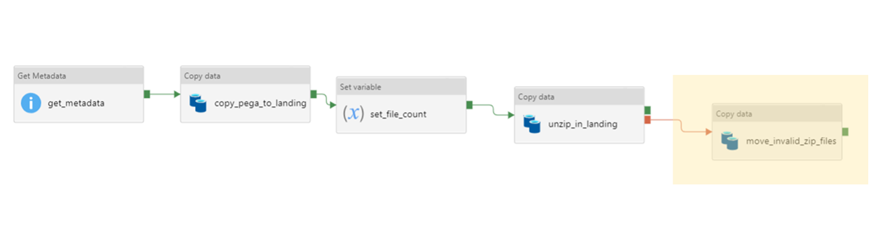

# ADF Hyper Pipeline - XML (PEGA)

This section contains the build summary of ADF Hyper Pipeline for PEGA.

At a high level, both ADF Hyper Pipeline and sub-pipeline (Ingestion and
Acquisition) will be provisioned via `pulumi `and ARM template. The
pipeline will constrains the pre-defined connections, activities,
datasets and **placeholders** for **runtime parameters.**

Below is a diagram to illustrate the activities and functions that has
been scheduled in the pipeline.

<div
id="ap-com.mxgraph.confluence.plugins.diagramly__drawio6534225490382908918"
class="ap-container">

<div
id="embedded-com.mxgraph.confluence.plugins.diagramly__drawio6534225490382908918"
class="ap-content">

</div>

</div>

## Definition and concept of Hyper Pipeline

The hyper pipeline is used to schedule and orchestrate the run of the
sub pipelines and activities defined in the acquisition and ingestion
process. At a high level, the acquisition pipeline is responsible for
pulling data from SFTP and sink it in datalake landing layer. The
ingestion pipeline constrains the process of de-nesting , extracting and
restructuring the XML data into snowflake tables. The curated pipeline
will contain the load from the snowflake structured layer to the curated
layer.

The hyper pipeline will be provisioned in the build time and chaining
the acquisition, ingestion and curated pipeline for different data
source. (e.g., When triggering the PEGA hyper pipeline, the PEGA
Acquisition and Ingestion pipelines will be run under the hook. )

The details of all the activities in each sub-pipeline are explained in
the diagram above.

### Trigger workflow description:

1.  A trigger will be waken up at the scheduled time, the trigger has
    the runtime config hardcoded, and pass in the corresponding global
    parameters to the pipeline. All triggers have been created based on
    the build-time config during the deployment phase.

2.  The trigger triggers the hyper pipeline with prepared parameter
    values. 

### Pipeline workflow description:

1.  Pre acquisition pipeline activities

    1.  Upon commencing the pipeline, a parameter parsing function will
        consume the trigger parameters and create the required
        parameters for consumption of the daily file.

2.  Two checks will be performed before proceeding with the current
    day’s execution

    1.  A check for unprocessed files from previous days in the data
        lake will occur and if found trigger an alert

    2.  A check for missed files from previous days in the PEGA SFTP
        server and if found trigger an alert

3.  SFTP pull pattern will pull all zip files for the given extract
    class from SFTP server based on the naming pattern and copy into the
    landing container of the datalake

4.  A copy statement will unzip these files and store the contents in
    the landing unzipped container.

    1.  If any of files that are unzipped are invalid, this step will
        fail and should trigger another copy step which removes the
        files from the folder in the landing container and moves them to
        an error directory for the extract class. This is detailed below
        in the section **Invalid zip files**

5.  The integrity check will then run on the file to be loaded for the
    given day to ensure the data is valid

6.  A check for multiple files for an extract will occur, if multiple
    files are found then an error will be raised and alerts will be
    sent.

7.  When the ingestion pipeline starts, a check for pipeline success on
    the previous day occurs, if the previous pipeline had an error and
    had not been resolved manually then the pipeline will fail and
    alerts will be sent.

8.  The XSD difference checker will check for any changes in the xsd
    file of a given extract.

    1.  If a difference is detected, this function will change the
        `curated_ready_flag` within the observability cosmos for this
        extract to be false, as a schema change has occurred and this
        change must be manually validated before loading to curated.

    2.  XML config generator - If a schema change has occurred, new
        config will be generated from the current xsd file

9.  Copy to snowflake function is executed to copy data from raw
    container into semi structured table in snowflake structured layer.

10. The dynamic SQL function will de-nest the extract and will load each
    of the tables for the extract into the structured database within
    Snowflake. These will be created based on the structured of the
    current xsd schema (based on the config created in step 8b) as all
    tables in structured layer are create or replace (transient)

11. The curated load checkpoint function will query the observability
    cosmos for this extract to check if the `curated_ready_flag` is
    `true` for this extract. If it is false, this function will fail and
    alert. Schema evolution is manually executed at this point to change
    the structure of the curated tables.

12. The curated load function will construct and run the merge statement
    to load data from structured into curated database on Snowflake.

### Logging workflow description:

1.  Each activity and pipeline that occurs in ADF will be logged to the
    log analytics workspace *log-sdi-\<env\>-logical.* This workspace
    can be queried to understand past runs

2.  The last status (failure or success) of each extract will be tracked
    in a cosmos DB for observability.

### Invalid zip files:

Note this section on invalid zip files has been designed but not yet
implemented. An invalid zip file will be detected at step 3 in the hyper
pipeline (copy statement to unzip files). An invalid zip file can be
detected in any of the sequenced extracts (e.g. \_1, \_2, …). When an
invalid zip file is detected, all of the extracts sequence files for
that date should be removed from landing and not processed further. for
Upon identifying an invalid zip file from the SFTP server, the following
steps are suggested to occur.

1.  Remove all sequenced extracts for the date containing the invalid
    zip file from the extract folder within the landing container and
    move to an error directory in the landing container. (diagram below
    for implementation in pega_acquisition_pipeline \>
    check_file_not_exists)

2.  Raise an error for the pipeline execution

    1.  This will block future executions of the pipeline which is the
        expected behaviour

3.  Request a new extract from Pega

4.  Process the new extract from Pega



## Run-time and Build-time Config

Below is the example of The build time config for acquisition pipeline
(dataset)

<div class="code panel pdl" style="border-width: 1px;">

<div class="codeContent panelContent pdl">

``` java
{
  "id": "pega_datasets",
  "resourceType": "datasets",
  "resources": [
    {
      "dataStore": "SftpLocation",
      "linkedServiceName": "pegaSftpLinkedService",
      "datasetName": "inputSftpZipped",
      "datasetType": "Binary",
      "parameters": [
        {
          "name": "folderPath",
          "type": "string"
        },
        {
          "name": "fileName",
          "type": "string"
        }
      ]
    },
    {
      "dataStore": "AzureBlobFSLocation",
      "linkedServiceName": "datalakeStorageLinkedService",
      "datasetName": "outputDatalakeLandingZipped",
      "datasetType": "Binary",
      "fileSystem": "landing-sdi-<env>-datalake",
      "parameters": [
        {
          "name": "folderPath",
          "type": "string"
        }
      ]
    },
    {
      "dataStore": "AzureBlobFSLocation",
      "linkedServiceName": "datalakeStorageLinkedService",
      "datasetName": "inputDatalakeLandingZipped",
      "datasetType": "Binary",
      "parameters": [
        {
          "name": "folderPath",
          "type": "string"
        },
        {
          "name": "fileName",
          "type": "string"
        }
      ],
      "fileSystem": "landing-sdi-<env>-datalake",
      "compressionType": "ZipDeflate"
    },
    {
      "dataStore": "AzureBlobFSLocation",
      "linkedServiceName": "datalakeStorageLinkedService",
      "datasetName": "outputDatalakeLandingUnzipped",
      "datasetType": "Binary",
      "fileSystem": "landing-unzipped-sdi-<env>-datalake",
      "parameters": [
        {
          "name": "folderPath",
          "type": "string"
        }
      ]
    },
    {
      "dataStore": "AzureBlobFSLocation",
      "linkedServiceName": "datalakeStorageLinkedService",
      "datasetName": "inputDatalakeLandingUnzipped",
      "datasetType": "Binary",
      "parameters": [
        {
          "name": "folderPath",
          "type": "string"
        }
      ],
      "fileSystem": "landing-unzipped-sdi-<env>-datalake"
    },
    {
      "dataStore": "AzureBlobFSLocation",
      "linkedServiceName": "datalakeStorageLinkedService",
      "datasetName": "outputDatalakeRaw",
      "datasetType": "Binary",
      "parameters": [
        {
          "name": "folderPath",
          "type": "string"
        }
      ],
      "fileSystem": "raw-sdi-<env>-datalake"
    }
  ]
}
```

</div>

</div>

This config will be consumed by the `SDI-DATALAKE-PIPELINE ` project and
provision a list of datasets that need to be used in the sub-pipeline.

Cosmos DB would contains separate build time config for `Dataset`,
`Linked Service` and` Pipeline Activities`.

Below is an example of the runtime config for data feed items:

<div class="code panel pdl" style="border-width: 1px;">

<div class="codeContent panelContent pdl">

``` java
{
  "id": "pega-config",
  "layer": "landing",
  "resourceType": "data feeds",
  "feeds": [
    {
      "fileName": "BIX_VMIA_Ins_Data_Payee_PayeeSORExtract",
      "sftpFolderPath": "/pegafiletransfer/bix",
      "sourceSystem": "PEGA",
      "classification": "PROTECTED",
      "compressionType": "zip",
      "sorClass": "VMIA_Ins_Data_Payee",
      "masterTableName": "VMIA"
    },
    {
      "fileName": "BIX_VMIA_Interface_BankDetails_BankSORExtract",
      "sftpFolderPath": "/pegafiletransfer/bix",
      "sourceSystem": "PEGA",
      "classification": "PROTECTED",
      "compressionType": "zip",
      "sorClass": "VMIA_Interface_BankDetails",
      "masterTableName": "VMIA"
    }
  ]
}
```

</div>

</div>

## ADF Trigger for HyperPipeline

There is a separate project for provision the ADF triggers based on the
runtime config. Once the trigger has been provisioned, the pipeline will
be run at a given point of time with retry policies.

An example of the runtime config for triggers created at the data feed
level is shown below:

<div class="code panel pdl" style="border-width: 1px;">

<div class="codeContent panelContent pdl">

``` java
{
  "id": "pega-trigger-config",
  "datafeed": "BIX",
  "configType": "trigger",
  "pipelineReference": {
    "referenceName": "hyperPipeline",
    "type": "PipelineReference"
  },
  "runtimeState": "Stopped",
  "type": "TumblingWindowTrigger",
  "frequency": "Hour",
  "interval": 24,
  "startTime": "2020-10-16T00:00:00.000Z",
  "delay": "00:00:00",
  "maxConcurrency": 50,
  "retryPolicy": {
    "count": 2,
    "intervalInSeconds": 120
  }
}
```

</div>

</div>

Updating Data Files

Adding and removing Data Files

<div class="pageSectionHeader">

## Attachments:

</div>

<div class="greybox" align="left">


[\~drawio\~5f3210f19aa96500466e388b\~hyperpipeline_Diagram.drawio.tmp](attachments/257884214/260734995.tmp)
(application/vnd.jgraph.mxfile)  

[\~drawio\~5f3210f19aa96500466e388b\~hyperpipeline_Diagram.drawio.tmp](attachments/257884214/260964355.tmp)
(application/vnd.jgraph.mxfile)  

[\~drawio\~5f3210f19aa96500466e388b\~hyperpipeline_Diagram.drawio.tmp](attachments/257884214/260767767.tmp)
(application/vnd.jgraph.mxfile)  

[\~drawio\~5f3210f19aa96500466e388b\~hyperpipeline_Diagram.drawio.tmp](attachments/257884214/260866075.tmp)
(application/vnd.jgraph.mxfile)  

[\~drawio\~5f3210f19aa96500466e388b\~hyperpipeline_Diagram.drawio.tmp](attachments/257884214/260800558.tmp)
(application/vnd.jgraph.mxfile)  

[\~drawio\~5f3210f19aa96500466e388b\~hyperpipeline_Diagram.drawio.tmp](attachments/257884214/260735004.tmp)
(application/vnd.jgraph.mxfile)  

[\~drawio\~5f3210f19aa96500466e388b\~hyperpipeline_Diagram.drawio.tmp](attachments/257884214/260997152.tmp)
(application/vnd.jgraph.mxfile)  

[\~drawio\~5f3210f19aa96500466e388b\~hyperpipeline_Diagram.drawio.tmp](attachments/257884214/260833313.tmp)
(application/vnd.jgraph.mxfile)  

[\~drawio\~5f3210f19aa96500466e388b\~hyperpipeline_Diagram.drawio.tmp](attachments/257884214/260571169.tmp)
(application/vnd.jgraph.mxfile)  

[hyperpipeline_Diagram.drawio](attachments/257884214/260866084.drawio)
(application/vnd.jgraph.mxfile)  

[hyperpipeline_Diagram.drawio.png](attachments/257884214/260964367.png)
(image/png)  

[\~drawio\~5f3210f19aa96500466e388b\~hyperpipeline_Diagram.drawio.tmp](attachments/257884214/260571137.tmp)
(application/vnd.jgraph.mxfile)  

[hyperpipeline_Diagram.drawio](attachments/257884214/276758964.drawio)
(application/vnd.jgraph.mxfile)  

[hyperpipeline_Diagram.drawio.png](attachments/257884214/276365763.png)
(image/png)  

[hyperpipeline_Diagram.drawio](attachments/257884214/276496863.drawio)
(application/vnd.jgraph.mxfile)  

[hyperpipeline_Diagram.drawio.png](attachments/257884214/276693470.png)
(image/png)  

[hyperpipeline_Diagram.drawio](attachments/257884214/276890081.drawio)
(application/vnd.jgraph.mxfile)  

[hyperpipeline_Diagram.drawio.png](attachments/257884214/276988436.png)
(image/png)  

[hyperpipeline_Diagram.drawio](attachments/257884214/276758992.drawio)
(application/vnd.jgraph.mxfile)  

[hyperpipeline_Diagram.drawio.png](attachments/257884214/276464210.png)
(image/png)  

[hyperpipeline_Diagram.drawio](attachments/257884214/277152239.drawio)
(application/vnd.jgraph.mxfile)  

[hyperpipeline_Diagram.drawio.png](attachments/257884214/276726358.png)
(image/png)  

[hyperpipeline_Diagram.drawio](attachments/257884214/279773197.drawio)
(application/vnd.jgraph.mxfile)  

[hyperpipeline_Diagram.drawio.png](attachments/257884214/280068097.png)
(image/png)  

[hyperpipeline_Diagram.drawio](attachments/257884214/282591411.drawio)
(application/vnd.jgraph.mxfile)  

[hyperpipeline_Diagram.drawio.png](attachments/257884214/282427584.png)
(image/png)  

[hyperpipeline_Diagram.drawio](attachments/257884214/282656863.drawio)
(application/vnd.jgraph.mxfile)  

[hyperpipeline_Diagram.drawio.png](attachments/257884214/282689698.png)
(image/png)  

[hyperpipeline_Diagram.drawio](attachments/257884214/283050213.drawio)
(application/vnd.jgraph.mxfile)  

[hyperpipeline_Diagram.drawio.png](attachments/257884214/282591562.png)
(image/png)  

[hyperpipeline_Diagram.drawio](attachments/257884214/283017504.drawio)
(application/vnd.jgraph.mxfile)  

[hyperpipeline_Diagram.drawio.png](attachments/257884214/283017514.png)
(image/png)  

[hyperpipeline_Diagram.drawio](attachments/257884214/282493361.drawio)
(application/vnd.jgraph.mxfile)  

[hyperpipeline_Diagram.drawio.png](attachments/257884214/282526298.png)
(image/png)  

[hyperpipeline_Diagram.drawio](attachments/257884214/444171115.drawio)
(application/vnd.jgraph.mxfile)  

[hyperpipeline_Diagram.drawio.png](attachments/257884214/443974766.png)
(image/png)  

[hyperpipeline_Diagram.drawio](attachments/257884214/441517106.drawio)
(application/vnd.jgraph.mxfile)  

[hyperpipeline_Diagram.drawio.png](attachments/257884214/443941844.png)
(image/png)  

[hyperpipeline_Diagram.drawio](attachments/257884214/441353328.drawio)
(application/vnd.jgraph.mxfile)  

[hyperpipeline_Diagram.drawio.png](attachments/257884214/441582773.png)
(image/png)  

[hyperpipeline_Diagram.drawio](attachments/257884214/444138564.drawio)
(application/vnd.jgraph.mxfile)  

[hyperpipeline_Diagram.drawio.png](attachments/257884214/441582797.png)
(image/png)  

[hyperpipeline_Diagram.drawio](attachments/257884214/441582843.drawio)
(application/vnd.jgraph.mxfile)  

[hyperpipeline_Diagram.drawio.png](attachments/257884214/444138618.png)
(image/png)  

[hyperpipeline_Diagram.drawio](attachments/257884214/452001847.drawio)
(application/vnd.jgraph.mxfile)  

[hyperpipeline_Diagram.drawio.png](attachments/257884214/452001857.png)
(image/png)  

[hyperpipeline_Diagram.drawio](attachments/257884214/441419120.drawio)
(application/vnd.jgraph.mxfile)  

[hyperpipeline_Diagram.drawio.png](attachments/257884214/441353506.png)
(image/png)  

[hyperpipeline_Diagram.drawio](attachments/257884214/683147405.drawio)
(application/vnd.jgraph.mxfile)  

[hyperpipeline_Diagram.drawio.png](attachments/257884214/680067237.png)
(image/png)  

[image-20201208-060515.png](attachments/257884214/472712348.png)
(image/png)  

[image-20201208-060545.png](attachments/257884214/472778025.png)
(image/png)  

[hyperpipeline_Diagram.drawio](attachments/257884214/696385568.drawio)
(application/vnd.jgraph.mxfile)  

[hyperpipeline_Diagram.drawio.png](attachments/257884214/688488558.png)
(image/png)  

[hyperpipeline_Diagram.drawio](attachments/257884214/696287310.drawio)
(application/vnd.jgraph.mxfile)  

[hyperpipeline_Diagram.drawio.png](attachments/257884214/696188971.png)
(image/png)  

[hyperpipeline_Diagram.drawio](attachments/257884214/696156220.drawio)
(application/vnd.jgraph.mxfile)  

[hyperpipeline_Diagram.drawio.png](attachments/257884214/696451138.png)
(image/png)  

[hyperpipeline_Diagram.drawio](attachments/257884214/696483888.drawio)
(application/vnd.jgraph.mxfile)  

[hyperpipeline_Diagram.drawio.png](attachments/257884214/696156242.png)
(image/png)  

[hyperpipeline_Diagram.drawio](attachments/257884214/707167114.drawio)
(application/vnd.jgraph.mxfile)  

[hyperpipeline_Diagram.drawio.png](attachments/257884214/704676916.png)
(image/png)  

[\~hyperpipeline_Diagram.drawio.tmp](attachments/257884214/707134366.tmp)
(application/vnd.jgraph.mxfile)  

[\~hyperpipeline_Diagram.drawio.tmp](attachments/257884214/707167094.tmp)
(application/vnd.jgraph.mxfile)  

[\~hyperpipeline_Diagram.drawio.tmp](attachments/257884214/707363567.tmp)
(application/vnd.jgraph.mxfile)  

[\~hyperpipeline_Diagram.drawio.tmp](attachments/257884214/704676906.tmp)
(application/vnd.jgraph.mxfile)  

[\~hyperpipeline_Diagram.drawio.tmp](attachments/257884214/707134380.tmp)
(application/vnd.jgraph.mxfile)  

[\~hyperpipeline_Diagram.drawio.tmp](attachments/257884214/707167104.tmp)
(application/vnd.jgraph.mxfile)  

[\~hyperpipeline_Diagram.drawio.tmp](attachments/257884214/707363577.tmp)
(application/vnd.jgraph.mxfile)  

[\~hyperpipeline_Diagram.drawio.tmp](attachments/257884214/753205907.tmp)
(application/vnd.jgraph.mxfile)  

[hyperpipeline_Diagram.drawio](attachments/257884214/752812611.drawio)
(application/vnd.jgraph.mxfile)  

[hyperpipeline_Diagram.drawio.png](attachments/257884214/752812621.png)
(image/png)  

[\~hyperpipeline_Diagram.drawio.tmp](attachments/257884214/758743600.tmp)
(application/vnd.jgraph.mxfile)  

[\~hyperpipeline_Diagram.drawio.tmp](attachments/257884214/276725867.tmp)
(application/vnd.jgraph.mxfile)  

[hyperpipeline_Diagram.drawio](attachments/257884214/260735013.drawio)
(application/vnd.jgraph.mxfile)  

[hyperpipeline_Diagram.drawio.png](attachments/257884214/260767778.png)
(image/png)  

</div>
