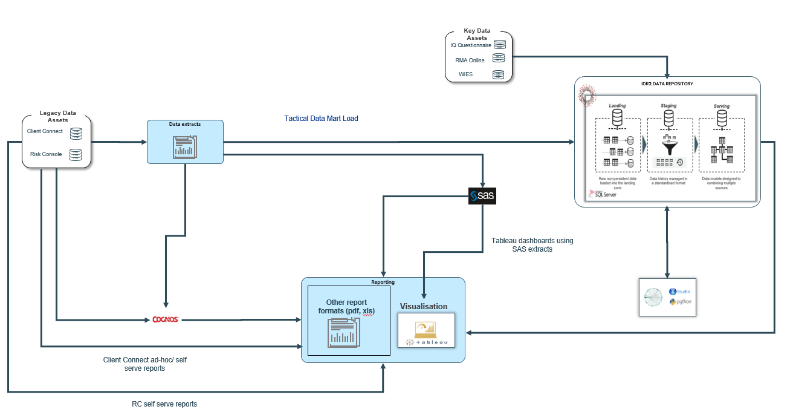
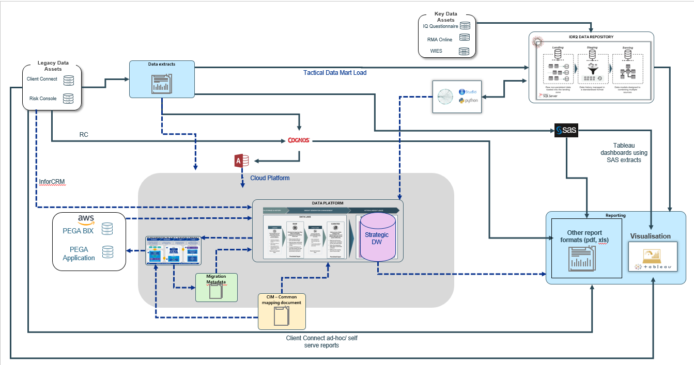
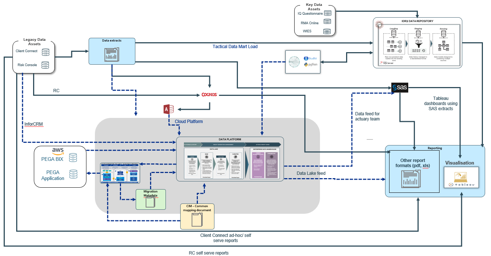
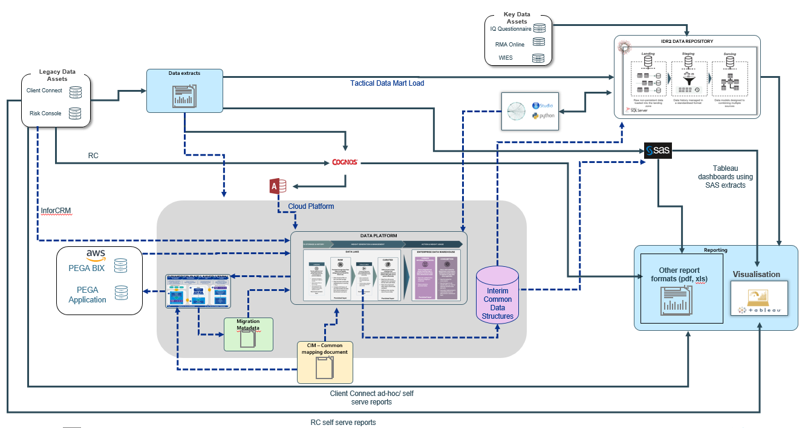
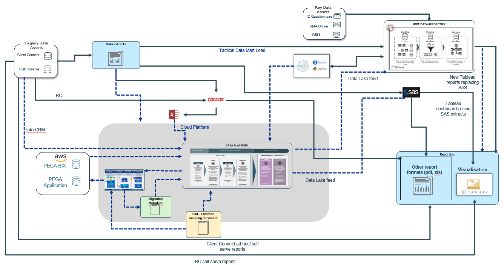

# Co-existence Reporting Design

OUTCOME DECIDED Add your comments directly to the page. Include links to
any relevant research, data, or feedback.

|              |                                                                                                                                                                                                                                                                                                                                                                                                                       |
|--------------|-----------------------------------------------------------------------------------------------------------------------------------------------------------------------------------------------------------------------------------------------------------------------------------------------------------------------------------------------------------------------------------------------------------------------|
| Status       | OUTCOME DECIDED                                                                                                                                                                                                                                                                                                                                                                                                       |
| Impact       | MEDIUM                                                                                                                                                                                                                                                                                                                                                                                                                |
| Driver       | Jason Dang (Deactivated) h.lindsaysmith@vmia.vic.gov.au Lindsay-Smith Ana Voinou (Deactivated)                                                                                                                                                                                                                                                                                                                        |
| Approver     | Hendry Susilo Maria Mota (Deactivated)                                                                                                                                                                                                                                                                                                                                                                                |
| Contributors |                                                                                                                                                                                                                                                                                                                                                                                                                       |
| Informed     | Lasath Kahingala                                                                                                                                                                                                                                                                                                                                                                                                      |
| Due date     | 03/07/2020                                                                                                                                                                                                                                                                                                                                                                                                            |
| Outcome      | VMIA agreed that Option 1 is the best option moving forward which sees reporting being produced out of the strategic data platform. The implication of going with Option 1 is that for some reports the full data set may not be available during co-existence. In those instances Option 2 will be considered for some reports depending on complexity and importance which will be decided on a case by case basis. |

## Background

As data (such as client list) is migrated and mastered from legacy
systems (Risk Console/Client Connect) into PEGA, there is a requirement
to ensure that any business reports dependent on this data are still
accurate and representative of the performance of the whole business.
This decision explores potential design options to mitigate the impact
on downstream reports as data is being migrated.

### Current state dataflows

As a point of reference the existing dataflows identified in the
analysis undertaken are represented in the diagram below.

An extensive analysis and assessment (9 meetings over a week) was
undertaken to identify all existing reports that will be impacted during
co-existence, broken down by release based on the functionality that
PEGA will drop in each release.  

The following table summarises the findings:

<table class="confluenceTable" data-layout="default">
<tbody>
<tr class="header">
<th class="confluenceTh">
<strong>Source System</strong>
</th>
<th class="confluenceTh">
<strong>Impacted reports per
release</strong>
</th>
<th class="confluenceTh">
<strong>Complexity and
importance</strong>
</th>
<th class="confluenceTh"><ul>
<li>
<strong>Solution Considerations</strong>
</li>
</ul></th>
</tr>

<tr class="odd">
<td class="confluenceTd">
SAS
</td>
<td class="confluenceTd"><ul>
<li>
16 reports affected for Rel 1 &amp; 2. Of these reports:

<ul>
<li>
10 reports relate to claims using different aggregations and
filters
</li>
<li>
3 reports relate to CRM data out of RC and will potentially be
handled by PEGA
</li>
<li>
1 is a mailing list
</li>
<li>
1 Cognos report only formatted by SAS
</li>
<li>
2 claim transaction reports one per month and YTD
respectively
</li>
</ul></li>
</ul></td>
<td class="confluenceTd"><ul>
<li>
Complexity:

<ul>
<li>
7 reports small
</li>
<li>
9 reports medium (contain some aggregations)
</li>
</ul></li>
<li>
The claim transactions reports may join to TechOne
</li>
</ul></td>
<td class="confluenceTd"><ul>
<li>
Actuary team should continue to receive data from RC and PEGA to
use for actuary purposes
</li>
<li>
Business will have 2 different mailing list extracts and will
have to merge them manually
</li>
<li>
Reports using similar datasets and different filters may be
consolidated into a single report
</li>
</ul></td>
</tr>
<tr class="even">
<td class="confluenceTd">
Cognos
</td>
<td class="confluenceTd"><ul>
<li>
7 reports affected for Rel 1 &amp; 2. Of these reports:

<ul>
<li>
5 relate to payments
</li>
<li>
1 to collections
</li>
<li>
1 to premium
</li>
</ul></li>
</ul></td>
<td class="confluenceTd"><ul>
<li>
These are mainly finance reports around claim payments and
premium invoiced. There will be further workshops between PEGA and
finance team for Release 2 to identify the scope and the functionality
provided directly in PEGA for these
</li>
<li>
Reports have small to medium complexity
</li>
</ul></td>
<td class="confluenceTd"><ul>
<li>
Data from PEGA and RC needs to be merged
</li>
<li>
Business will have 2 different report formats for some reports,
one for Cognos and one for migrated data
</li>
<li>
Reports using similar datasets and different filters may be
consolidated into a single report
</li>
</ul></td>
</tr>
<tr class="odd">
<td class="confluenceTd">
Tableau
</td>
<td class="confluenceTd"><ul>
<li>
2 dashboards sourcing from RC via SAS into Tableau
</li>
<li>
Reports relate to tickets
</li>
</ul></td>
<td class="confluenceTd"><ul>
<li>
Medium complexity due to multiple extracts used to build each
dashboard
</li>
</ul></td>
<td class="confluenceTd"><ul>
<li>
Datasets either to be merged or complex joined and logic to be
added to Tableau reports
</li>
</ul></td>
</tr>
<tr class="even">
<td class="confluenceTd">
Adhoc Risk Console reports
</td>
<td class="confluenceTd"><ul>
<li>
5 reports (Westpac load file, certificate of currency, policies
to endorsements and policy schedule, invoice premium)
</li>
</ul></td>
<td class="confluenceTd"><ul>
<li>
These reports should be operational reports produced by
PEGA
</li>
</ul></td>
<td class="confluenceTd"><ul>
<li>
Business will have 2 different report formats for some reports,
one for RC and one for migrated data
</li>
<li>
Reports using similar datasets and different filters may be
consolidated into a single report
</li>
</ul></td>
</tr>
<tr class="odd">
<td class="confluenceTd">
Adhoc Client Connect reports
</td>
<td class="confluenceTd"><ul>
<li>
3 types of adhoc report requests with several permutations of the
same data with different filters. Subject areas include:

<ul>
<li>
Active Clients
</li>
<li>
Contacts - Renewals
</li>
<li>
Tickets
</li>
</ul></li>
</ul></td>
<td class="confluenceTd"><ul>
<li>
Queries simple but according to user there are around 300 active
queries using various filters and combinations of the same data
</li>
<li>
Requests come in waves but could be a few requests per
month
</li>
</ul></td>
<td class="confluenceTd"><ul>
<li>
Data may be refreshed in Client Connect via feed from PEGA. In
that case reports will not need remediation
</li>
<li>
Reports using similar datasets and different filters may be
consolidated into a single report
</li>
</ul></td>
</tr>
<tr class="even">
<td class="confluenceTd">
IDR2
</td>
<td class="confluenceTd"><ul>
<li>
Currently 4 existing reports
</li>
<li>
A fifth report is currently build
</li>
<li>
Reports difficult to use due to complexity and lack of
visualisation tool (Tableau) for VMIA clients
</li>
<li>
1 python script that calculates PL Taxonomy and may potentially
be affected if PEGA doesn’t include that functionality
</li>
</ul></td>
<td class="confluenceTd"><ul>
<li>
Reports (Insurance Profile and Claims Profile) are still being
rolled out to clients but some clients sites still don’t have access to
Tableau on client side. This should be potentially available in the next
3-6 months
</li>
<li>
Reports contain sensitive data and need rework so can’t be use as
they are
</li>
<li>
Rest of reports not relevant for Release 1 &amp; 2 (Health
related)
</li>
</ul></td>
<td class="confluenceTd"><ul>
<li>
Existing data marts may be able to cater for producing existing
SAS reports that were migrated to IDR2 due to other reporting
priorities
</li>
</ul></td>
</tr>
<tr class="odd">
<td class="confluenceTd">
Total
</td>
<td class="confluenceTd">
30 reports
</td>
<td class="confluenceTd"><ul>
<li>
More that half of the reports are a similar extract with
different filters
</li>
<li>
Many of the reports especially around payments and CRM data still
to be determined if source directly via PEGA
</li>
</ul></td>
<td class="confluenceTd"></td>
</tr>
</tbody>
</table>

## Relevant data

The information below provides details of the design on the proposed
options.

**Option 1: Reporting out of the Data Warehouse on the Strategic Data
Platform**

This option would involve accelerating the development of the Data
Warehouse portion of the strategic Data Platform. The data marts and
star schemas will be reused or remodeled and enhanced based on the VMIA
business processes. Existing reports that are currently sourced from
IDR2, SAS, Cognos or directly from Risk Console or Client Connect will
be rebuild using the new Data Platform.

For the co-existence, logic will be incorporated in the integration
layer to combine data from legacy and PEGA BIX. Gradually data will be
sourced more and more from the PEGA BIX channel until the data migration
project is completed. The migration metadata will be used to know which
data in reports should be sourced from PEGA BIX and which from the
legacy sources . The above solution would have the following steps:

-   Create / adapt star schemas to existing / improved business
    processes due to use of the new PEGA application

-   Create strategic acquisition pipelines to load data into the
    platform

-   Create strategic ETL pipelines with logic that combines the legacy
    and PEGA data for load into the new data warehouse structures

-   Creation of reports out of the new Data platform

The dotted lines on the diagram below describe the data flows during
co-existence.

**Option 2: Report from Data lake but rebuild reports to not use SAS**

This option would involve rebuilding the SAS reports outside SAS using
data directly from the Data Lake. Data flows will be developed to
combine the relevant data from RC and PEGA and recreate the reports in
the required format.

Data extracts will still be sent to SAS only for use of the actuary
team. Reports will be created containing consolidated PEGA and legacy
data.

This process would required the following data flows to be developed:

-   Acquisition and Ingestion of Risk Console and Client Connect data
    into the raw layer of the data platform

-   Acquisition and Ingestion of PEGA BIX data into the Data Lake of the
    data platform

-   Creation of data flows to combine and prepare data for the extracts

The dotted lines on the diagram below describe the data flows during
co-existence.

**Option 3: Use interim common table structures to combine legacy and
PEGA data**

As per option 1, this would require legacy and PEGA data to be ingested
into the Data Platform. A number of common data structures would be
created that including all necessary fields for the existing reports
from legacy. Data from PEGA for the migrated clients will be merged into
these structures. Once the data is combined, extracts could be created
that feed into IDR2 and SAS similar to the old extract feeds. SAS and
IDR2 can be re-pointed to use the new extracts instead of the current
sources and all reporting out of these systems will stay intact. The
migration metadata will be used to know which data in reports should be
sourced from PEGA BIX and which from the legacy sources. This option
will require the following data flows:

-   Strategic acquisition and Ingestion of Risk Console and Client
    Connect data into the raw layer of the data platform as required by
    the old data extracts

-   Acquisition and Ingestion of PEGA BIX data into the data platform

-   ETL processes to combine the data and load into the common data
    structures

-   Creation of extracts to simulate the previous legacy extracts

-   Re-pointing of new extracts to IDR2 and SAS to be used as a source
    now

Once the data flows above have been developed and a common data
structure has been populated, this will then act as the new data source
for downstream reports allowing VMIA to maintain visibility of their
clients across both systems.

The dotted lines on the diagram below describe the data flows during
co-existence.

**Option 4: Report on Data Lake and IDR2 and no SAS**

This option would involve rebuilding the SAS reports outside SAS using
data ingested into IDR2. New data flows would be developed sending the
PEGA BIX data from the data platform to IDR2. New SSIS load packages
would be developed to combine the relevant data from RC and PEGA and
populate the star schemas appropriately. Any additional fields needed to
enable the functionality of the reports would be added to the IDR2
solution. Reports will be then recreated out of IDR2 in the required
format.

Data extracts will still be sent to SAS only for use of the actuary
team. Reports will be created containing consolidated PEGA and legacy
data.

This process would required the following data flows to be developed:

-   Acquisition and Ingestion of Risk Console and Client Connect data
    into the raw layer of the data platform

-   Acquisition and Ingestion of PEGA BIX data into the Data Lake of the
    data platform

-   Development of SSIS packages to load new data into IDR2 staging

-   Creation of SSIS packages to combine and load data into the star
    schemas

-   Creation of new reports out of IDR2

The dotted lines on the diagram below describe the data flows during
co-existence.

## Options considered

<table class="confluenceTable" data-layout="wide">
<tbody>
<tr class="header">
<th class="confluenceTh"></th>
<th class="confluenceTh">
<strong>Option 1: Reporting out of the Data
Warehouse on the Strategic Data Platform</strong>
</th>
<th class="confluenceTh">
<strong>Option 2: Report from Data lake but
rebuild reports to not use SAS</strong>
</th>
<th class="confluenceTh">
<strong>Option 3: Use interim common table
structures to combine legacy and PEGA data</strong>
</th>
<th class="confluenceTh">
<strong>Option 4 Report on Data Lake and
IDR2 and no SAS</strong>
</th>
</tr>

<tr class="odd">
<th class="confluenceTh">
Description
</th>
<td class="confluenceTd">
This option would involve accelerating the
development of the Data Warehouse portion of the strategic Data
Platform. The Data marts and star schemas will be reused or remodeled
and enhanced based on the VMIA business processes. Existing reports that
are currently sourced from IDR2, SAS, Cognos or directly from Risk
Console or Client Connect will be rebuild using the new Data
Platform.

For the co-existence, logic will be incorporated in the integration
layer to combine data from legacy and PEGA BIX. Gradually data will be
sourced more and more from the PEGA BIX channel until the data migration
project is completed. The migration metadata will be used to know which
data in reports should be sourced from PEGA BIX and which from the
legacy sources. The above solution would have the following steps:

<ul>
<li>
Create / adapt star schemas to existing / improved business
processes due to use of the new PEGA application
</li>
<li>
Fast track strategic data acquisition patterns
</li>
<li>
Create ETL pipelines with logic that combines the legacy and PEGA
data for load into the new data warehouse structures
</li>
<li>
Creation of reports out of the new Data platform
</li>
</ul></td>
<td class="confluenceTd">
This option would involve rebuilding the SAS
reports outside SAS using data directly from the Data Lake. Data flows
will be developed to combine the relevant data from RC and PEGA and
recreate the reports in the required format.

Data extracts will still be sent to SAS only for use of the actuary
team. Reports will be created containing consolidated PEGA and legacy
data.

This process would required the following data flows to be
developed:

<ul>
<li>
Acquisition and Ingestion of Risk Console and Client Connect data
into the raw layer of the data platform
</li>
<li>
Acquisition and Ingestion of PEGA BIX data into the Data Lake of
the data platform
</li>
<li>
Creation of data flows to combine and prepare data for the
extracts
</li>
</ul></td>
<td class="confluenceTd">
This option would require legacy and PEGA
data to be ingested into the Data Platform separately. A common data
structure would be created that includes all necessary fields for
reporting from legacy. Data from PEGA for the migrated clients would be
merged into these structures. Once the data is combined, extracts could
be created that feed into IDR2 and SAS similar to the old extract feeds.
SAS and IDR2 can be re-pointed to use the new extracts instead and all
reporting out of these systems will stay intact. This option will
require the following data flows:

<ul>
<li>
Acquisition and Ingestion of Risk Console and Client Connect data
into the raw layer of the data platform as required by the old data
extracts
</li>
<li>
Acquisition and Ingestion of PEGA BIX data into the data
platform
</li>
<li>
ETL processes to combine the data and load into the common data
structures
</li>
<li>
Creation of extracts to simulate the previous legacy
extracts
</li>
<li>
Re-pointing of new extracts to IDR2 and SAS to be used as a
source now
</li>
</ul>

Once the data flows above have been developed and a common data
structure has been populated this will then act as the new data source
for downstream reports allowing VMIA to maintain visibility of their
clients across both systems.
</td>
<td class="confluenceTd">
This option would involve rebuilding the SAS
reports outside SAS using data ingested into IDR2. New data flows would
be developed sending the PEGA BIX data from the data platform to IDR2.
New SSIS load packages would be developed to combine the relevant data
from RC and PEGA and populate the star schemas appropriately. Any
additional fields needed to enable the functionality of the reports
would be added to the IDR2 solution. Reports will be then recreated out
of IDR2 in the required format.

Data extracts will still be sent to SAS only for use of the actuary
team. Reports will be created containing consolidated PEGA and legacy
data.

This process would required the following data flows to be
developed:

<ul>
<li>
Acquisition and Ingestion of Risk Console and Client Connect data
into the raw layer of the data platform
</li>
<li>
Acquisition and Ingestion of PEGA BIX data into the Data Lake of
the data platform
</li>
<li>
Development of SSIS packages to load new data into IDR2
staging
</li>
<li>
Creation of SSIS packages to combine and load data into the star
schemas
</li>
<li>
Creation of new reports out of IDR2
</li>
</ul></td>
</tr>
<tr class="even">
<th class="confluenceTh">
Pros and cons
</th>
<td class="confluenceTd">

<ul>
<li>
No technical debt or throw away work
</li>
<li>
SAS decommissioned as an ETL tool, bringing mappings and business
logic into the platform
</li>
<li>
Strategic reporting capability is available in the shortest
possible time frame
</li>
</ul>

<ul>
<li>
It will not be possible to deliver a full data warehouse solution
in 3 months, so there will be a period of 3+ months where existing
reports loose sight of migrated clients and there are no reports
available for the migrated clients
</li>
</ul></td>
<td class="confluenceTd">

<ul>
<li>
SAS decommissioned as an ETL tool, bringing mappings and business
logic into the platform
</li>
<li>
Quick time to deliver as metric definition can be done in
reporting tool
</li>
</ul>

<ul>
<li>
Business logic for metrics locked up in reporting tool
</li>
<li>
Strategic data warehouse delayed
</li>
<li>
Re-work will be needed to re-point resources once the strategic
solution is finished and there maybe no driver for this
</li>
</ul></td>
<td class="confluenceTd">

<ul>
<li>
High likelihood there will be no reporting discontinuity as
cohorts are migrated to PEGA
</li>
</ul>

<ul>
<li>
ETL to merge datasets will not be reusable for other reports and
business logic remains in SAS
</li>
<li>
Re-work will be needed to re-point resources once the strategic
solution is finished and there maybe no driver for this
</li>
<li>
Strategic data warehouse delayed
</li>
</ul></td>
<td class="confluenceTd">

<ul>
<li>
SAS that can use IDR are pointed to a common data model
</li>
</ul>

<ul>
<li>
More tech debt on legacy on-premise environment
</li>
<li>
Strategic Data warehouse delayed
</li>
</ul></td>
</tr>
<tr class="odd">
<th class="confluenceTh">
Estimated effort
</th>
<td class="confluenceTd">
MEDIUM
</td>
<td class="confluenceTd">
MEDIUM
</td>
<td class="confluenceTd">
MEDIUM
</td>
<td class="confluenceTd">
MEDIUM
</td>
</tr>
</tbody>
</table>

## Action items

-   

## Outcome

## Attachments:

[image-20200611-055315.png](attachments/8978505/11370553.png)
(image/png)  

[image-20200611-063746.png](attachments/8978505/11468919.png)
(image/png)  

[image-20200611-225850.png](attachments/8978505/13303809.png)
(image/png)  

[image-20200611-231405.png](attachments/8978505/11305184.png)
(image/png)  

[image-20200611-231936.png](attachments/8978505/11337945.png)
(image/png)  

[image-20200611-231953.png](attachments/8978505/11337951.png)
(image/png)  

[image-20200611-232016.png](attachments/8978505/13434881.png)
(image/png)  

[image-20200611-232600.png](attachments/8978505/13434900.png)
(image/png)  

[image-20200611-232616.png](attachments/8978505/11469089.png)
(image/png)  

[image-20200611-232618.png](attachments/8978505/13303817.png)
(image/png)  

[image-20200611-233217.png](attachments/8978505/11305198.png)
(image/png)  

[image-20200629-060038.png](attachments/8978505/41256786.png)
(image/png)  

[image-20200629-064923.png](attachments/8978505/50463055.png)
(image/png)  

[image-20200629-075832.png](attachments/8978505/50201118.png)
(image/png)  

[image-20200629-075936.png](attachments/8978505/50463092.png)
(image/png)  

[image-20200629-080151.png](attachments/8978505/50201124.png)
(image/png)  

[image-20200629-080409.png](attachments/8978505/50168437.png)
(image/png)  

[image-20200629-080607.png](attachments/8978505/44041047.png)
(image/png)  

[image-20200629-080637.png](attachments/8978505/50201144.png)
(image/png)  

[image-20200629-080734.png](attachments/8978505/50070287.png)
(image/png)  

[image-20200629-214244.png](attachments/8978505/52101171.png)
(image/png)  

[image-20200629-215108.png](attachments/8978505/52035627.png)
(image/png)  

[image-20200629-232108.png](attachments/8978505/52428861.png)
(image/png)  

[image-20200629-232150.png](attachments/8978505/52035859.png)
(image/png)  

