# Tableau vs Power BI (Update)

-   [Key Points and
    Recommendation](#TableauvsPowerBI(Update)-KeyPointsandRecommendation)
    -   [Scoring Table](#TableauvsPowerBI(Update)-ScoringTable)
    -   [Blockers](#TableauvsPowerBI(Update)-Blockers)
    -   [Other Key
        Limitations](#TableauvsPowerBI(Update)-OtherKeyLimitations)
    -   [Advantages of
        PowerBI](#TableauvsPowerBI(Update)-AdvantagesofPowerBI)
-   [Appendix 1: Cost
    Details](#TableauvsPowerBI(Update)-Appendix1:CostDetails)
-   [Appendix 2: Further
    Details](#TableauvsPowerBI(Update)-Appendix2:FurtherDetails)
    -   [Ease of Use
        (Viewer)](#TableauvsPowerBI(Update)-EaseofUse(Viewer))
        -   [PowerBI Workspaces
            (Online)](#TableauvsPowerBI(Update)-PowerBIWorkspaces(Online))
        -   [View the underlying
            data](#TableauvsPowerBI(Update)-Viewtheunderlyingdata)
        -   [Subscribing to a
            Report](#TableauvsPowerBI(Update)-SubscribingtoaReport)
        -   [Exporting a
            Report](#TableauvsPowerBI(Update)-ExportingaReport)
    -   [Ease of Use
        (Creator)](#TableauvsPowerBI(Update)-EaseofUse(Creator))
        -   [Data Import Function
            (Bob)](#TableauvsPowerBI(Update)-DataImportFunction(Bob))
        -   [Data Import
            Speed/Accessibility](#TableauvsPowerBI(Update)-DataImportSpeed/Accessibility)
        -   [Formatting
            Visuals](#TableauvsPowerBI(Update)-FormattingVisuals)
        -   [Tooltips in
            PowerBI](#TableauvsPowerBI(Update)-TooltipsinPowerBI)
    -   [Ease of Upgrade (Bob,
        Dan)](#TableauvsPowerBI(Update)-EaseofUpgrade(Bob,Dan))
        -   [PowerBI Desktop](#TableauvsPowerBI(Update)-PowerBIDesktop)
        -   [PowerBI Workspaces
            (Cloud)](#TableauvsPowerBI(Update)-PowerBIWorkspaces(Cloud))
    -   [Amount of Data that can be handled
        (Bob)](#TableauvsPowerBI(Update)-AmountofDatathatcanbehandled(Bob))
        -   [PowerBI
            Desktop](#TableauvsPowerBI(Update)-PowerBIDesktop.1)
        -   [PowerBI Workspace
            (Online)](#TableauvsPowerBI(Update)-PowerBIWorkspace(Online))
    -   [Connections to different types of data
        sources.](#TableauvsPowerBI(Update)-Connectionstodifferenttypesofdatasources.)
    -   [Speed at which data is processed
        (imported)](#TableauvsPowerBI(Update)-Speedatwhichdataisprocessed(imported))
    -   [How data extract/refresh is handled
        (Bob)](#TableauvsPowerBI(Update)-Howdataextract/refreshishandled(Bob))
        -   [Manual Refresh](#TableauvsPowerBI(Update)-ManualRefresh)
        -   [Scheduled Refresh
            (Automatic)](#TableauvsPowerBI(Update)-ScheduledRefresh(Automatic))
        -   [Scheduled Refresh
            (Python)](#TableauvsPowerBI(Update)-ScheduledRefresh(Python))
    -   [Connections to different types of data
        (Bob)](#TableauvsPowerBI(Update)-Connectionstodifferenttypesofdata(Bob))
    -   [Data Security
        (Bob)](#TableauvsPowerBI(Update)-DataSecurity(Bob))
        -   [PowerBI Azure Data
            Security](#TableauvsPowerBI(Update)-PowerBIAzureDataSecurity)
        -   [PowerBI User Permissions
            Data](#TableauvsPowerBI(Update)-PowerBIUserPermissionsData)
    -   [Ability to Customise and Modify
        Graphs](#TableauvsPowerBI(Update)-AbilitytoCustomiseandModifyGraphs)
        -   [Word Clouds](#TableauvsPowerBI(Update)-WordClouds)
    -   [Web Charts (Peter
        Parker)](#TableauvsPowerBI(Update)-WebCharts(PeterParker))
    -   [Tableau Prep
        Builder](#TableauvsPowerBI(Update)-TableauPrepBuilder)
    -   [Creating a Client
        Portal](#TableauvsPowerBI(Update)-CreatingaClientPortal)
    -   [Report Sharing](#TableauvsPowerBI(Update)-ReportSharing)
        -   [Publishing Apps in
            PowerBI](#TableauvsPowerBI(Update)-PublishingAppsinPowerBI)
    -   [Challenges](#TableauvsPowerBI(Update)-Challenges)
    -   [Case Studies](#TableauvsPowerBI(Update)-CaseStudies)
        -   [Bob Zhu - Property & Liability Taxonomy with Geospatial
            Integration](#TableauvsPowerBI(Update)-BobZhu-Property&LiabilityTaxonomywithGeospatialIntegration)
        -   [Claims Close Out Times
            (Alex)](#TableauvsPowerBI(Update)-ClaimsCloseOutTimes(Alex))

# Key Points and Recommendation

## Scoring Table

<table class="confluenceTable" data-layout="wide">
<tbody>
<tr class="odd">
<td class="confluenceTd">
<strong>Criteria</strong>
</td>
<td class="confluenceTd">
Assigned to
</td>
<td class="confluenceTd">
Weighting
</td>
<td class="confluenceTd">
Score (1-5)
</td>
<td class="confluenceTd">
Comments
</td>
</tr>
<tr class="even">
<td class="confluenceTd">
<strong>Ease of Use</strong>
</td>
<td class="confluenceTd"></td>
<td class="confluenceTd"></td>
<td class="confluenceTd"></td>
<td class="confluenceTd"></td>
</tr>
<tr class="odd">
<td class="confluenceTd">
Ease of use by new user (Viewer)
</td>
<td class="confluenceTd">
All
</td>
<td class="confluenceTd">
4
</td>
<td class="confluenceTd">
4
</td>
<td class="confluenceTd">
The inherent integration with Excel in Power
BI makes it more user friendly for end-users. PowerBI is a Microsoft
product that looks like a Microsoft product, so it will be more familiar
to Microsoft users.
</td>
</tr>
<tr class="even">
<td class="confluenceTd">
Ease of use by new user (Creator)
</td>
<td class="confluenceTd">
All
</td>
<td class="confluenceTd">
2
</td>
<td class="confluenceTd">
2
</td>
<td class="confluenceTd">
PowerBI requires more coding ability to
build reports. Tableau is more intuitive in terms of building graphs,
PowerBI is much more fixed and static, a user needs to know the graph.
Creating new columns or calculated fields does involve additional
steps.
</td>
</tr>
<tr class="odd">
<td class="confluenceTd">
Ease of upgrade
</td>
<td class="confluenceTd">
Dan
</td>
<td class="confluenceTd">
1
</td>
<td class="confluenceTd">
4
</td>
<td class="confluenceTd">
PowerBI Desktop needs to be upgraded every
month, but the PowerBI app is upgraded automatically. If we stick with
Tableau Server, then we need to upgrade both Tableau Desktop and Tableau
Server ourselves.
</td>
</tr>
<tr class="even">
<td class="confluenceTd">
<strong>Availability of
Support</strong>
</td>
<td class="confluenceTd"></td>
<td class="confluenceTd"></td>
<td class="confluenceTd"></td>
<td class="confluenceTd"></td>
</tr>
<tr class="odd">
<td class="confluenceTd">
Availability of training
</td>
<td class="confluenceTd">
Alex
</td>
<td class="confluenceTd">
2
</td>
<td class="confluenceTd">
3
</td>
<td class="confluenceTd">
Both have training readily
available.
</td>
</tr>
<tr class="even">
<td class="confluenceTd">
Support by vendor
</td>
<td class="confluenceTd">
Alex
</td>
<td class="confluenceTd">
1
</td>
<td class="confluenceTd">
2
</td>
<td class="confluenceTd">
Tableau has more direct contact
support.
</td>
</tr>
<tr class="odd">
<td class="confluenceTd">
<strong>Data</strong>
</td>
<td class="confluenceTd"></td>
<td class="confluenceTd"></td>
<td class="confluenceTd"></td>
<td class="confluenceTd"></td>
</tr>
<tr class="even">
<td class="confluenceTd">
Ability to join/transform data
</td>
<td class="confluenceTd">
All
</td>
<td class="confluenceTd">
3
</td>
<td class="confluenceTd">
3
</td>
<td class="confluenceTd">
Similar to Tableau, the only weakness is its
inability to easily reuse the same table more than once. Affects the
validity of DIM_DATE.
</td>
</tr>
<tr class="odd">
<td class="confluenceTd">
Amount of data that can be handled
</td>
<td class="confluenceTd">
Bob
</td>
<td class="confluenceTd">
3
</td>
<td class="confluenceTd">
3
</td>
<td class="confluenceTd">
Similar to Tableau, the limiting factor for
both is mostly RAM on Desktop and the 10GB limit per workspace on
PowerBI Workspaces.

We are currently only using 2.7GB of space in Tableau, so unless
PowerBI tables take up vastly more room then this should not be a
problem.

250MB cap for PowerBI when on Excel Viewing Mode.
</td>
</tr>
<tr class="even">
<td class="confluenceTd">
Inbuilt data validation
</td>
<td class="confluenceTd">
All
</td>
<td class="confluenceTd">
3
</td>
<td class="confluenceTd">
2
</td>
<td class="confluenceTd">
View data function doesn’t seem to work for
all chart complexities in Power BI making validation more difficult in
some instances.

Tableau Prep offers significant more support for in-built data
validation and testing out data pipelines, in a step-by-step format. The
ability to import/export data to databases is also a plus compared to
PowerBI
</td>
</tr>
<tr class="odd">
<td class="confluenceTd">
Connections to different types of data
sources (specific attention to Snowflake, APIs)
</td>
<td class="confluenceTd">
Bob
</td>
<td class="confluenceTd">
5
</td>
<td class="confluenceTd">
2
</td>
<td class="confluenceTd">
PowerBI is not as optimised with its
integration to Snowflake as compared to Tableau (unable to select user
roles).

Power BI also lacks Tableau Prep Builder functionality, which is
extremely handy for dealing with new messy data sources.
</td>
</tr>
<tr class="even">
<td class="confluenceTd">
Speed at which data is processed
</td>
<td class="confluenceTd">
All
</td>
<td class="confluenceTd">
3
</td>
<td class="confluenceTd">
3
</td>
<td class="confluenceTd">
Limited by internet connection speed, for
most data sets at VMIA should be the same, barring really large FACT to
DIM joins, Tableau does have the advantage.
</td>
</tr>
<tr class="odd">
<td class="confluenceTd">
How data extract/refresh is handled
</td>
<td class="confluenceTd">
All
</td>
<td class="confluenceTd">
2
</td>
<td class="confluenceTd">
3
</td>
<td class="confluenceTd">
PowerBI Pro is has 8 refreshes per dataset
per day. Tableau has unlimited. Normally we don’t use more than once a
day. There are live connections.
</td>
</tr>
<tr class="even">
<td class="confluenceTd">
<strong>Functionality</strong>
</td>
<td class="confluenceTd"></td>
<td class="confluenceTd"></td>
<td class="confluenceTd"></td>
<td class="confluenceTd"></td>
</tr>
<tr class="odd">
<td class="confluenceTd">
Inbuilt functions
</td>
<td class="confluenceTd">
All
</td>
<td class="confluenceTd">
5
</td>
<td class="confluenceTd">
2
</td>
<td class="confluenceTd">
DAX appears to be more cumbersome requiring
more code for complex transformations than Tableau. It is far easier to
write complex calculations in a single step in Tableau due to the fact
that the formula can be structured, whereas PowerBI only allows for
Excel-style formulas. Learning curve is also higher for PowerBI, given
Tableau’s similarity with SQL.
</td>
</tr>
<tr class="even">
<td class="confluenceTd">
Ability to aggregate data
</td>
<td class="confluenceTd">
All
</td>
<td class="confluenceTd">
4
</td>
<td class="confluenceTd">
2
</td>
<td class="confluenceTd">
Tableau has very good auto-aggregation,
which allows the aggregation type to be changed using a drop-down menu
whereas in PowerBI a lot of manual calculation is required to do this.
(e.g. sums, averages)
</td>
</tr>
<tr class="odd">
<td class="confluenceTd">
Ease of data exploration
</td>
<td class="confluenceTd">
All
</td>
<td class="confluenceTd">
5
</td>
<td class="confluenceTd">
1
</td>
<td class="confluenceTd">
Tableau makes it easier to drag data in and
produce and change tables quickly in order to perform exploratory
analysis
</td>
</tr>
<tr class="even">
<td class="confluenceTd">
Python integration
</td>
<td class="confluenceTd">
Alex
</td>
<td class="confluenceTd">
3
</td>
<td class="confluenceTd">
4
</td>
<td class="confluenceTd">
Power BI takes fewer steps and is more
intuitive in applying python code.
</td>
</tr>
<tr class="odd">
<td class="confluenceTd">
Functionality of filters
</td>
<td class="confluenceTd">
All
</td>
<td class="confluenceTd">
5
</td>
<td class="confluenceTd">
2
</td>
<td class="confluenceTd">
More flexibility and options for filtering
and display of filters in Tableau.

PowerBI is (originally) limited to dropdowns.
</td>
</tr>
<tr class="even">
<td class="confluenceTd">
Geospatial integration
</td>
<td class="confluenceTd">
Dan
</td>
<td class="confluenceTd">
4
</td>
<td class="confluenceTd">
2
</td>
<td class="confluenceTd">
Tableau allows for multiple layers to be
loaded and intersections, etc. to be calculated. PowerBI’s base
geospatial functionality is very limited, but an Esri plugin is
available (for an additional cost) which allows more complex
calculations. Without plugins, PowerBI is sufficient to analyse point
data, while Tableau can do analysis with shape files.
</td>
</tr>
<tr class="odd">
<td class="confluenceTd">
<strong>Visualisation</strong>
</td>
<td class="confluenceTd"></td>
<td class="confluenceTd"></td>
<td class="confluenceTd"></td>
<td class="confluenceTd"></td>
</tr>
<tr class="even">
<td class="confluenceTd">
Visual appeal of reports
</td>
<td class="confluenceTd">
All
</td>
<td class="confluenceTd">
5
</td>
<td class="confluenceTd">
2
</td>
<td class="confluenceTd">
The visual customizability of reports is
definitively less than Tableau - PowerBI reports are more ‘blocky’ as
compared to Tableau.

<a href="https://public.tableau.com/en-gb/gallery"
rel="nofollow">https://public.tableau.com/en-gb/gallery</a>

<a
href="https://community.powerbi.com/t5/Data-Stories-Gallery/bd-p/DataStoriesGallery"
rel="nofollow">https://community.powerbi.com/t5/Data-Stories-Gallery/bd-p/DataStoriesGallery</a>
</td>
</tr>
<tr class="odd">
<td class="confluenceTd">
Ability to customise
graphs/dashboards
</td>
<td class="confluenceTd">
All
</td>
<td class="confluenceTd">
5
</td>
<td class="confluenceTd">
1
</td>
<td class="confluenceTd">
Limited chart dimensions means some charts
in Tableau cannot be recreated in Power BI.
</td>
</tr>
<tr class="even">
<td class="confluenceTd">
Ability to set templates
</td>
<td class="confluenceTd">
All
</td>
<td class="confluenceTd">
2
</td>
<td class="confluenceTd">
4
</td>
<td class="confluenceTd">
There are templated themes that can be added
in PowerBI, unlike Tableau.
</td>
</tr>
<tr class="odd">
<td class="confluenceTd">
Printability: Do reports display well when
printed?
</td>
<td class="confluenceTd">
All
</td>
<td class="confluenceTd">
1
</td>
<td class="confluenceTd">
3
</td>
<td class="confluenceTd">
Report displays are similar to
Tableau.
</td>
</tr>
<tr class="even">
<td class="confluenceTd">
<strong>External Access</strong>
</td>
<td class="confluenceTd"></td>
<td class="confluenceTd"></td>
<td class="confluenceTd"></td>
<td class="confluenceTd"></td>
</tr>
<tr class="odd">
<td class="confluenceTd">
Ability to create client portal 
</td>
<td class="confluenceTd">
All
</td>
<td class="confluenceTd">
5
</td>
<td class="confluenceTd">
5
</td>
<td class="confluenceTd">
Easy to create and share access to PowerBI
Workspaces, just need to check sensitivity of data stored in PowerBI’s
contracts. Also better for monitoring report usage and feedback. There
are ways to comment on the report as well.
</td>
</tr>
<tr class="even">
<td class="confluenceTd">
Report sharing
</td>
<td class="confluenceTd">
All
</td>
<td class="confluenceTd">
5
</td>
<td class="confluenceTd">
3
</td>
<td class="confluenceTd">
Report sharing is similar to
Tableau.
</td>
</tr>
<tr class="odd">
<td class="confluenceTd">
Data security (e.g. row level security,
security of data storage, etc.)
</td>
<td class="confluenceTd">
Bob
</td>
<td class="confluenceTd">
5
</td>
<td class="confluenceTd">
3
</td>
<td class="confluenceTd">
Tableau and PowerBI share similar levels of
protection for Row Level Security. There are not really any major
differences - just in terms of how the formulas works for defining
security for different users.
</td>
</tr>
<tr class="even">
<td class="confluenceTd">
Weighted Score
</td>
<td class="confluenceTd"></td>
<td class="confluenceTd"></td>
<td class="confluenceTd">
2.64
</td>
<td class="confluenceTd"></td>
</tr>
</tbody>
</table>

As part of the assessment, please assume that the rating scale, 1-5, 3
is **on par with Tableau**, and any score above 3 is **better** than
Tableau, and any score less than 3 is **inferior** to Tableau.

This assessment was conducted over the period of 2 weeks within the
Insights & Analytics team, which has spent years working with Tableau,
as opposed to PowerBI.

## Blockers

-   Number of dimensions - limits our ability to create charts that show
    how measures interact with multiple dimensions and requires multiple
    charts to compensate. The below chart example would not be possible
    to recreate because it utilises 3 dimensions: Claim type, Cost
    Banding, and Law firms.

    

    Research into this limitation yielded the following from a similar
    question asked of the Power BI community online: <a
    href="https://community.powerbi.com/t5/Desktop/Bar-chart-for-3-different-measures-over-one-dimension/m-p/493629"
    rel="nofollow">https://community.powerbi.com/t5/Desktop/Bar-chart-for-3-different-measures-over-one-dimension/m-p/493629</a>

    It essentially shows that only one “lane” can be utilised per chart,
    whereas tableau has the flexibility produce multiple lanes for
    different measures and dimensions within a given chart. This is
    crucial for analytics across dimension-rich datasets.

<!-- -->

-   Parameters - PowerBI does not allow for string parameters, which
    means that we cannot switch between which field is used in a
    calculation.  

-   Measures which are designed to change based on parameters cannot be
    aggregated. The underlying measures have to be aggregated and a
    specific aggregation type chosen. Again this leaves less flexibility
    from a dashboard development perspective and take significantly more
    time to implement changes.  

-   Data validation is limited - one of the crucial parts of the
    analytics is confirming that the numbers are correct, and this means
    going into the row-level data behind an aggregation to confirm what
    the visualisation software is doing. Power BI seems to only have
    this functionality for simple tables whereas Tableau seems to have
    it functional in all cases including the most complex tables which
    is where it is most required.  

-   License management - If we are using PowerBI Pro we will need to
    purchase PowerBI licenses for external users and invite these
    external users to join the relevant Microsoft Workspace. IT has
    indicated that this is something that they would be reluctant to
    monitor/administer. As PowerBI is a Microsoft product and licenses
    are assigned through the Microsoft 365 admin centre we would have to
    set up a separate Microsoft 365 account to administer this through
    the Insights team, which may cause complications.

## Other Key Limitations

-   Snowflake integration

Tableau is well integrated with Snowflake, and allows roles to be
selected. PowerBI can connect to Snowflake, but requires the role to be
changed by logging into Snowflake, which may cause difficulties for
users that operate using multiple roles.

-   Appearance

Tableau invests a lot into the appearance of their product, and this
results in graphs/dashboards that are very visually appealing. PowerBI
looks like a Microsoft product, but the appearance can be uplifted by
putting more work into the design.

-   Complex calculations

Power BI requires proficiency in 2 coding languages, DAX and M. Tableau
only requires one and it is similar to SQL which most analysts are
familiar with.

Using DAX requires more code for simple calculations. A different
measure needs to be created for average, sum, min/max, count etc.
Whereas Tableau gives just one measure which can be customised in the
visual as required with click of a button. This allows for a flow and
speed of thought when it comes to uncovering insights. Altering
dashboards due to changes in requirements for example, mean more code
changes which takes longer and creates more potential points of error.

-   No Tableau Prep Builder alternative

Tableau Prep Builder is a crucial part of rapid/agile development of
reporting/insights requirements for VMIA clients (internal and
external). A lot of VMIA reports/data sets remain unclean and in varying
formats/areas, Tableau Prep allows for rapid prototyping and development
using unclean datasets which is not a feature SDI or Power BI has
available to it.

The benefit of Tableau Prep Builder is also in its flexibility in
‘extracting’ the logic from transformations and recreating it in other
systems, e.g. SQL or Python. Such a tool has been critical for
developing a Cyber Tracking Tool for DPC, without it, it would’ve been
impossible to rapidly build, test and begin automation of the Cyber
Tracking Tool for DPC.

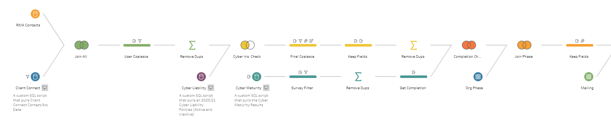

SDI is currently also missing a ‘fast way’ to test new data ingestion,
especially for the countless small datasets VMIA has. Tableau Prep
Builder serves that purpose, as a ‘pre-ingestion' of a new data set
prior to formalising the automated data ingestion process.

-   Poor strategic Timing

The key data sources and interfaces the I&A team use are being
overhauled in the near future through the introduction of Snowflake as a
cloud-based data platform and Client 360 as an iteratively-built
replacement for our current claims, insurance and contact systems. If
the team will also have to redesign its reports and adapt to a new data
visualisation program (key to much of the teams' work), then the team
will be stretched to the point where it may fail to meet key strategic
commitments, or do so sub-optimally. Innovative analysis, reporting and
client engagement will need to be de-prioritised for a further period as
the team adjusts to meet its core competencies with all systems.

## Advantages of PowerBI

-   Price

PowerBI is substantially cheaper than Tableau. PowerBI Pro annual
licensing costs are

-   Ability to publish and download other content (e.g. Excel
    spreadsheets).

PowerBI uses Microsoft Workspaces. It is well integrated with other
Microsoft products, and content such as Excel spreadsheets, Word
documents, etc. can easily be published to the same Workspace as the
PowerBI reports.

-   Client portal

-   Off the shelf chart types

Power BI offers several ready-to-use chart types such as radar, Sankey
or node navigation that can be built quickly and easily with less
overall control than Tableau (where specific co-ordinates and paths have
to be mapped, giving more control but being harder to build).

# Appendix 1: Cost Details

# Appendix 2: Further Details

## Ease of Use (Viewer)

### PowerBI Workspaces (Online)

PowerBI Workspaces has a ‘left-column’ layout as opposed to Tableau,
which has the different ‘pages’ of a dashboard at the top of the page in
a small font.

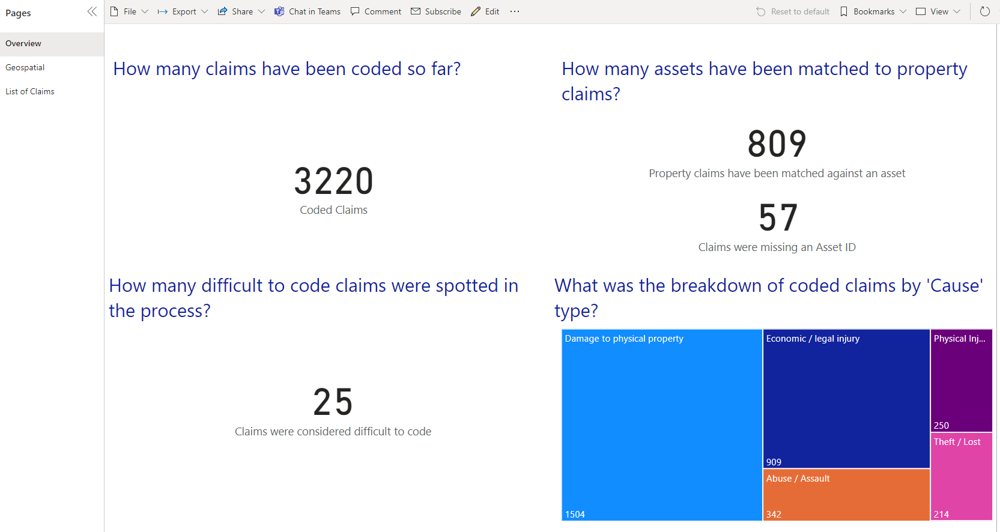

### View the underlying data

It is possible to view the underlying data in a view as a creator using
the ‘Show Table’ function on Power BI Workspaces.

### Subscribing to a Report

If anything, the ability for viewers to subscribe to a report is a
replica of Tableau’s offerings. There are different frequencies and
‘start/end dates’ which can be specified.

The only difference is that Tableau can generate a PDF version of the
report for subscriptions, whereas PowerBI Workspaces doesn’t seem to
have that ability.

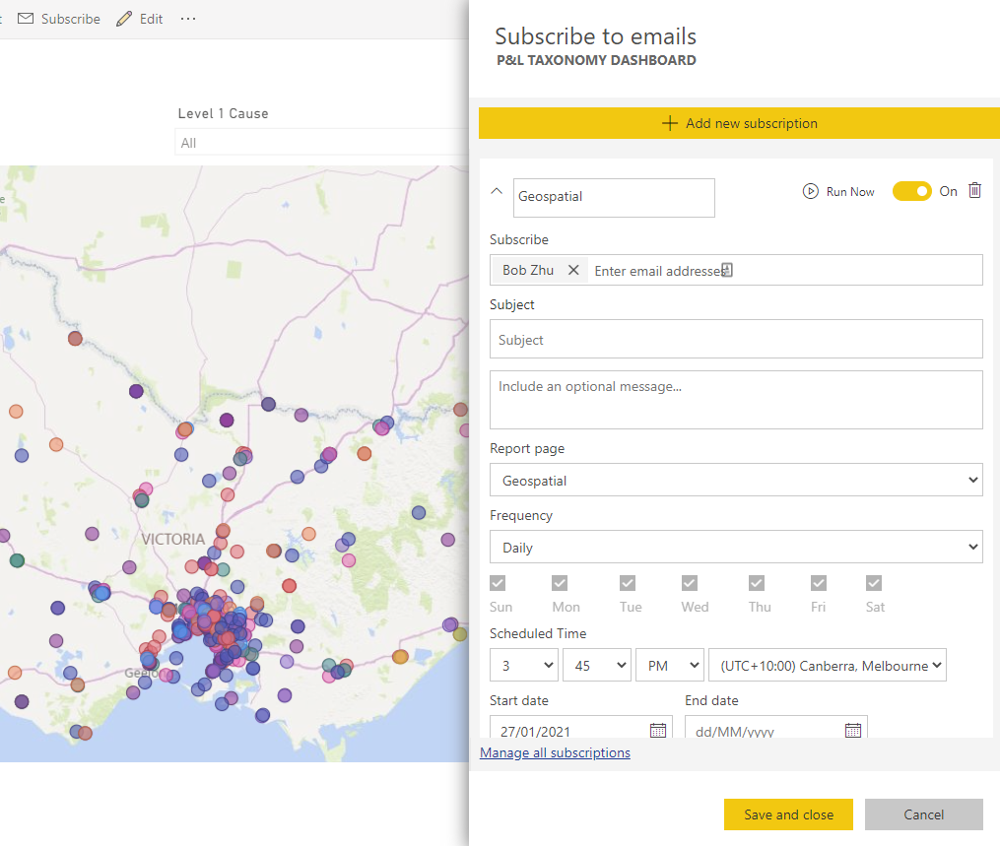

### Exporting a Report

It is possible to export a report as a PDF or PowerPoint, alongside as a
separate Excel Spreadsheet.

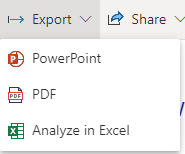

## Ease of Use (Creator)

A creator is defined as an individual who uses PowerBI Desktop to create
new reports/dashboards.

### Data Import Function (Bob)

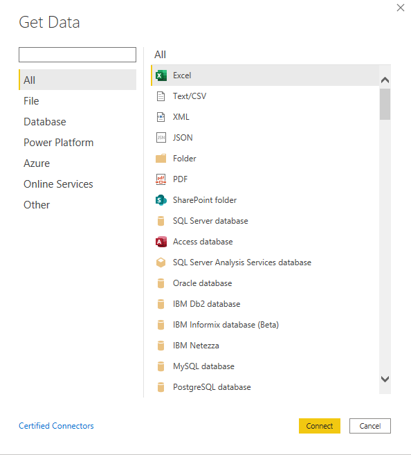

For a Creator to fully appreciate and leverage PowerBI’s DAX Query or
PowerQuery ‘language’ (which bears more resemblance to Microsoft Visual
Basic as opposed to traditional SQL), when importing data, you should
not select the **DirectQuery** option. That option limits capabilities
of data transformations within PowerBI. DirectQuery is basically a
**live** connection the datasource.

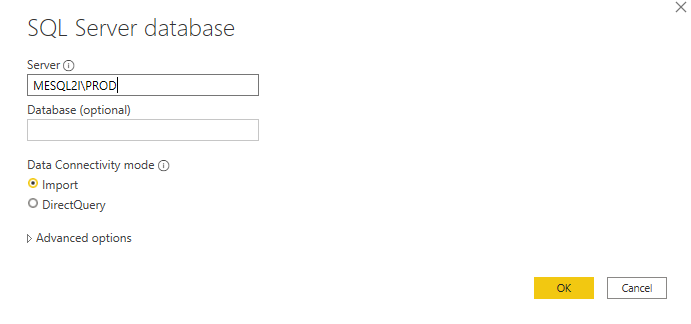

Compared to Tableau, this seems like a significant limitation - as
Tableau supports a live connection with a datasource with the option to
manipulate data.

**In order to take advantage of PowerBI’s supposedly powerful DAX Query
(PowerQuery) functions, a Creator is limited to using the Import
Connectivity mode.**

Also, please refrain from pressing Enter on the keyboard when selecting
data - you’ll automatically be skipped to the next step in PowerBI,
basically forcing you to heed to a long-load time.

### Data Import Speed/Accessibility

Data Import Speed warrants discussion on how best to structure the Data
Warehouse (Serving Layer) in SDI. PowerBI differs from Tableau in being
less flexible on how to join data.

There are a few questions that need to be explored in detail:

1.  Should most data transformations be done in Snowflake (which is a
    high-performance cloud-based data warehouse) or in PowerBI?

2.  Is PowerBI more of just a data visualisation tool, where most of the
    heavy-lifting is done outside of the tool itself?

### Formatting Visuals

PowerBI has a more intuitive - PowerPoint-esque method of formatting
graphs, it helps centre and align different graphs automatically as
compared to Tableau, where it is normally best to use the X and Y
coordinates to type in the preferred location.

### Tooltips in PowerBI

Tooltip functionality, which allows end-users to hover over charts and
obtain additional information, works in a similar fashion to Tableau.

Like Tableau, it is possible to add other charts within tooltips.

## Ease of Upgrade (Bob, Dan)

<a href="https://powerbi.microsoft.com/en-us/blog/tag/update/"
rel="nofollow">https://powerbi.microsoft.com/en-us/blog/tag/update/</a>

This should be broken into two separate sections - upgrading of PowerBI
Desktop and PowerBI Workspaces (Cloud).

### PowerBI Desktop

Microsoft maintains a monthly cadence for upgrading PowerBI Desktop.
This means that there are new features and bugfixes which are rolled out
each month.

Installation/upgrades requires administrator permissions on a desktop
computer.

Tableau has a quarterly cadence for rolling out Tableau Desktop updates.
Updates are also a little more difficult to install, as one needs to
both install the new version while removing the older version.

Tableau sometimes creates hotfix/bugfix packages for a quarterly release
within a few months. These don’t require uninstalling the old version.

### PowerBI Workspaces (Cloud)

PowerBI Workspaces is hosted by Microsoft Azure in the cloud, and
requires no ongoing upgrades/updates.

Tableau Server requires IT involvement in an upgrade, and is generally a
long-winded and difficult process, however Tableau Online always runs on
the latest version, and requires no ongoing updates.

**This may not be the case for PowerBI Premium**.

## Amount of Data that can be handled (Bob)

For the purposes of the assessment - it is a good idea to separate the
‘max data’ for PowerBI Desktop and PowerBI Workspace (Online).

### PowerBI Desktop

At the moment, it seems there is no ‘theoretical’ limit to how much data
can be stored on PowerBI Desktop. It is apparently limited only by two
things: internet connection timeouts and RAM. Because PowerBI stores
data in RAM for ‘fast retrieval’, the only real limitation.

Via DirectQuery, there is no 1GB limit either.

**If you have chosen to keep the Excel experience, unlike the 1GB import
cap, the limit is 250 MB for the dataset.**

**Assumptions**:

1.  Using the **Import** feature as opposed to the DirectQuery (which
    severely restrains the PowerBI DAX Query functionality)

### PowerBI Workspace (Online)

There is a 1GB cap on how much can be uploaded directly from PowerBI
Desktop to a PowerBI Workspace. This means that the size of the PowerBI
Report File (.pbix) cannot exceed 1GB.

There is also a 10GB **shared** cap on a PowerBI Workspace.

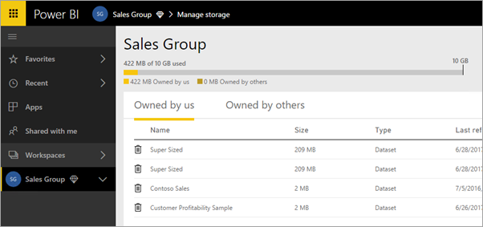

Unlike Tableau, which supports **live** connections with
transformations, as every single PowerBI report that requires
transformations will need to use DAX Queries, there is a risk to hitting
that 10GB cap.

**This also warrants a discussion on how to best implement PowerBI
Workspaces, as that is the only ‘feasible’ option to sharing reports
with the rest of the business/clients.**

Please make sure, should we transition to PowerBI, we have a detailed
planning session to discuss the transition process in terms of setting
up Workspaces.

## Connections to different types of data sources.

The key integration required for PowerBI is with **Snowflake**, the
future SDI repository cloud warehouse.

PowerBI’s Snowflake integration is **not as sophisticated as** the
integration with Tableau. For example, a key missing component with
PowerBI is the inability to select the role.

What this means is that PowerBI automatically selects the default role
of the user - the Default Role must be set prior to a user logging in.

**If PowerBI is chosen, it’s important to first ensure that user roles
have been defined and set clearly, for a more seamless integration**.
Relying on an AccountAdmin role is not ideal with PowerBI being set as
the default role.

## Speed at which data is processed (imported)

There are two tests that need to be conducted - firstly a side-by-side
comparison of Tableau and PowerBI **at home** (WFH) and at the office.

## How data extract/refresh is handled (Bob)

There are three ways to handle data extracts/refresh on PowerBI
Workspaces. Similar to Tableau, PowerBI separates the datasets from the
reports, allowing the datasets to be reused for other reports as well.

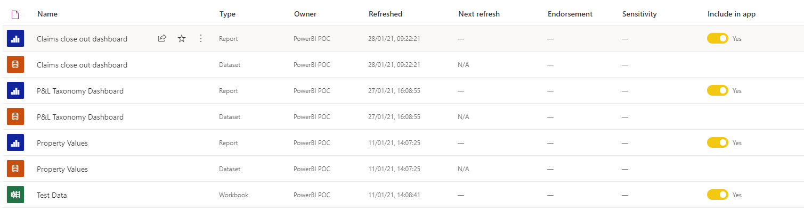

### Manual Refresh

There is a fully manual way to refresh data. It is possible to hover
over the dataset and press the ‘Refresh now’ button.

### Scheduled Refresh (Automatic)

There is also a way to schedule automatic refreshes. Next to the
‘Refresh now’ button is another button that allows for a scheduled
refresh.

There are **limitations** to how much refreshes can be scheduled per
day.

1.  Power BI limits datasets on shared capacity to 8 daily refreshes.

2.  If the dataset resides on a Premium capacity, you can schedule up to
    48 refreshes per day in the **dataset** settings.

This suggests that there might need to be a bit of a different approach
for dealing with refreshing data between PowerBI and Tableau.

**Such a consideration in terms of how to retrieve data from SDI should
be considered as part of the Data Warehouse (DW) serving layer
roll-out.**

### Scheduled Refresh (Python)

To get around the ‘8 refreshes’ per dataset maximum per day, it may be
possible to build a Python script that takes over that ability. This
would be additional work.

<a
href="https://pivotalbi.com/automate-your-power-bi-dataset-refresh-with-python/"
rel="nofollow">https://pivotalbi.com/automate-your-power-bi-dataset-refresh-with-python/</a>

**In terms of an approach involving Python, there would be a need to
embed this within Azure Cloud for ease of use and automation. Such a
request should be directly coordinated with SDI.**

## Connections to different types of data (Bob)

For the most part, PowerBI supports the same datasources as Tableau. It
is not as flexible as Tableau in terms of joining those datasets
together - as it doesn’t allow for duplicating the same table multiple
times (see DIM_DATE in IDR2).

-   The above should be part of a design principle for the data
    warehouse (serving layer) in SDI, perhaps a DIM_DATE table that
    seems ‘efficient’ may not be optimal for PowerBI use if we’re not
    expected to use SQL to perform joins prior to PowerBI.

## Data Security (Bob)

Security should be viewed from two aspects - firstly the security of
Microsoft Azure for storing data on PowerBI Workspaces, and secondly,
the actual data permissions available within PowerBI itself for
different levels of users and permissions.

### PowerBI Azure Data Security

### PowerBI User Permissions Data

Similar to Tableau Desktop, it is possible to set up user-level
permissions with PowerBI’s Role-Level Security (RLS) available on
PowerBI Desktop.

<a
href="https://docs.microsoft.com/en-us/power-bi/create-reports/desktop-rls"
rel="nofollow">https://docs.microsoft.com/en-us/power-bi/create-reports/desktop-rls</a>

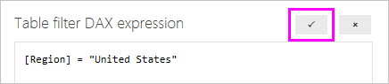

An example of DAX filtering for role based permissions. Aside from this
kind of permission of DAX Filtering, there doesn’t seem to be any other
method of adding security to users.

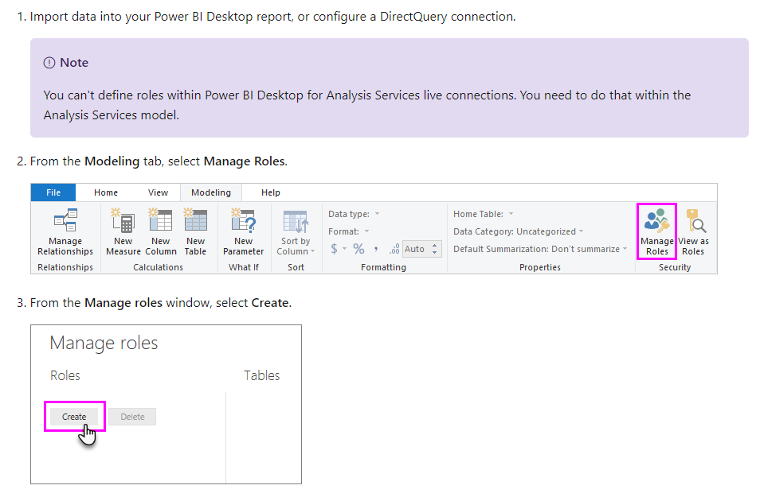

It is also possible to ‘mock’ as a specific role type in order to
**test** prior to publishing online. This adds an additional level of
security as compared to Tableau, whereby it’s difficult to test other
user’s permissions prior to publishing a report.

The roles are assigned as ‘groups’ on PowerBI Workspaces - I don’t
believe there is a way to select the users within the PowerBI Desktop
system itself.

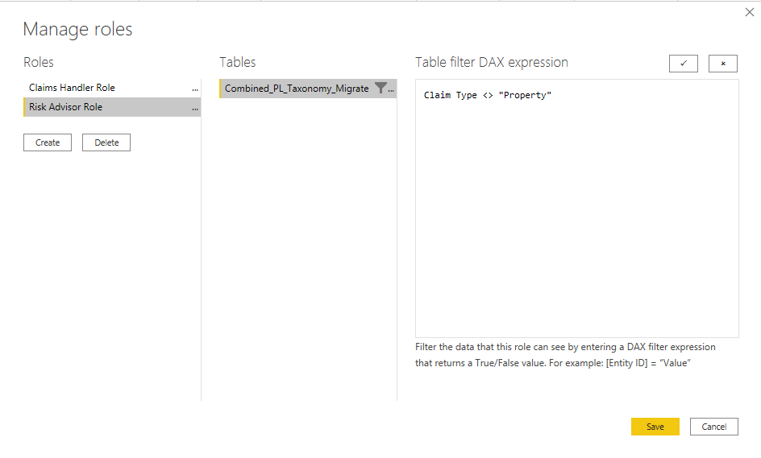

## Ability to Customise and Modify Graphs

The ability to customise and modify graphs is restricted to the
Visualizations panel usually found on the right side of the screen.

The first two ‘tabs’ are the most important to consider, the final one
with a magnifying glass and a chart within is **not usually active**.

The first one allows you to drag and drop fields, legends, filters etc
into it to customise the data. The second one (paint roller) allows you
to tailor specific

The functionality is somewhat reminiscent of Excel chart modifications.

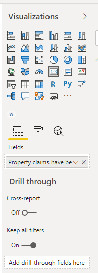

### Word Clouds

The one benefit of PowerBI custom Word Clouds over Tableau is the
automatic stopwords filter.

It makes filtering for repetitive words slightly faster.

## Web Charts (Peter Parker)

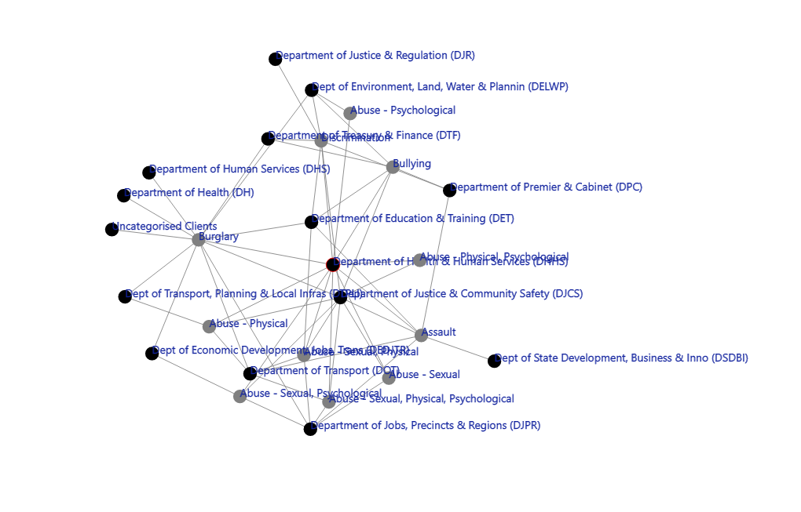

Node connection charts can be made more easily in Power BI with the Node
Navigator chart type, and **satisfy our needs for WEBAR and JARVIS**.
These are **simpler to build but somewhat less flexible** than
equivalent charts in Tableau.

Colour and size weighting for lines and nodes need to be calculated and
are not relative . For example, you need a field with a specific html
colour code, and a calculation will need to be done to make sizing
relative. The overall experience of creating these charts is better than
in Tableau as positioning coordinates are generated automatically, not
specified in the data.

The charts automatically come with text filtering, which enlarges the
nodes that match the text input.

Automatically generated coordinates would mean that specific shapes such
as an inner and outer circle are not able to be generated, however this
feel of a dynamic network is very hard to create using our current
method in Tableau.

## Tableau Prep Builder

Tableau Prep Builder has become an increasingly more important component
of I&A’s ability to deal with the general level of new messy datasets
within VMIA.

## Creating a Client Portal

Creating a client portal seems much more straightforward in PowerBI
Workspaces than it is via Tableau Server.

<a
href="https://docs.microsoft.com/en-us/power-bi/collaborate-share/service-share-dashboards"
rel="nofollow">https://docs.microsoft.com/en-us/power-bi/collaborate-share/service-share-dashboards</a>

It is possible to create a PowerBI Workspace for only external users and
then provide them email access to the reports via Sharing.

See Report Sharing below on how that can be accomplished.

With **Groups** functionality as well, it is very accessible to
add/change users from different groups to share access on reports.

## Report Sharing

Report sharing functions are primarily through PowerBI Workspaces
(Online).

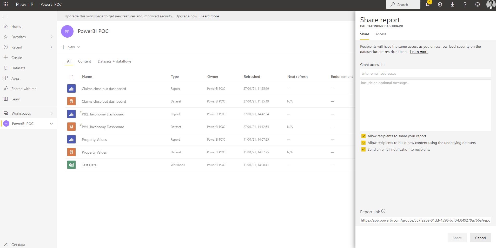

After a Creator publishes a report to a Workspace, they will be able to
share the report from there. Report sharing is relatively simple.

### Publishing Apps in PowerBI

In Power BI, you can create official packaged content, then distribute
it to a broad audience as an *app*. You create apps in *workspaces*,
where you can collaborate on Power BI content with your colleagues. Then
you can publish the finished apps to large groups of people in your
organization.

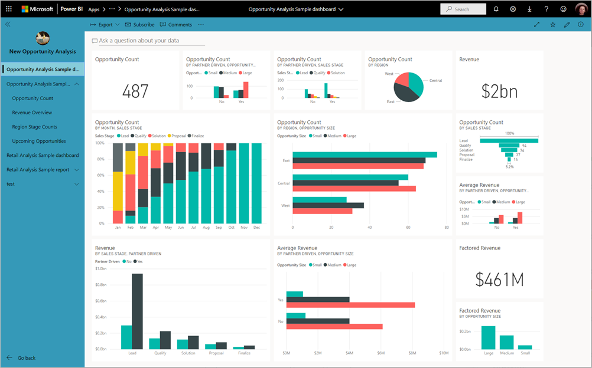

To create or update an app, you need a Power BI Pro license. For
app *consumers*, there are two options.

-   **Option 1** The workspace for this app is *not* in a Power BI
    Premium capacity: All business users need Power BI Pro licenses to
    view your app.

-   **Option 2** The workspace for this app *is* in a Power BI Premium
    capacity: Business users without Power BI Pro licenses in your
    organization can view app content. However, they can't copy the
    reports, or create reports based on the underlying datasets. Read <a
    href="https://docs.microsoft.com/en-us/power-bi/admin/service-premium-what-is"
    rel="nofollow">What is Power BI Premium?</a> for details.

## Challenges

<table class="confluenceTable" data-layout="full-width">
<tbody>
<tr class="header">
<th class="confluenceTh"></th>
<th class="confluenceTh">
<strong>Issue</strong>
</th>
<th class="confluenceTh">
<strong>Power BI</strong>
</th>
<th class="confluenceTh">
<strong>Tableau</strong>
</th>
<th class="confluenceTh">
<strong>Description</strong>
</th>
<th class="confluenceTh">
<strong>Impact (1-5)</strong>
</th>
</tr>

<tr class="odd">
<td class="confluenceTd">
1
</td>
<td class="confluenceTd">
Flexibility, time efficiency
</td>
<td class="confluenceTd">
Single dimension tables only
</td>
<td class="confluenceTd">
Multiple dimensional tables
possible
</td>
<td class="confluenceTd">
Given that VMIA data is dimension-rich, i.e.
we often want to be able to examine multiple categorical dimensions (eg.
date, Organisation type, claim type, cost banding) against a given
measure like Total Total, this limitation in Power BI means that we’d
have to build out multiple charts for what would be a single charting
Tableau.

So if we had, date and cost banding as dimensions and were measuring
days to claim close out, in Power BI we’d have to build at least 3
charts - one for low, one for medium, and one for high band, and have
each of these measuring that close out time. And then to make it look
cohesive, we’d have to spend additional time playing around with
formatting as well.

In the development stage of a dashboard this also makes things less
efficient from a change perspective because any changes to the dashboard
would have to be made across 3 charts (for this example) instead of a
single one.

<a
href="https://community.powerbi.com/t5/Desktop/Bar-chart-for-3-different-measures-over-one-dimension/m-p/493629"
rel="nofollow">https://community.powerbi.com/t5/Desktop/Bar-chart-for-3-different-measures-over-one-dimension/m-p/493629</a>
</td>
<td class="confluenceTd">
5
</td>
</tr>
<tr class="even">
<td class="confluenceTd">
2
</td>
<td class="confluenceTd">
Flexibility, time-efficiency
</td>
<td class="confluenceTd">
Direct query significantly slower
</td>
<td class="confluenceTd">
Live query
</td>
<td class="confluenceTd"></td>
<td class="confluenceTd">
4
</td>
</tr>
<tr class="odd">
<td class="confluenceTd">
3
</td>
<td class="confluenceTd">
Capability, flexibility.
</td>
<td class="confluenceTd">
Not able to do aggregates of Measures which
are designed to change based on parameters.
</td>
<td class="confluenceTd">
Can do aggregates of Measures which are
designed to change based on parameters
</td>
<td class="confluenceTd">
Have to create a new field showing the
average of each original measure, this doubles the amount of fields.

And then create a field which switches between those newly created
fields.
</td>
<td class="confluenceTd">
3
</td>
</tr>
<tr class="even">
<td class="confluenceTd">
4
</td>
<td class="confluenceTd">
Capability, flexibility
</td>
<td class="confluenceTd">
Free-type parameters appear to only work in
Power Query

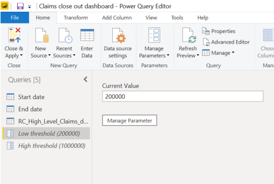</td>
<td class="confluenceTd">
Free-type parameters appear more intuitively
in the dashboard
</td>
<td class="confluenceTd">
We use these free type parameters to
bucket/create bands dynamically at the end users' discretion. At the
moment haven’t found a way to do this in Power BI.
</td>
<td class="confluenceTd">
3
</td>
</tr>
<tr class="odd">
<td class="confluenceTd">
5
</td>
<td class="confluenceTd">
User experience
</td>
<td class="confluenceTd">
Multiple selection dropdowns require a
ctrl+left click
</td>
<td class="confluenceTd">
Multiple selection dropdowns are simple
point and click.
</td>
<td class="confluenceTd">
Slightly less intuitive from an end user
experience, will likely require an initial instruction for all new
users.
</td>
<td class="confluenceTd">
1
</td>
</tr>
<tr class="even">
<td class="confluenceTd">
6
</td>
<td class="confluenceTd">
Data joins
</td>
<td class="confluenceTd">
Inability to join the same table (e.g. DIM
DATE) multiple times to a FACT Table
</td>
<td class="confluenceTd">
Ability to reuse the same table multiple
times.
</td>
<td class="confluenceTd"></td>
<td class="confluenceTd"></td>
</tr>
<tr class="odd">
<td class="confluenceTd">
7
</td>
<td class="confluenceTd">
Data connections
</td>
<td class="confluenceTd">
Snowflake is not fully optimised, unable to
select Role, need to set Default Roles on Snowflake first
</td>
<td class="confluenceTd">
Snowflake integration is more optimised,
allows parsing of custom parameters and also selection of role.
</td>
<td class="confluenceTd">
We have tried the Microsoft Account to
PowerBI Link, it doesn’t work. Need to build out roles and permissions
properly before linking to PowerBI
</td>
<td class="confluenceTd">
3
</td>
</tr>
<tr class="even">
<td class="confluenceTd">
8
</td>
<td class="confluenceTd">
Cpability, Flexibility
</td>
<td class="confluenceTd">
Difficult to write neat/understandable
formulas - they become more and more complex/unwieldly especially with
IF statements
</td>
<td class="confluenceTd">
CASE WHEN or IF combination allows for
flexible queries that can easily be transcribed to SQL
</td>
<td class="confluenceTd"></td>
<td class="confluenceTd"></td>
</tr>
</tbody>
</table>

## Case Studies

Each tester was asked to build a specific report of their choosing that
has been previously built on Tableau. Alongside this, they were asked to
give their thoughts on what aspects of the process was
challenging/straightforward.

### Bob Zhu - Property & Liability Taxonomy with Geospatial Integration

The report I was tasked with rebuilding was a relatively simple one -
but it would test the limits of PowerBI in terms of detailed
functionality.

The below is the original design, followed by the link to PowerBI’s
version.

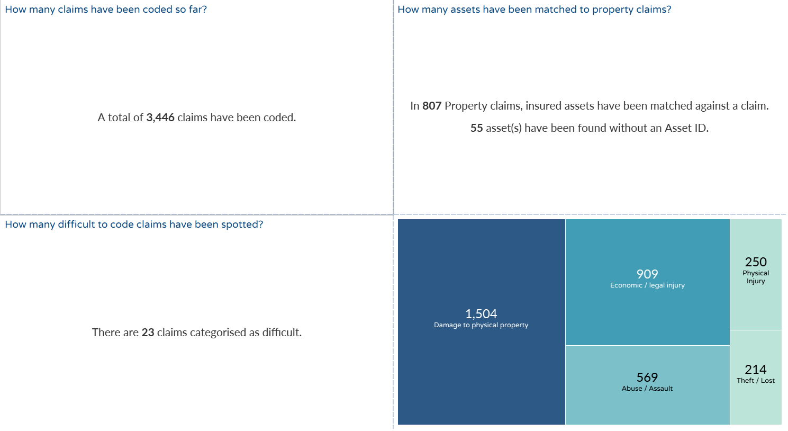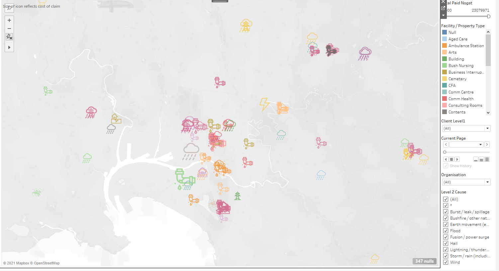

The above are the Tableau equivalents (original reports). Some of the
notable features that can be easily achieved on Tableau are:

1.  Timelapse view of geospatial, where you can see the claim causes
    over time via icons.

    1.  This doesn’t seem easy to implement in PowerBI

2.  Icons for claim causes, e.g. storms, pipe burst/leak, earthquake

    1.  This doesn’t seem easy to implement in PowerBI

3.  Tooltips that contain custom information/additional information.

    1.  This is possible in PowerBI via a report tooltip page: <a
        href="https://docs.microsoft.com/en-us/power-bi/create-reports/desktop-tooltips"
        rel="nofollow">https://docs.microsoft.com/en-us/power-bi/create-reports/desktop-tooltips</a>

Overall, my thoughts are as follows: **PowerBI has much quicker ease of
use for creating simple charts and reports, e.g. bar charts, pie charts,
basic combo charts**. Its limitation is that in order to create more
complex diagrams, e.g. maps with icons for visual display, there is a
need to install **separate custom ‘apps’** as visuals, which there is
less support from Microsoft. This means that other individuals may be
able to create their own visuals, but it also means that visuals are
**much more fixed** and less flexible compared to Tableau. Things won’t
be as **easy to change, unlike in Tableau, where modifying a chart’s
visuals is quite easy, it is very inflexible to do so in PowerBI**.

The below are the PowerBI equivalents.

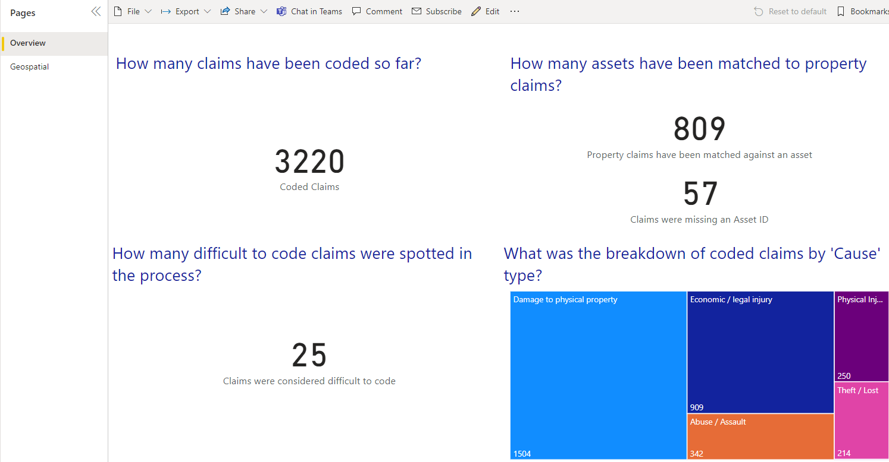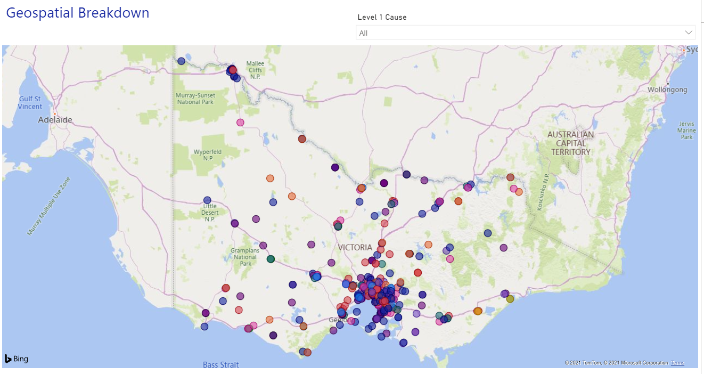

### Claims Close Out Times (Alex)

The overview page in Power BI requires the creation of 7+ different
charts instead of a single chart for Tableau. This is because Power BI
doesn’t do multiple dimensions on a single chart (as far as I can tell).

It also means that there is a lack of flexibility when changes are
required. From experience, I know that when we’re in a development stage
and the exact requirements aren’t understood by the User requesting it,
this flexibility (being able to swap dimensions quickly and change
things in a single chart) is crucial from a time-efficiency perspective.

Multiple charts instead of one creates some sync issues between the
visualisations as they behave individually rather than as a whole - we
can see in the below example that filtering for the last 12 months
provides data for every single month in Medical Indemnity, but only for
some months in Expatriate Medical Expenses. Power BI filters out the
months with no data so the charts don’t sync from a date perspective.

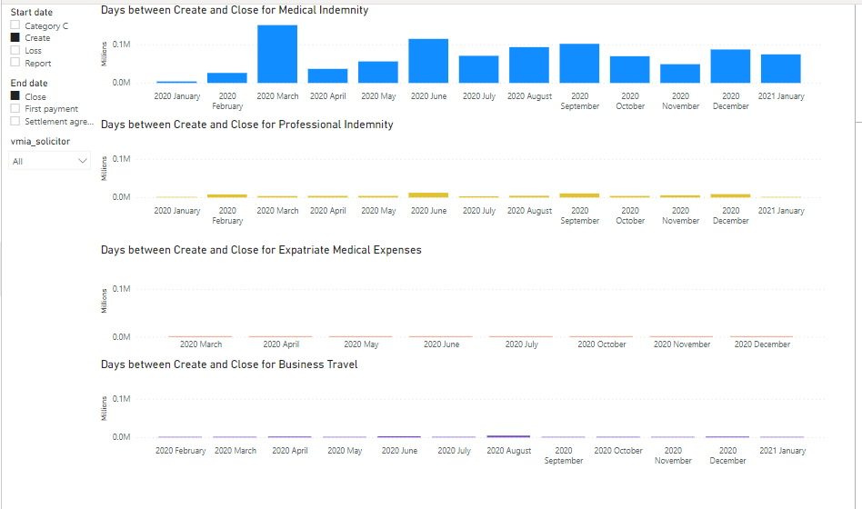

This chart took longer in Power BI also because it required more DAX
language to compute the Average close out times than the equivalent for
Tableau. And any time we require an average or sum or count or min/max,
it looks like we’ll need to copy and paste/replace these functions into
the DAX below instead of just creating a function using the underlying
parameter-based measure in Tableau.

Tableau:

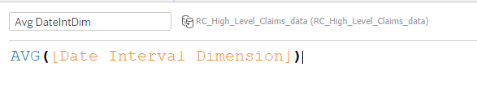

Power BI:

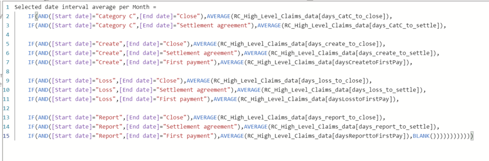

For more complex report recreations there will sometimes be
discrepancies/anomalies that need to be examined. The “show data”
functionality which is equivalent to Tableau’s “show underlying data” is
less capable. It shows up for the simpler visualisations but for the
more complex ones, like the below (which takes the average close out
times based on the parameters to the left), this functionality is
lacking.

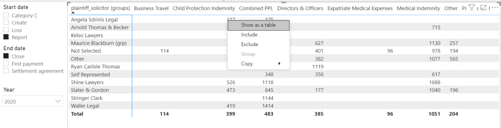

Tableau does have this functionality for this kind of chart below:

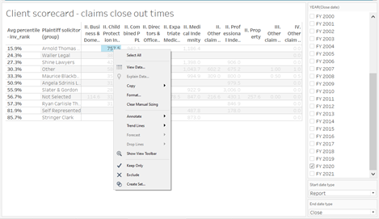

## Attachments:

[image-20210201-014044.png](attachments/621543578/621117607.png)
(image/png)  

[image-20210201-003019.png](attachments/621543578/621117614.png)
(image/png)  

[image-20210127-225756.png](attachments/621543578/621117620.png)
(image/png)  

[image-20210127-043206.png](attachments/621543578/621117626.png)
(image/png)  

[image-20210127-052809.png](attachments/621543578/621117632.png)
(image/png)  

[image-20210126-223208.png](attachments/621543578/621117638.png)
(image/png)  

[image-20210126-223244.png](attachments/621543578/621117644.png)
(image/png)  

[image-20210126-224047.png](attachments/621543578/621117650.png)
(image/png)  

[image-20210128-230614.png](attachments/621543578/621117656.png)
(image/png)  

[image-20210127-223726.png](attachments/621543578/621117662.png)
(image/png)  

[image-20210127-223807.png](attachments/621543578/621117668.png)
(image/png)  

[image-20210126-231148.png](attachments/621543578/621117674.png)
(image/png)  

[image-20210126-224507.png](attachments/621543578/621117680.png)
(image/png)  

[image-20210127-035320.png](attachments/621543578/621117686.png)
(image/png)  

[image-20210128-024219.png](attachments/621543578/621117692.png)
(image/png)  

[image-20210128-024735.png](attachments/621543578/621117698.png)
(image/png)  

[image-20210201-012903.png](attachments/621543578/621117704.png)
(image/png)  

[image-20210127-034720.png](attachments/621543578/621117710.png)
(image/png)  

[image-20210127-232705.png](attachments/621543578/621117716.png)
(image/png)  

[image-20210127-222108.png](attachments/621543578/621117722.png)
(image/png)  

[image-20210127-035755.png](attachments/621543578/621117728.png)
(image/png)  

[image-20210127-035820.png](attachments/621543578/621117734.png)
(image/png)  

[image-20210127-041630.png](attachments/621543578/621117740.png)
(image/png)  

[image-20210127-041659.png](attachments/621543578/621117746.png)
(image/png)  

[image-20210127-232316.png](attachments/621543578/621117752.png)
(image/png)  

[image-20210127-234604.png](attachments/621543578/621117758.png)
(image/png)  

[image-20210127-234700.png](attachments/621543578/621117764.png)
(image/png)  

[image-20210128-002555.png](attachments/621543578/621117770.png)
(image/png)  

[image-20210128-003107.png](attachments/621543578/621117776.png)
(image/png)  

