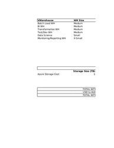

# Data Warehouse Platform (Snowflake Vs Synapse Analytics)

Add your comments directly to the page. Include links to any relevant
research, data, or feedback.

|              |                                                                                                                                                                                                                                                                                                                                      |
|--------------|--------------------------------------------------------------------------------------------------------------------------------------------------------------------------------------------------------------------------------------------------------------------------------------------------------------------------------------|
| Status       | OUTCOME DECIDED                                                                                                                                                                                                                                                                                                                      |
| Impact       | MEDIUM                                                                                                                                                                                                                                                                                                                               |
| Driver       | Jason Dang (Deactivated)                                                                                                                                                                                                                                                                                                             |
| Approver     | Hendry Susilo                                                                                                                                                                                                                                                                                                                        |
| Contributors | h.lindsaysmith@vmia.vic.gov.au Lindsay-Smith                                                                                                                                                                                                                                                                                         |
| Informed     | Lasath Kahingala                                                                                                                                                                                                                                                                                                                     |
| Due date     | 20 Jul 2020                                                                                                                                                                                                                                                                                                                          |
| Outcome      | Following the demonstration, recommendation specified and internal project leadership discussion happy to endorse to proceed with Snowflake as VMIA’s Data Platform. Security, Risk and Privacy Assessment along with Master Services Agreement will be performed shortly before we can move to the deployment/implementation stage. |

## Background

A VMIA Enterprise Data Warehouse will provide human readable and system
consumable data to sources internal and external to the strategic data
platform. Selecting of a platform to serve this purpose is one of the
key design decisions of the data platform and there is a need to
evaluate potential technology candidates (Synapse analytics or
Snowflake) against a set of key considerations and requirements for
VMIA.

## Relevant data

### What is Synapse Analytics?

Azure Synapse Analytics is an evolution of Azure SQL Data Warehouse. At
its core, Azure Synapse contains the MPP, scale-out technology designed
to process and store large volumes of data within the Microsoft Azure
cloud platform.

Azure Synapse has four components:

-   Synapse SQL: Complete T-SQL based analytics – Generally Available

    -   SQL pool (pay per DWU provisioned)

        -   Represents a collection of analytic resources that re being
            provisioned when using Synapse SQL. The size of SQL pool is
            determined by Data Warehousing Units (DWU).

    -   SQL on-demand (pay per TB processed) (preview)

-   Spark: Deeply integrated Apache Spark (preview)

-   Synapse Pipelines: Hybrid data integration (preview)

-   Studio: Unified user experience. (preview)

### What is Snowflake?

Snowflake is an analytic data warehouse provided as
Software-as-a-Service (SaaS). Snowflake provides a data warehouse that
is faster, easier to use, and far more flexible than traditional data
warehouse offerings.

Snowflake’s unique architecture consists of three key layers:

-   Database Storage: Snowflake reorganizes that data into its internal
    optimized, compressed, columnar format. Snowflake stores this
    optimized data in cloud storage.

-   Query Processing: Query execution is performed in the processing
    layer. Snowflake processes queries using “virtual warehouses”. Each
    virtual warehouse is an MPP compute cluster composed of multiple
    compute nodes allocated by Snowflake from a cloud provider.

-   Cloud Services: The cloud services layer is a collection of services
    that coordinate activities across Snowflake. These services tie
    together all of the different components of Snowflake in order to
    process user requests, from login to query dispatch.

### Snowflake Vs Synapse Analytics Feature Comparison

<table class="confluenceTable" data-layout="default">
<tbody>
<tr class="header">
<th class="confluenceTh">
<strong>Feature</strong>
</th>
<th class="confluenceTh">
<strong>Snowflake</strong>
</th>
<th class="confluenceTh">
<strong>Synapse Analytics</strong>
</th>
</tr>

<tr class="odd">
<td class="confluenceTd">
Security
</td>
<td class="confluenceTd"><ul>
<li>
Ability to choose geographical location of where data should be
stored
</li>
<li>
User authentication through standard user/password as well as
MFA, SSO and OAuth included
</li>
<li>
Communication between client and server protected through
TLS
</li>
<li>
Can be deployed within an Azure Virtual Network
</li>
<li>
Isolation of data (for loading and unloading) using Azure Storage
Access Controls
</li>
<li>
Support for PHI data (in compliance with HIPAA regulations) —
requires Business Critical Edition
</li>
<li>
Automatic data encryption by Snowflakee
</li>
<li>
Object-level access control
</li>
<li>
column level data masking available
</li>
</ul></td>
<td class="confluenceTd"><ul>
<li>
SQL pool currently supports SQL Server Authentication with a
username and password, and with Azure Active Directory
</li>
<li>
Authorization privileges are determined by role memberships and
permissions
</li>
<li>
Transparent Data Encryption (TDE) helps protect against the
threat of malicious activity by encrypting and decrypting your data at
rest. 
</li>
<li>
Provides advanced capabilities for discovering, classifying,
labeling, and reporting the sensitive data in your databases.
</li>
<li>
Private Link and Virtual Endpoint is available
</li>
<li>
Column-level and row level security
</li>
<li>
column level data masking available
</li>
</ul></td>
</tr>
<tr class="even">
<td class="confluenceTd">
Deployment Offering (SaaS, PaaS
etc)
</td>
<td class="confluenceTd">
SaaS-delivered Data Warehouse as a
Service
</td>
<td class="confluenceTd">
Platform as a Service (PaaS)
</td>
</tr>
<tr class="odd">
<td class="confluenceTd">
SQL Support
</td>
<td class="confluenceTd">
Snowflake is a data platform and data
warehouse that supports the most common standardized version of SQL:
ANSI. This means that all of the most common operations are usable
within Snowflake. Snowflake also supports all of the operations that
enable data warehousing operations, like create, update, insert,
etc.
</td>
<td class="confluenceTd">
Azure Synapse SQL is a big data analytic
service that enables you to query and analyze your data using the T-SQL
language. You can use standard ANSI-compliant dialect of SQL language
used on SQL Server and Azure SQL Database for data analysis.
</td>
</tr>
<tr class="even">
<td class="confluenceTd">
User Interface
</td>
<td class="confluenceTd">
Web-based GUI for account and general
management, monitoring of resources and system usage, and querying
data.
</td>
<td class="confluenceTd">
Synapse Studio (in preview, therefore not
generally available to the required Azure region and not recommended for
production workloads)
</td>
</tr>
<tr class="odd">
<td class="confluenceTd">
Connectivity
</td>
<td class="confluenceTd"><ul>
<li>
Supports BI Tools such as PowerBI, Tableau
</li>
<li>
Supports multiple SQL Clients such as DBeaver and SQL
Workbench
</li>
<li>
Supports multiple programming interfaces including Python,
NodeJS, ODBC and JDBC
</li>
<li>
Can inter-operate with multiple ML and Data Science platforms
such as Databricks, SAS and Apache Spark
</li>
<li>
Can inter-operate with multiple data integration platforms such
as Azure Data Factory
</li>
</ul></td>
<td class="confluenceTd"><ul>
<li>
supports mulitple BI tools
</li>
<li>
Can integrate with multiple Azure Services such as Power BI,
Azure Data Factory. Azure Machine Learning and Azure Stream Analytics
however these are still in preview.
</li>
</ul></td>
</tr>
<tr class="even">
<td class="confluenceTd">
Data Loading
</td>
<td class="confluenceTd"><ul>
<li>
Support for bulk loading and unloading data into/out of tables,
including:

<ul>
<li>
Load any data that uses a supported character encoding.
</li>
<li>
Load data from compressed files.
</li>
<li>
Load most flat, delimited data files (CSV, TSV, etc.).
</li>
<li>
Load data files in JSON, Avro, ORC, Parquet, and XML
format.
</li>
<li>
Load from S3 data sources and local files using Snowflake web
interface or command line client.
</li>
</ul></li>
<li>
Support for continuous bulk loading data from files:

<ul>
<li>
Use Snowpipe to load data in micro-batches from internal (i.e.
Snowflake) stages or external (Amazon S3, Google Cloud Storage, or
Microsoft Azure) stages.
</li>
</ul></li>
</ul></td>
<td class="confluenceTd">
While SQL pool supports many loading
methods, including popular SQL Server options such as
<strong>b</strong>ulk <strong>c</strong>opy <strong>p</strong>rogram
utility and the SqlBulkCop API, the fastest and most scalable way to
load data is through PolyBase external tables and the COPY
Statement <strong>(preview)</strong>.

With PolyBase and the COPY statement, you can access external data
stored in Azure Blob storage or Azure Data Lake Store via the T-SQL
language. For the most flexibility when loading, we recommend using the
COPY statement.
</td>
</tr>
<tr class="odd">
<td class="confluenceTd">
Data Sharing
</td>
<td class="confluenceTd"><ul>
<li>
Secure Data Sharing enables sharing selected objects (tables,
secure views, and secure UDFs) in a database in your account with other
Snowflake accounts. There are 3 different types of product offering for
data sharing:

<ul>
<li>
Direct Share is the simplest form of data sharing that enables
account-to-account sharing of data utilizing Snowflake’s Secure Data
Sharing.
</li>
<li>
The Snowflake Data Marketplace utilizes Snowflake Secure Data
Sharing to connect providers of data with consumers. 
</li>
<li>
Data Exchange is your own data hub for securely collaborating
around data between a selected group of members that you invite. It
enables providers to <em>publish</em> data that can then
be <em>discovered</em> by consumers. This is a preview feature
</li>
</ul></li>
</ul></td>
<td class="confluenceTd">
Azure Data Share enables organizations to
simply and securely share data with multiple customers and partners. In
just a few clicks, you can provision a new data share account, add
datasets, and invite your customers and partners to your data
share.
</td>
</tr>
<tr class="even">
<td class="confluenceTd">
Database Replication and Failover
</td>
<td class="confluenceTd">
Support for replicating and syncing
databases across multiple Snowflake accounts in different regions:

<ul>
<li>
Replicate databases between Snowflake accounts (within the same
organization) and keep the database objects and stored data
synchronized.
</li>
<li>
Configure database failover to one or more Snowflake accounts for
business continuity and disaster recovery.
</li>
</ul></td>
<td class="confluenceTd">
Use SQL pool restore points to recover or
copy your data warehouse to a previous state in the primary region. Use
data warehouse geo-redundant backups to restore to a different
geographical region.
</td>
</tr>
<tr class="odd">
<td class="confluenceTd">
Workload Management
</td>
<td class="confluenceTd">
Snowflake’s unique multi-cluster, shared
data architecture makes it possible to allocate multiple independent,
isolated clusters for processing while sharing the same data. Each
cluster (called a “virtual warehouse”) can both read and write data,
with full transactional consistency ensured by Snowflake’s cloud
services layer.

The size and resources of each virtual warehouse can be chosen
independently by the user based on the characteristics and performance
requirements for the workload(s) that will run on each virtual
warehouse.

With Snowflake’s ability to configure auto-scale mode, a
multi-cluster warehouse eliminates the need for resizing the warehouse
or starting and stopping additional warehouses to handle fluctuating
workloads. Snowflake automatically starts and stops additional clusters
as needed.
</td>
<td class="confluenceTd">
Synapse SQL pool workload management in
Azure Synapse consists of three high-level concepts: Workload
Classification, Workload Importance and Workload Isolation. These
capabilities give you more control over how your workload utilizes
system resources.

<ul>
<li>
Workload classification is the concept of assigning a request to
a workload group and setting importance levels.
</li>
<li>
Workload importance influences the order in which a request gets
access to resources. On a busy system, a request with higher importance
has first access to resources. Importance can also ensure ordered access
to locks.
</li>
<li>
Workload isolation reserves resources for a workload
group. 
</li>
</ul></td>
</tr>
<tr class="even">
<td class="confluenceTd">
Time Travel - Ability to access historical
data at any point in time 

</td>
<td class="confluenceTd">
Snowflake Time Travel enables accessing
historical data (i.e. data that has been changed or deleted) at any
point within a defined period. It serves as a powerful tool for
performing the following tasks.

Using Time Travel, you can perform the following actions within a
defined period of time:

<ul>
<li>
Query data in the past that has since been updated or
deleted.
</li>
<li>
Create clones of entire tables, schemas, and databases at or
before specific points in the past.
</li>
<li>
Restore tables, schemas, and databases that have been
dropped.
</li>
</ul></td>
<td class="confluenceTd">
Synapse Analytics does not have this
capability
</td>
</tr>
<tr class="odd">
<td class="confluenceTd">
Fail-safe: Ensures historical data is
protected in the event of a system failure or other catastrophic event,
e.g. a hardware failure or security breach.
</td>
<td class="confluenceTd">
Fail-safe provides a (non-configurable)
7-day period during which historical data is recoverable by Snowflake.
This period starts immediately after the Time Travel retention period
ends.
</td>
<td class="confluenceTd">
The capability that is most similar to this
is Synapse backup and restore capability. However this method doubles or
even triples overall data storage. In addition, data recovery can be
painful and costly due to numerous factors, including:

<ul>
<li>
Time required to reload lost data.
</li>
<li>
Business downtime during recovery.
</li>
<li>
Loss of data since the last backup.
</li>
</ul>

A bespoke manual process or automated solution would be needed to
take advantage of the bakcup and restore.
</td>
</tr>
<tr class="even">
<td class="confluenceTd">
Database Administration
</td>
<td class="confluenceTd">
Snowflake requires near zero database
administration management
</td>
<td class="confluenceTd">
Scaling an Azure Synapse Analytics data
warehouse requires administrator attention. Administrators are also
required to partition data structures to improve performance and do
other kinds of performance optimization. in addition once the extra
parts of synapse analytics make it out of preview there is more overhead
to maintain metadata for 4 diefferen query engines and decide which one
to use.
</td>
</tr>
<tr class="odd">
<td class="confluenceTd">
Data Cloning: Cloning creates a copy of a
database, schema or table. A snapshot of data present in the source
object is taken when the clone is created, and is made available to the
cloned object. The cloned object is writable, and is independent of the
clone source. That is, changes made to either the source object or the
clone object are not part of the other
</td>
<td class="confluenceTd">
With Snowflake’s Zero Copy Cloning Feature,
customers can create multiple copies of the data tables, schemas, and
databases, without replicating the data itself. This gives customers the
ability to almost <em>instantly</em> make the data available to use for
multiple user groups, without the additional cost (or time) of actually
replicating the data.
</td>
<td class="confluenceTd">
Synapse Analytics does not have this
capability
</td>
</tr>
</tbody>
</table>

### Snowflake Pricing Data

Snowflake pricing is based on the usage of the three distinct layers in
their architecture (storage, virtual warehouses (compute) and cloud
services) and of serverless features. Snowflake credits are used to pay
for the consumption of resources on Snowflake. Snowflake offers 4
different editions, with each providing progressively more features.

<table class="confluenceTable" data-layout="default">
<tbody>
<tr class="header">
<th class="confluenceTh"></th>
<th class="confluenceTh">
<strong>Standard Edition</strong>
</th>
<th class="confluenceTh">
<strong>Enterprise Edition</strong>
</th>
<th class="confluenceTh"
data-highlight-colour="#4c9aff">
<strong>Business
Critical</strong>
</th>
<th class="confluenceTh">
<strong>Virtual Private
Snowflake</strong>
</th>
</tr>

<tr class="odd">
<td class="confluenceTd"
data-highlight-colour="#f4f5f7">
<strong>Features</strong>
</td>
<td class="confluenceTd"><ul>
<li>
Complete SQL Data Warehouse
</li>
<li>
Secure Data Sharing across regions / clouds
</li>
<li>
Premier Support 24 x 365
</li>
<li>
1 day of time travel
</li>
<li>
Always-on enterprise grade encryption in transit and at
rest
</li>
<li>
Customer dedicated virtual warehouses
</li>
<li>
Federated authentication
</li>
<li>
Database Replication
</li>
<li>
External Functions
</li>
<li>
Snowsight analytics UI
</li>
<li>
Create your own Data Exchange
</li>
<li>
Data Marketplace access
</li>
</ul></td>
<td class="confluenceTd"><ul>
<li>
Standard +
</li>
<li>
Multi-cluster warehouse
</li>
<li>
Up to 90 days of Time Travel
</li>
<li>
Annual rekey of all encrypted data
</li>
<li>
Materialized Views
</li>
<li>
Search Optimization Service
</li>
<li>
Dynamic Data Masking
</li>
<li>
External Data Tokenization
</li>
</ul></td>
<td class="confluenceTd" data-highlight-colour="#4c9aff"><ul>
<li>
Enterprise +
</li>
<li>
HIPAA Support
</li>
<li>
PCI Compliance
</li>
<li>
Data encryption everywhere
</li>
<li>
Tri-Secret Secure using customer managed keys
</li>
<li>
Azure PrivateLink support
</li>
<li>
Database failover and failback for business continuity
</li>
</ul></td>
<td class="confluenceTd"><ul>
<li>
Business Critical +
</li>
<li>
Customer dedicated virtual servers wherever the encryption key is
in memory
</li>
<li>
Customer dedicated metadata store
</li>
</ul></td>
</tr>
<tr class="even">
<td class="confluenceTd" data-highlight-colour="#f4f5f7">
Price Per
Snowflake Credit 
(On Demand)
</td>
<td class="confluenceTd">
$2.75
</td>
<td class="confluenceTd">
$4.05
</td>
<td class="confluenceTd"
data-highlight-colour="#4c9aff">
$5.50
</td>
<td class="confluenceTd">
Contact Snowflake
</td>
</tr>
</tbody>
</table>

## Options considered

<table class="confluenceTable" data-layout="default">
<tbody>
<tr class="header">
<th class="confluenceTh"></th>
<th class="confluenceTh">
Option 1: Snowflake
</th>
<th class="confluenceTh">
Option 2: Synapse Analytics
</th>
</tr>

<tr class="odd">
<th class="confluenceTh">
Description
</th>
<td class="confluenceTd">
Snowflake is an analytic data warehouse
provided as Software-as-a-Service (SaaS). Snowflake provides a data
warehouse that is faster, easier to use, and far more flexible than
traditional data warehouse offerings.
</td>
<td class="confluenceTd">
Azure Synapse Analytics is an evolution of
Azure SQL Data Warehouse. At its core, Azure Synapse contains the MPP,
scale-out technology designed to process and store large volumes of data
within the Microsoft Azure cloud platform.
</td>
</tr>
<tr class="even">
<th class="confluenceTh">
Pros and cons
</th>
<td class="confluenceTd">
 Ability
to access historical data at any point in time through time travel

Additional Data Protection through Fail Safe

 Ability
to quickly clone/replicate data for development/testing purposes without
incurring additional time or storage costs

 Close
to zero database administration

Baseline security managed by snowflake

Deployment infrastructure owned by snowflake

 care
and attention needed to make sure snowflake costs are optimised

 some
additional network configuration required
</td>
<td class="confluenceTd">
 Native
Azure Resource, no separate procurement

 Some
Azure services such as Azure Data Factory will be closely integrated
with Synapse Analytics

Product suite is less mature then Snowflake as a many new features are
still in preview

Requires a database administrator

 Does
not have any time travel and cloning capabilities requiring extra
solution engineering to workaround.

 less
flexibility for workload management
</td>
</tr>
<tr class="odd">
<th class="confluenceTh">
Estimated cost
</th>
<td class="confluenceTd">
compute and storageMEDIUM

implementation and operational LOW
</td>
<td class="confluenceTd">
compute and storageMEDIUM

implementation and operational HIGH
</td>
</tr>
</tbody>
</table>

<a href="attachments/8978487/88047818.xlsx"
data-nice-type="Microsoft Excel Spreadsheet"
data-file-src="/wiki/download/attachments/8978487/DataWarehouse%20Pricing%20Calculator%20for%20VMIA.xlsx?version=1&amp;modificationDate=1594705903477&amp;cacheVersion=1&amp;api=v2"
data-linked-resource-id="88047818"
data-linked-resource-type="attachment"
data-linked-resource-container-id="8978487"
data-linked-resource-default-alias="DataWarehouse Pricing Calculator for VMIA.xlsx"
data-mime-type="application/vnd.openxmlformats-officedocument.spreadsheetml.sheet"
data-has-thumbnail="true" data-linked-resource-version="1"
data-media-id="2b35cac4-b038-42bc-a44e-43a00354983a"
data-media-type="file"></a>

Estimated snowflake costs are $40-60k AUD. These estimates can be
refined during build

## Action items

-   

## Recommendation

In comparison to Synapse Analytics, Snowflake has much more advanced
capabilities as part of their data warehouse offering such as time
travel, zero copy cloning, complete workload isolation with instaneous
elastic scaling and SnowPipe data ingestion. It also inter-operates with
a vast majority of industry leading tools and technologies, some of
which are relevant and/or currently in use within VMIA such as Azure
Data Factory, Tableau, PowerBI, SAS and Databricks. Snowflake also
offers an almost completely automated solution with close to zero effort
required to maintain and administer the platform such as auto-scaling,
thus much reducing the need for a database administrator within VMIA
past setting up schemas, uers and groups

While Synapse Analytics is considered an evolution of Azure’s previous
offering, Azure SQL Data Warehouse, a number of it’s features are still
in preview as of the date of this document, which suggests in comparison
to Snowflake, is lacking behind in platform capabilities. In addition to
this, with Synapse Analytics, VMIA would be required to invest in a
database administrator role to manage and optimise the resources within
and usage of the platform. Even when the preview features arrive they
appear to be a Web UI skin over a number of difference product, leading
to a confusing experience, compared to snowflakes simpler solution.

Therefore the recommendation would be for VMIA to use Snowflake as the
Data Warehouse Platform for the Strategic Data Infrastructure Platform.
Additionally, the recommended edition VMIA should consider using would
be Business Critical as this offers even higher levels of data
protection to support the needs of organisations with extremely
sensitive data such as Health Data.

## Outcome

Following the demonstration, recommendation specified and internal
project leadership discussion happy to endorse to proceed with Snowflake
as VMIA’s Data Platform. Security, Risk and Privacy Assessment along
with Master Services Agreement will be performed shortly before we can
move to the deployment/implementation stage.

## Attachments:

[DataWarehouse Pricing Calculator for
VMIA.xlsx](attachments/8978487/88047818.xlsx)
(application/vnd.openxmlformats-officedocument.spreadsheetml.sheet)  

