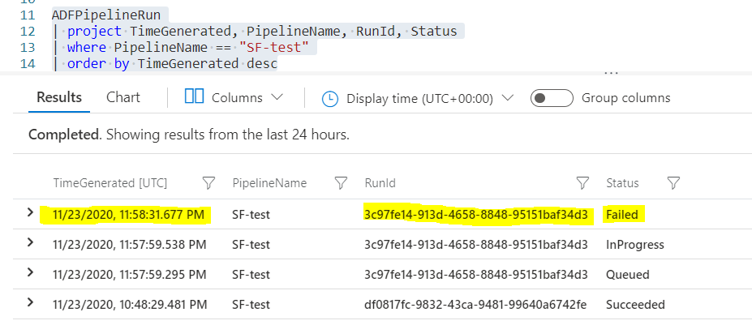
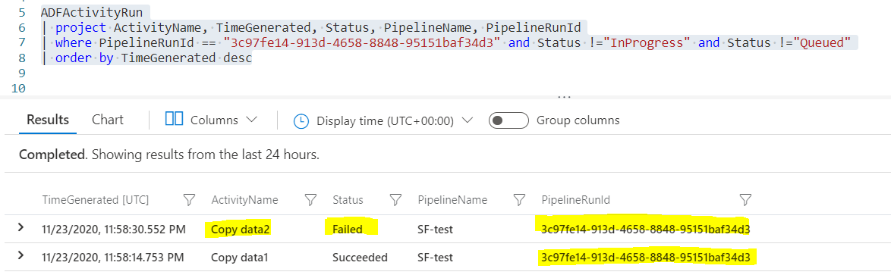
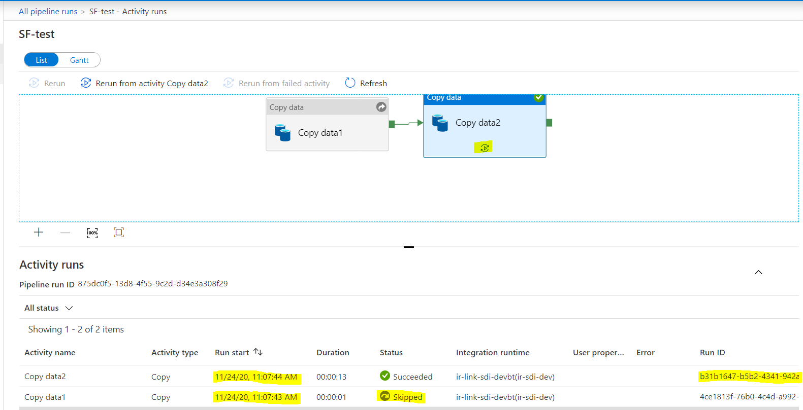
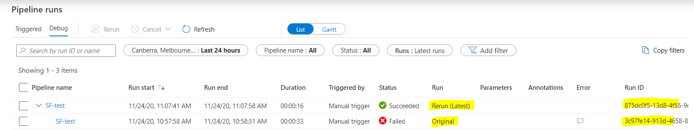

# ADF Hyper Pipeline - File Server (Risk Console)

This section contains the build summary of ADF Hyper Pipeline for Risk
Console.

At a high level, both ADF Hyper Pipeline and sub-pipeline (Acquisition,
Structured and Curated) will be provisioned via `pulumi `and ARM
template. The pipeline will constrains the pre-defined connections,
activities, datasets and **placeholders** for **runtime parameters.**

-   1 [Risk console Hyper Pipeline
    Design](#ADFHyperPipeline-FileServer(RiskConsole)-RiskconsoleHyperPipelineDesign)
    -   1.1 [Trigger workflow
        description:](#ADFHyperPipeline-FileServer(RiskConsole)-Triggerworkflowdescription:)
    -   1.2 [Pipeline Workflow
        description:](#ADFHyperPipeline-FileServer(RiskConsole)-PipelineWorkflowdescription:)
-   2 [Checkpoint Parameter and Decision
    Rules](#ADFHyperPipeline-FileServer(RiskConsole)-CheckpointParameterandDecisionRules)
    -   2.1 [Assumptions made by the
        solution](#ADFHyperPipeline-FileServer(RiskConsole)-Assumptionsmadebythesolution)
    -   2.2 [Inputs and Business
        Rules](#ADFHyperPipeline-FileServer(RiskConsole)-InputsandBusinessRules)

# Risk console Hyper Pipeline Design

Below is a diagram to illustrate the activities and functions that are
part of the risk console hyper pipeline. There are three file types to
ingest for risk console (i.e. excel, .txt delimited with Tilda and .csv
delimited with Tab), however only one hyper pipeline will be provisioned
to handle all the different file types.

The **policy_section** feed has a specific characteristic that due to
the large size, it is chunked into various parts (currently 6 at the
time of writing this but increasing over time). Consequently, the
pipeline needs to cope with a varying number of file to be processed.

### **Trigger workflow description:**

1.  A trigger will activate the pipeline at the scheduled time, query
    Run-time config from cosmosDB, and pass in the corresponding global
    parameters to the pipeline. All triggers are created based on the
    build-time config during the deployment phase.

2.  The trigger triggers the hyper pipeline with prepared parameter
    values. There is one trigger per data feed

3.  Trigger cadence. The excel files run daily, the txt and csv files
    run weekly.

### **Pipeline Workflow description:**

0\. A pre-requisite process managed by VMIA IT will decrypt and drop the
Risk Console (RC) extract files with agreed naming pattern to Host
\\\\<a href="http://stprdfs01.file.core.windows.net"
rel="nofollow">stprdfs01.file.core.windows.net</a>\\vmiadata. The host
can be accessed using a service account.

1.  Pre acquisition pipeline activities

    1.  Upon commencing the pipeline, a parameter parsing function will
        consume the trigger parameters and create the required
        parameters for consumption of the daily file.

2.  Trigger the acquisition pipeline if no previous days files are left
    unprocessed

    1.  Read in the parameters prepared by the parameter parser.

    2.  Use the same linked service and wild card in the file name to
        access and pull all RC extracts.

    3.  Store files at the Data Lake Landing layer in the Azure Storage
        Account.

3.  1.  A **Get Metadata Activity** is used to return an array of files
        copied. This will inform all downstream looped activities what
        files to loop.

    2.  A looped **Copy activity** in ADF will loop through all RC
        extracts copied of a data feed (usually one but for policy
        section many) and convert extract files (i.e. Excel file with
        “page” as the target sheet, .txt file with “\~” as the delimiter
        or .csv with tab as a delimiter) into parquet files without
        providing any schema information or informing the first row as
        column names. This is to allow ADF to pick all the columns
        including any unexpected (due to newly added columns, extra
        fields). In the produced parquet files, they will contain ADF
        default headers (i.e. Prop_0, Prop_1, etc.) and inferred schema.
        Note that the only **integrity check** (i.e. row count and sum)
        that could be performed would be on the txt files as they
        contain metadata for validation. However, since the integrity
        check on a txt file requires to open and scan through a file, it
        is more suitable to be completed in snowflake and therefore it
        is subsumed as part of the <a
        href="https://vmia.atlassian.net/wiki/spaces/SDI/pages/370638849/Technical+Data+Quality+%28TDQ%29+Check+-+Non-PEGA+data+source"
        rel="nofollow">TDQ check</a>. hence there is no integrity check
        function in the risk console pipelines

4.   If the acquisition pipeline finishes successfully, it will trigger
    the checkpoint function.

5.  The checkpoint function (Azure Function) will query pipeline and
    activity status from Log Analytics Workspace using <a
    href="https://docs.microsoft.com/en-us/azure/data-explorer/kusto/concepts/"
    rel="nofollow">Kusto</a> (see <a
    href="https://medium.com/@IrekRomaniuk/query-azure-log-analytics-from-python-f282151b7d46"
    rel="nofollow">how to use Python query Log Analytics</a>.). Since
    Log Analytics doesn’t support AD token authentication, we will need
    to create a service principal and authenticate Azure Function with
    Log Analytics using a secret. Log Analytics can access both ADF and
    Azure Function’s logs (for the latter, need to access app insights
    via Log Analytics Workspace). Some example code (<a
    href="https://vmia.atlassian.net/wiki/spaces/SDI/pages/285999125/ADF+Logging"
    data-linked-resource-id="285999125" data-linked-resource-version="2"
    data-linked-resource-type="page">ADF Logging</a> contains example of
    how to query app insights log using Kusto from Log Analytics
    Workspace):

**Example 1**: retrieve the latest log of a given pipeline. (for a given
file’s particular pipeline, see **Example 5**). You can use **project**
to narrow down what fields to retain.

**Example 2**: retrieve a list of activities of a given pipeline by
PipelineRunId.

**Note**: example 1 and 2 could potentially use JOIN to achieve (<a
href="https://docs.microsoft.com/en-us/azure/data-explorer/kusto/query/samples?pivots=azuredataexplorer"
rel="nofollow">https://docs.microsoft.com/en-us/azure/data-explorer/kusto/query/samples?pivots=azuredataexplorer</a>)

**Example 3**: an activity failed and result in the pipeline failure.

**Example 4**: rerun from the failed activity. This will create a new
PipelineRunId, skip successful activities before, and rerun the failed
activity. The behaviour confirms that we can use the generic rule that
the checkpoint function can just query the latest pipeline status to
understand if in the previous period, the pipeline has succeeded or not,
regardless if the last run is the initial run or rerun.

Rerun from a failed activity creating a new PipelineRunId

Same behaviour in ADF Log GUI

In the newly created PipelineRunId, the skipped activity **Copy data1**
will be copied over with its original **TimeGenerated (UTC)**, and the
rerun activity will have a new **TimeGenerated (UTC)** which indicates
it gets rerun.

**Note**:

-   In the ADF GUI log, the Run start timestamp for the rerun activity
    won’t be updated to the rerun time, while in the Log Analytics,
    TimeGenerated (UTC) will keep the timestamps for skipped activities
    but use the rerun timestamp for the rerun activity.

-   There maybe few seconds lag between ADF finishes execution and log
    available in Log Analytics. The Azure Function code will need to
    handle when a pipeline already starts (i.e. status = “InProgress” or
    “Queued”) but hasn’t reached to the final status (i.e. status =
    “Succeeded” or “Failed”). Will need to implement a retry loop to
    poll the final status before start to query activity status.

**Example 5:** extract a file’s latest pipeline status.

**Note**: Although **project** can narrow down to a subset of fields to
retrieve, it has to include fields mentioned for filtering and ordering
or the query will throw error.

**6.** The checkpoint function reads in the pipeline dependency
conditions from a config stored in Cosmos, and apply to the pipeline and
activity status.

**7a.** If all conditions are met, continue to the structured pipeline.
the number of files to loop through is passed in as a parameter. The
entire structured pipeline will sit in a loop

**7b.** If fail to met condition(s), cease the execution of the hyper
pipeline and make pipeline failed.

**8a, 8b, 8c** are the <a
href="https://vmia.atlassian.net/wiki/spaces/SDI/pages/370638849/Technical+Data+Quality+%28TDQ%29+Check+-+Non-PEGA+data+source"
data-linked-resource-id="370638849" data-linked-resource-version="46"
data-linked-resource-type="page">Technical Data Quality (TDQ) Check -
Non-PEGA data source</a>. The parquet files will be loaded into the
structured layer using the COPY command of snowflake if all the data
quality checks pass successfully.

**9.** If TDQ failed, trigger the move activity in the structure
pipeline.

**10.** The move activity moves the file in the raw layer of Azure
Storage Account to an error folder.

**11.** If the structured pipeline (i.e. TDQ check) finishes
successfully, it will trigger the curated structure.

**12a** and **12b** refer to <a
href="https://vmia.atlassian.net/wiki/spaces/SDI/pages/432144521/Time+Varying+Data+Load"
data-linked-resource-id="432144521" data-linked-resource-version="5"
data-linked-resource-type="page">Time Varying Data Load</a> . For risk
console this will be a **full pattern** for all data feeds, except for
**policy_section** which will be a **full transactional pattern**
(decision pending Sarah Fan (Deactivated) )

# Checkpoint Parameter and Decision Rules

The purpose of the checkpoint function is to make sure that dependencies
are met before trigger the next step. It is designed to be a generic
config-driven function where rules/conditions will come from a config
stored in cosmosDB.

## Assumptions made by the solution

**Assumption 1**: each time the hyper-pipeline trigger to run, it only
runs for the current round. It doesn’t do any historical run or rerun.
Historical runs and reruns will be done manually.

**Assumption 2**: the checkpoint function only trigger the structured
pipeline at t1 only if at t0, but structured and curated pipeline have
successfully executed.

**Assumption 3**: the TimeGenerated (UTC) in the Log Analytics reflects
the scheduled run timestamp at least within a confident tolerance (e.g.
always within 5sec difference), as we will base on the TimeGenerated
(UTC) to retrieve logs within last scheduled run.

**Assumption 4**: human is responsible to make sure all the reruns or
historical runs are executed in the right order and no rounds are
skipped.

## Inputs and Business Rules

The inputs and business rules for the checkpoint function prior to
trigger the structured pipeline:

-   Suppose the current time is **t1**. Parameters from the acquisition
    pipeline will pass **file name** that got successfully executed,
    **scheduled run timestamp** and **cadence** (i.e. daily, weekly)
    into the checkpoint function.

-   The checkpoint function will read in the config from cosmosDB. The
    config will inform the function

    -   **pipeline names** (e.g. structured and curated pipeline names)
        that it needs to check status

    -   **Kusto query templates**

-   The checkpoint function will use **file name, pipeline names,
    scheduled run timestamps and cadence** to query the log and check if
    the pipeline actually ran n the last scheduled period (**t0**). This
    is to handle situations where rerun of rounds before t0 happened in
    the last period.

    -   If yes for both pipeline, retrieve the **status**

        -   if both pipelines' statuses are Succeeded, trigger the
            structured pipeline for **t1**

    -   Otherwise, make the pipeline failed. The failure will trigger an
        existing alert based on the metrics put in place, to notify that
        there are some previous rounds that need manual investigation
        and run. In the Log Analytics Workspace, query all the pipeline
        between t1 and the last period both pipelines were Succeeded can
        give you information (e.g. PipelineRunId, file name, scheduled
        run timestamp) on what need to be rerun.

**Note**: other information that the function needs to gain access etc.
is left out from the description for simplicity purpose.

## Attachments:

[hyperpipeline_Diagram.drawio.png](attachments/424116229/423624824.png)
(image/png)  

[hyperpipeline_Diagram.drawio](attachments/424116229/423919703.drawio)
(application/vnd.jgraph.mxfile)  

[\~drawio\~5f3210f19aa96500466e388b\~hyperpipeline_Diagram.drawio.tmp](attachments/424116229/424116251.tmp)
(application/vnd.jgraph.mxfile)  

[hyperpipeline_Diagram.drawio](attachments/424116229/423625449.drawio)
(application/vnd.jgraph.mxfile)  

[hyperpipeline_Diagram.drawio.png](attachments/424116229/423625459.png)
(image/png)  

[hyperpipeline_Diagram.drawio](attachments/424116229/423297854.drawio)
(application/vnd.jgraph.mxfile)  

[hyperpipeline_Diagram.drawio.png](attachments/424116229/423723738.png)
(image/png)  

[hyperpipeline_Diagram.drawio](attachments/424116229/431816799.drawio)
(application/vnd.jgraph.mxfile)  

[hyperpipeline_Diagram.drawio.png](attachments/424116229/423723962.png)
(image/png)  

[hyperpipeline_Diagram.drawio](attachments/424116229/431751292.drawio)
(application/vnd.jgraph.mxfile)  

[hyperpipeline_Diagram.drawio.png](attachments/424116229/431751302.png)
(image/png)  

[hyperpipeline_Diagram.drawio](attachments/424116229/431784181.drawio)
(application/vnd.jgraph.mxfile)  

[hyperpipeline_Diagram.drawio.png](attachments/424116229/431751384.png)
(image/png)  

[hyperpipeline_Diagram.drawio](attachments/424116229/432144634.drawio)
(application/vnd.jgraph.mxfile)  

[hyperpipeline_Diagram.drawio.png](attachments/424116229/423920881.png)
(image/png)  

[hyperpipeline_Diagram.drawio](attachments/424116229/437387293.drawio)
(application/vnd.jgraph.mxfile)  

[hyperpipeline_Diagram.drawio.png](attachments/424116229/437387303.png)
(image/png)  

[image-20201123-230456.png](attachments/424116229/423920895.png)
(image/png)  

[image-20201123-232302.png](attachments/424116229/434864129.png)
(image/png)  

[image-20201123-233202.png](attachments/424116229/434503695.png)
(image/png)  

[image-20201124-000234.png](attachments/424116229/434765836.png)
(image/png)  

[image-20201124-000348.png](attachments/424116229/434798603.png)
(image/png)  

[image-20201124-001130.png](attachments/424116229/434503709.png)
(image/png)  

[image-20201124-001500.png](attachments/424116229/432144648.png)
(image/png)  

[image-20201124-002005.png](attachments/424116229/434798611.png)
(image/png)  

[image-20201124-002120.png](attachments/424116229/434831371.png)
(image/png)  

[image-20201124-015740.png](attachments/424116229/434929690.png)
(image/png)  

[image-20201124-015745.png](attachments/424116229/434831384.png)
(image/png)  

[image-20201124-020659.png](attachments/424116229/434733075.png)
(image/png)  

[image-20201124-022846.png](attachments/424116229/423724148.png)
(image/png)  

[image-20201124-023209.png](attachments/424116229/434733083.png)
(image/png)  

[hyperpipeline_Diagram.drawio](attachments/424116229/437387375.drawio)
(application/vnd.jgraph.mxfile)  

[hyperpipeline_Diagram.drawio.png](attachments/424116229/437354632.png)
(image/png)  

[hyperpipeline_Diagram.drawio](attachments/424116229/437485751.drawio)
(application/vnd.jgraph.mxfile)  

[hyperpipeline_Diagram.drawio.png](attachments/424116229/437485761.png)
(image/png)  

[hyperpipeline_Diagram.drawio](attachments/424116229/440270956.drawio)
(application/vnd.jgraph.mxfile)  

[hyperpipeline_Diagram.drawio.png](attachments/424116229/440270966.png)
(image/png)  

[hyperpipeline_Diagram.drawio](attachments/424116229/455246078.drawio)
(application/vnd.jgraph.mxfile)  

[hyperpipeline_Diagram.drawio.png](attachments/424116229/458096758.png)
(image/png)  

[hyperpipeline_Diagram.drawio](attachments/424116229/462815649.drawio)
(application/vnd.jgraph.mxfile)  

[hyperpipeline_Diagram.drawio.png](attachments/424116229/462881316.png)
(image/png)  

[hyperpipeline_Diagram.drawio](attachments/424116229/462881354.drawio)
(application/vnd.jgraph.mxfile)  

[hyperpipeline_Diagram.drawio.png](attachments/424116229/462913918.png)
(image/png)  

[\~hyperpipeline_Diagram.drawio.tmp](attachments/424116229/580059141.tmp)
(application/vnd.jgraph.mxfile)  

[hyperpipeline_Diagram.drawio](attachments/424116229/580091909.drawio)
(application/vnd.jgraph.mxfile)  

[hyperpipeline_Diagram.drawio.png](attachments/424116229/580157441.png)
(image/png)  

[\~hyperpipeline_Diagram.drawio.tmp](attachments/424116229/580157451.tmp)
(application/vnd.jgraph.mxfile)  

[hyperpipeline_Diagram.drawio](attachments/424116229/580124707.drawio)
(application/vnd.jgraph.mxfile)  

[hyperpipeline_Diagram.drawio.png](attachments/424116229/579993625.png)
(image/png)  

[\~hyperpipeline_Diagram.drawio.tmp](attachments/424116229/580124687.tmp)
(application/vnd.jgraph.mxfile)  

[\~hyperpipeline_Diagram.drawio.tmp](attachments/424116229/580091927.tmp)
(application/vnd.jgraph.mxfile)  

[\~hyperpipeline_Diagram.drawio.tmp](attachments/424116229/580157461.tmp)
(application/vnd.jgraph.mxfile)  

[\~hyperpipeline_Diagram.drawio.tmp](attachments/424116229/580222985.tmp)
(application/vnd.jgraph.mxfile)  

[\~hyperpipeline_Diagram.drawio.tmp](attachments/424116229/580124697.tmp)
(application/vnd.jgraph.mxfile)  

[\~hyperpipeline_Diagram.drawio.tmp](attachments/424116229/580026383.tmp)
(application/vnd.jgraph.mxfile)  

[hyperpipeline_Diagram.drawio](attachments/424116229/580091949.drawio)
(application/vnd.jgraph.mxfile)  

[hyperpipeline_Diagram.drawio.png](attachments/424116229/580190225.png)
(image/png)  

[\~hyperpipeline_Diagram.drawio.tmp](attachments/424116229/603389957.tmp)
(application/vnd.jgraph.mxfile)  

[hyperpipeline_Diagram.drawio](attachments/424116229/603291659.drawio)
(application/vnd.jgraph.mxfile)  

[hyperpipeline_Diagram.drawio.png](attachments/424116229/603258892.png)
(image/png)  

[\~hyperpipeline_Diagram.drawio.tmp](attachments/424116229/424116248.tmp)
(application/vnd.jgraph.mxfile)  

[hyperpipeline_Diagram.drawio](attachments/424116229/424116245.drawio)
(application/vnd.jgraph.mxfile)  

[hyperpipeline_Diagram.drawio.png](attachments/424116229/424116242.png)
(image/png)  

